# คู่มือและสคริปต์การทดสอบระบบ 6 Flows แบบ End-to-End (Live Testing & Video Demo Playbook)
## อ้างอิงบริบทและภาษาจริงจากโครงการ Excise (กรมสรรพสามิต)

> **ระบบ:** AutomationX Engine & TicketX Support Automation Platform  
> **เอกสารอ้างอิงและคลังข้อมูลจริง:**  
> - `Interaction.docx` (ประวัติการคุยจริงระหว่าง User กับ CS โครงการ Excise)  
> - `ตัวอย่างแจ้งเคสเปิดเเทร์กEXCIS.docx` (ตัวอย่างข้อความและขั้นตอนการแจ้งเปิดแทร็กปัญหาจริง)  
> - `docs/AUTOMATIONX_6_FLOWS_MASTER_E2E_SPECIFICATION_TH.md` (Master Architecture V2)  
> - `docs/AUTOMATIONX_IMPLEMENTATION_ROADMAP_V2.md` (Implementation Roadmap V2)  
> **วัตถุประสงค์และโครงสร้างเอกสาร:**  
> 1. **User UI & Screen Flow (§1):** แผนภาพโฟลว์ฝั่งผู้ใช้งาน 100% แสดงเฉพาะสิ่งที่ผู้ใช้เห็นและกระทำบนหน้าจอ LINE OA (ทั้งภาพรวมและ 6 ระบบย่อย พร้อมระบบตรวจจับเคสในอดีต)  
> 2. **Developer & System Flow (§2):** แผนภาพโฟลว์ฝั่งนักพัฒนาและเบื้องหลังระบบ แสดงการประมวลผลเชิงเทคนิค (Webhooks, AI, Historical Matching, PostgreSQL, Redis Focus, Plane.so, Workers)  
> 3. **The 3-Way Test Alignment Table (§3):** ตารางประกบ 3 มุมมองการทดสอบ (การกระทำของผู้ทดสอบ vs หน้าจอที่ผู้ใช้เห็น vs การทำงานเบื้องหลังระบบ) ครบ TC-01 ถึง TC-15  
> 4. **User Journey Map (§4):** แผนภาพเส้นทางประสบการณ์ผู้ใช้งานจริง (Customer-Centric)  
> 5. **Technical System Architecture Specs (§5):** ข้อมูลจำเพาะทางเทคนิค State Machine และ Sequence Diagram เชิงลึก  
> 6. **Storyboard & Video Demo Script (§6):** บทพูดและลำดับเหตุการณ์สำหรับการอัดคลิปวิดีโอสาธิตระบบด้วยบริบทและภาษาจริงจากโครงการ Excise  
> 7. **Live UAT Sign-off Matrix (§7):** เกณฑ์และแผ่นตรวจรับงานจริง 15+ รายการทดสอบ

---
## 1. แผนภาพโฟลว์ฝั่งผู้ใช้งาน (User UI & Screen Flow)

> **นิยาม:** แผนภาพโฟลว์ในหมวดนี้สะท้อนมุมมองจาก **"หน้าจอโทรศัพท์มือถือของผู้ใช้งานจริง (User LINE OA Screen)" 100%** โดยแสดงเฉพาะ:
> - สิ่งที่ผู้ใช้งานพิมพ์ส่ง หรือ แตะเลือก (User Input & Tap Actions)
> - สิ่งที่ปรากฏบนหน้าจอ LINE OA (Bot Messages, Summary Cards, Quick Reply Chips, Push Notifications)
> - **การตรวจจับเคสประวัติในอดีต (Historical Closed Detection):** เมื่อตรวจพบปัญหาเดิมที่เคยปิดไปแล้ว บอทจะทักถามเพื่อผูกความสัมพันธ์กับเคสเก่า (Parent Ticket Link) ทันที
> - **ไม่มี** การอ้างอิงถึง Database, Webhook, API, Docker, Worker หรือคำศัพท์เทคนิคหลังบ้านใดๆ ทั้งสิ้น

### 1.1 แผนภาพภาพรวมโฟลว์ฝั่งผู้ใช้งาน (Grand User Screen Flowchart)

```mermaid
flowchart TD
    Start(["👤 ผู้ใช้งานเปิดแช็ต LINE OA"]) --> U_Msg["1. ลูกค้าพิมพ์ข้อความแจ้งปัญหา<br/>'แจ้งเคสค่ะ ระบบชดใช้เงินยืม...'"]
    U_Msg --> U_FastAck["2. ข้อความตอบรับอัตโนมัติทันที<br/>'รับเรื่องแล้วนะคะ ขอเวลาสักครู่ค่ะ' (~1s)"]
    U_FastAck --> U_Summary["3. การ์ดสรุปประเด็นปัญหาจากบอท<br/>ปุ่มลัด: ( ยืนยัน ) ( ขอแก้ไขข้อมูล ) ( ยกเลิก )"]

    U_Summary --> U_Choice{"4. ลูกค้าแตะเลือกทางไหน?"}

    %% Edit Branch
    U_Choice -- "แตะ ( ขอแก้ไขข้อมูล )" --> U_AskEdit["5. บอทถามเจาะจง: 'ต้องการแก้ตรงส่วนไหนคะ?'"]
    U_AskEdit --> U_SendEdit["6. ลูกค้าพิมพ์ข้อความที่ต้องการแก้"]
    U_SendEdit --> U_Summary

    %% Pre-cancel Branch
    U_Choice -- "แตะ ( ยกเลิก )" --> U_PreCancel["7. บอทแจ้ง: 'ยกเลิกการแจ้งเรื่องเรียบร้อยแล้วค่ะ'"]
    U_PreCancel --> U_Reset(["หน้าจอพร้อมรับการแจ้งเรื่องใหม่"])

    %% Confirm Branch -> Historical Check
    U_Choice -- "แตะ ( ยืนยัน )" --> U_HistCheck{"8. ผลการตรวจสอบประวัติเคสเดิม"}

    %% Historical Match: In Progress
    U_HistCheck -- "เคสเดิมกำลังทำอยู่" --> U_ActiveAck["บอทแจ้ง: 'เคสนี้กำลังดำเนินการอยู่ค่ะ (TCK-62090)'<br/>แนบข้อความเพิ่มให้เรียบร้อย (ไม่เปิดเคสซ้ำ)"]

    %% Historical Match: Closed Case Found
    U_HistCheck -- "ตรวจพบเคสเดิมที่เคยปิดไปแล้ว" --> U_PromptParent["8B. บอททักถามอัจฉริยะ:<br/>'ตรวจพบว่าอาการนี้เคยได้รับการแก้ไขในเคส TCK-2026-10111 ที่ปิดไปแล้วค่ะ<br/>ต้องการเปิดเคสใหม่โดยอ้างอิงประวัติจากเคสเดิมนี้ใช่ไหมคะ?'<br/>ปุ่มลัด: ( ยืนยันเปิดใหม่อ้างอิงเคสเดิม ) ( เป็นเรื่องใหม่เลย )"]
    
    U_PromptParent --> U_ParentChoice{"ลูกค้าเลือกการอ้างอิง"}
    U_ParentChoice -- "แตะ ( ยืนยันเปิดใหม่อ้างอิงเคสเดิม )" --> U_GetLinkedTicket["8C. บอทส่งข้อความยืนยัน:<br/>'ออกเลขเคสใหม่ TCK-2026-62090 เรียบร้อยแล้วค่ะ<br/>(ผูกประวัติและเชื่อมโยงกับเคสเดิม TCK-10111 ให้แล้วค่ะ)'"]
    U_ParentChoice -- "แตะ ( เป็นเรื่องใหม่เลย )" --> U_GetFreshTicket["8D. บอทส่งข้อความยืนยัน:<br/>'ออกเลขเคสใหม่ TCK-2026-62090 เรียบร้อยแล้วค่ะ'"]

    %% Historical Match: Never Existed
    U_HistCheck -- "ไม่เคยมีเรื่องนี้มาก่อนเลย" --> U_GetFreshTicket

    %% Flow 6: Media continuity
    U_GetLinkedTicket --> U_SendPhoto["9. ลูกค้าส่งรูปแคปหน้าจอตามเข้ามา"]
    U_GetFreshTicket --> U_SendPhoto
    U_SendPhoto --> U_AckPhoto["10. บอทตอบทันที:<br/>'แนบรูปภาพเข้าเคส TCK-2026-62090 เรียบร้อยแล้วค่ะ'"]

    %% Flow 2: Follow status
    U_AckPhoto --> U_AskStatus["11. ลูกค้าพิมพ์: 'ตามเคส TCK-2026-62090 ให้หน่อยค่ะ'"]
    U_AskStatus --> U_ShowStatus["12. บอทส่งการ์ดรายงานสถานะภาษาไทยเข้าใจง่าย<br/>พร้อมปุ่ม: ( ดูเคสล่าสุดทั้งหมด )"]

    U_ShowStatus --> U_TapList["13. ลูกค้าแตะ ( ดูเคสล่าสุดทั้งหมด )"]
    U_TapList --> U_ShowList["14. บอทส่งรายการตั๋วค้างทั้งหมด<br/>พร้อมปุ่มลัด: ( TCK-62090 ) ( TCK-19804 )"]

    %% Flow 6: Ambiguous question
    U_ShowList --> U_AskVague["15. ลูกค้าพิมพ์ถามกว้างๆ: 'แล้วเรื่องรายงานล่ะคะ'"]
    U_AskVague --> U_ShowChips["16. บอทส่งปุ่มเลือกเคส:<br/>( รายงานกรุงไทย TCK-19804 ) ( สิทธิเบิกจ่าย TCK-03834 )"]

    U_ShowChips --> U_TapChip["17. ลูกค้าแตะเลือก ( รายงานกรุงไทย TCK-19804 )"]
    U_TapChip --> U_SwitchAck["18. บอทแจ้ง: 'สลับมาดูแลเคสรายงานกรุงไทยแล้วค่ะ'"]

    %% Flow 5: Cancel after ticket
    U_SwitchAck --> U_AskCancel["19. ลูกค้าพิมพ์: 'ขอยกเลิกเคส TCK-2026-62090 ค่ะ'"]
    U_AskCancel --> U_PromptCancel["20. บอทส่งปุ่มถามยืนยัน:<br/>( ยืนยันยกเลิกเคส ) ( ไม่ยกเลิก )"]
    U_PromptCancel --> U_CancelChoice{"21. ลูกค้ายืนยันหรือไม่?"}
    U_CancelChoice -- "แตะ ( ยืนยันยกเลิกเคส )" --> U_CancelDone["22. บอทแจ้ง: 'ยกเลิกเคส TCK-2026-62090 เรียบร้อยแล้วค่ะ'"]
    U_CancelChoice -- "แตะ ( ไม่ยกเลิก )" --> U_CancelAbort["บอทแจ้ง: 'ดำเนินการเคสต่อตามเดิมค่ะ'"]

    %% Flow 3: UAT Delivery
    U_CancelDone -.->|"ทีมงานแก้ไขเสร็จ"| U_PushNotice["23. LINE แจ้งเตือนเด้งเตือน:<br/>'ทีมงานแก้ไขเรียบร้อยแล้ว รบกวนตรวจสอบอีกครั้งที่ระบบใช้งานจริงนะคะ'<br/>ปุ่มลัด: ( ใช้งานได้แล้ว ) ( ยังมีปัญหาอยู่ )"]

    U_PushNotice --> U_UATChoice{"24. ลูกค้าตรวจที่ระบบจริง"}

    %% Pass UAT
    U_UATChoice -- "แตะ ( ใช้งานได้แล้ว )" --> U_PromptClose["25. บอทส่งปุ่มถามยืนยันปิดเคส:<br/>( ยืนยันปิดเคส ) ( ยังไม่ปิด )"]
    U_PromptClose --> U_FinalCloseChoice{"26. ยืนยันปิดงาน?"}
    U_FinalCloseChoice -- "แตะ ( ยืนยันปิดเคส )" --> U_ClosedNotice["27. บอทส่งข้อความขอบคุณและปิดงานสมบูรณ์"]
    U_FinalCloseChoice -- "แตะ ( ยังไม่ปิด )" --> U_KeepOpenNotice["บอทแจ้ง: 'รอลูกค้าสะดวกตรวจรับงานอีกครั้งค่ะ'"]

    %% Fail UAT -> Flow 4
    U_UATChoice -- "แตะ ( ยังมีปัญหาอยู่ )" --> U_ScopePrompt["28. บอทถาม: 'อาการที่พบเป็นปัญหาเดิม หรือ ปัญหาใหม่คะ?'<br/>ปุ่มลัด: ( ปัญหาเดิม ) ( ปัญหาใหม่ )"]
    U_ScopePrompt --> U_ScopeChoice{"29. ลูกค้าเลือกประเภทปัญหา"}
    U_ScopeChoice -- "แตะ ( ปัญหาเดิม )" --> U_ReopenNotice["30. บอทแจ้ง: 'ส่งเรื่องกลับให้ทีมพัฒนาแก้ไขเคสเดิมต่อทันทีเรียบร้อยแล้วค่ะ'"]
    U_ScopeChoice -- "แตะ ( ปัญหาใหม่ )" --> U_NewCaseNotice["31. บอทแจ้ง: 'ปิดเคสเดิม และนำเรื่องใหม่ไปเปิดเคสใหม่โดยผูกประวัติเดิมเรียบร้อยค่ะ'"]

    %% Flow 6: Closed Case
    U_ClosedNotice --> U_AskClosed["32. ลูกค้าพิมพ์ถามถึงเคสที่ปิดไปแล้ว"]
    U_AskClosed --> U_ClosedProtect["33. บอทแจ้ง: 'เคสนี้ปิดเรียบร้อยแล้วค่ะ'<br/>พร้อมปุ่มลัด: ( ➕ เปิดเคสใหม่จากเรื่องนี้ )"]

    style Start fill:#eff6ff,stroke:#3b82f6,stroke-width:2px
    style U_PromptParent fill:#fefce8,stroke:#eab308,stroke-width:2px
    style U_GetLinkedTicket fill:#dcfce7,stroke:#16a34a,stroke-width:2px
    style U_GetFreshTicket fill:#dcfce7,stroke:#16a34a,stroke-width:2px
    style U_ShowStatus fill:#eff6ff,stroke:#2563eb,stroke-width:2px
    style U_ClosedNotice fill:#16a34a,color:#fff
    style U_ReopenNotice fill:#f97316,color:#fff
    style U_CancelDone fill:#ef4444,color:#fff
```

---

### 1.2 แผนภาพโฟลว์ย่อยฝั่งผู้ใช้งานทั้ง 6 ระบบ (Subflows 1 - 6: User Perspective)

#### 🔹 Subflow 1: Flow 1 - New Case Intake (เปิดเคสใหม่ พร้อมตรวจจับประวัติเคสเก่า - หน้าจอผู้ใช้)
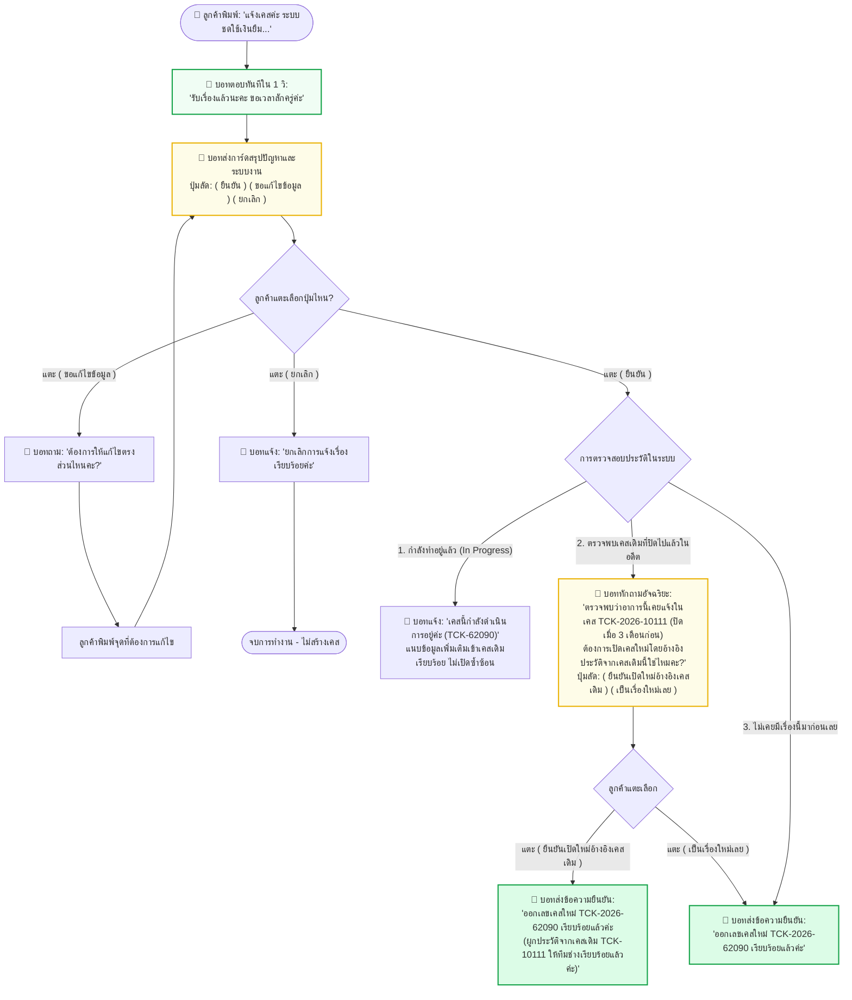

---

#### 🔹 Subflow 2: Flow 2 - Follow Existing Case (ติดตามสถานะ - หน้าจอผู้ใช้)
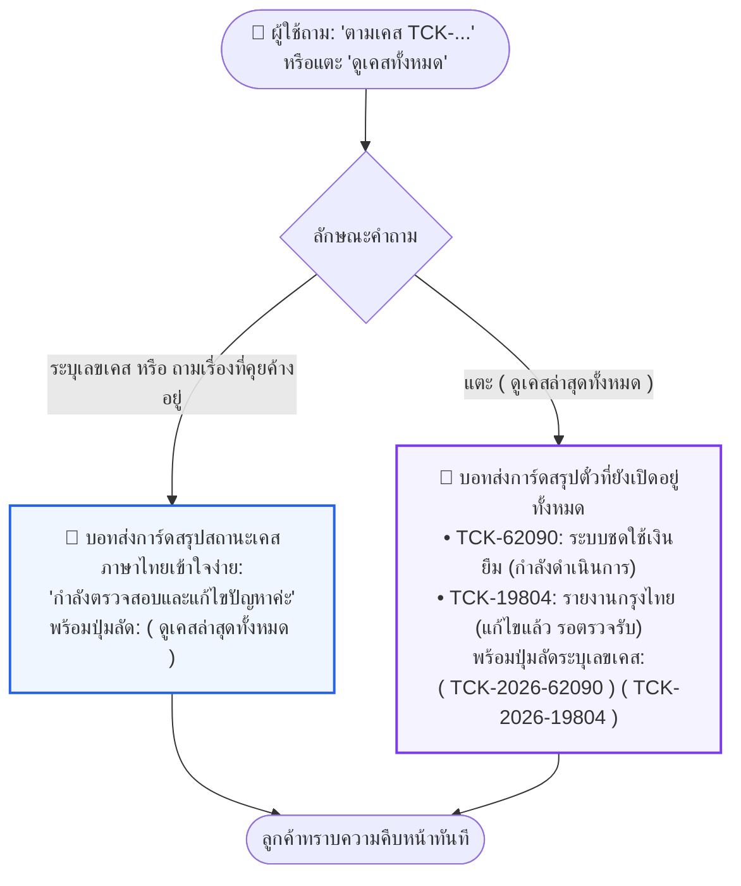

---

#### 🔹 Subflow 3: Flow 3 - Close Case (ตรวจรับงานและปิดเคส - หน้าจอผู้ใช้)
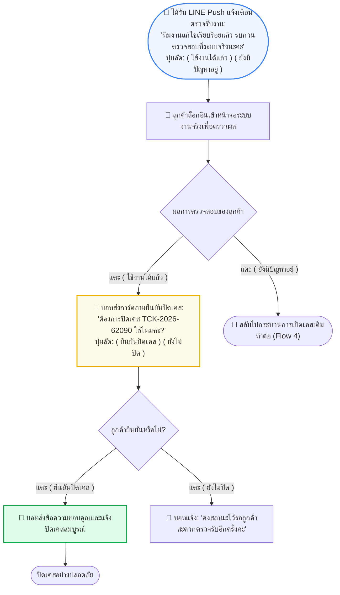

---

#### 🔹 Subflow 4: Flow 4 - Reopen Case (เคสเดิมยังมีปัญหา - หน้าจอผู้ใช้)
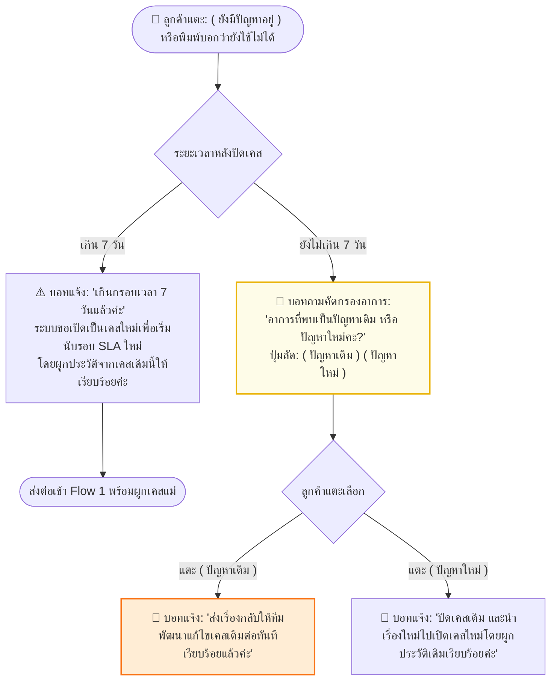

---

#### 🔹 Subflow 5: Flow 5 - Cancel Case (ยกเลิกเคส - หน้าจอผู้ใช้)
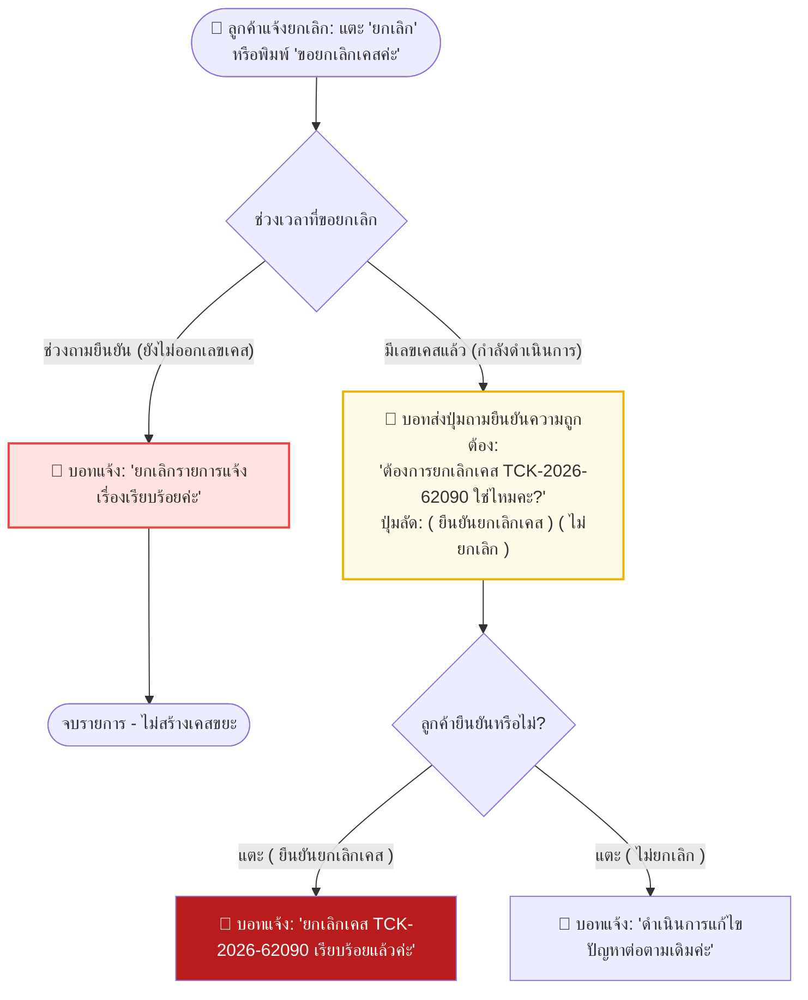

---

#### 🔹 Subflow 6: Flow 6 - Multi-case & Switching (บริบทหลายเคสและสลับเรื่อง - หน้าจอผู้ใช้)
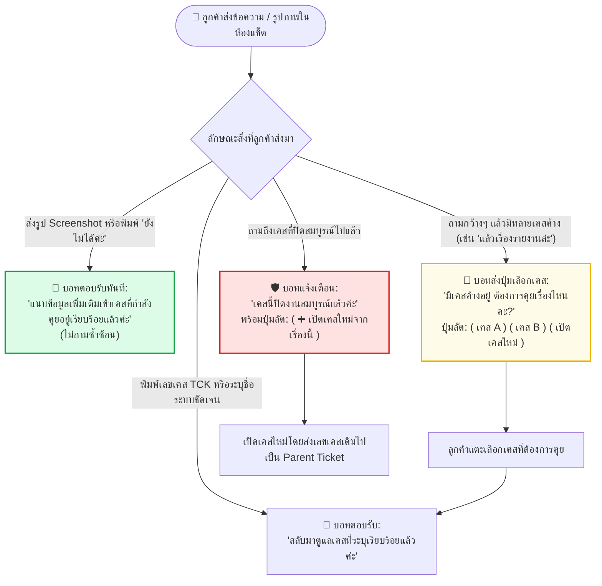

---
## 2. แผนภาพโฟลว์ฝั่งนักพัฒนาและเบื้องหลังระบบ (Developer & System Flow)

> **นิยาม:** แผนภาพโฟลว์ในหมวดนี้สะท้อนมุมมองจาก **"สถาปัตยกรรมและการประมวลผลเบื้องหลังระบบ (Developer & System Architecture)" 100%** เพื่อให้ทีมวิศวกรและสถาปนิกซอฟต์แวร์สามารถตรวจสอบ:
> - จุดรับข้อมูล Webhook Ingress (Fastify Gateway)
> - การตัดคำและสกัดฟิลด์ข้อมูลด้วย AI Gatekeeper (Module, Symptom, Entity Keys, Priority)
> - **กลไกตรวจสอบเคสประวัติในอดีต (Historical Query Engine):** การตรวจจับเคสเดิมที่เคยปิดไปแล้วด้วย Entity Matching และ Semantic Vector Search (pgvector) เพื่อกำหนดค่า `parent_ticket_id`
> - ธุรกรรมฐานข้อมูล (PostgreSQL: `tickets`, `conversations`, `ticket_attachments`)
> - การจัดการเซสชันจำเคสปัจจุบัน (Focus Engine: `active_ticket_id` ใน Redis/DB)
> - การเชื่อมต่อกระดานงานภายนอก (Plane.so REST API & Webhooks)
> - งานเบื้องหลังแบบอะซิงโครนัส (BullMQ Worker, Background Sync)
> - ช่องทางแจ้งเตือนอัตโนมัติ (LINE Messaging API Push, SMTP Done/Alert Email)

### 2.1 แผนภาพภาพรวมการทำงานเบื้องหลังระบบ (Grand Developer & System Flowchart)

```mermaid
flowchart TD
    D_Hook["1. Fastify Gateway รับ Webhook จาก LINE API<br/>(POST /api/v1/webhooks/line)"] --> D_FastAck["2. ยิง Push Message ตอบรับอัตโนมัติทันที<br/>'รับเรื่องแล้วนะคะ ขอเวลาสักครู่ค่ะ' (~1s)"]
    
    D_FastAck --> D_AI["3. AI Gatekeeper สกัดข้อมูลสำคัญ<br/>Module, Symptoms, Entity Keys (เลขเอกสาร/Error), Priority P3"]
    D_AI --> D_DraftStore["4. บันทึกข้อมูลร่างลง Memory Session Buffer<br/>(ยังไม่สร้างตั๋ว / Zero Junk Ticket)"]
    D_DraftStore --> D_SendConfirm["5. ส่ง Two-Step Confirm Card สู่ LINE<br/>ปุ่ม: ( ยืนยัน ) ( ขอแก้ไขข้อมูล ) ( ยกเลิก )"]

    D_SendConfirm --> D_UserEvent{"6. Event Postback จากผู้ใช้"}

    %% Edit
    D_UserEvent -- "action: REQUEST_EDIT" --> D_EditDraft["7. บันทึกแก้ไขเฉพาะจุดใน Memory Draft Buffer<br/>ไม่ทวนข้อความเดิมซ้ำ"]
    D_EditDraft --> D_SendConfirm

    %% Cancel Draft
    D_UserEvent -- "action: CANCEL_DRAFT" --> D_PurgeMemory["8. ล้าง Memory Draft Buffer ทิ้งทันที<br/>ไม่มีการ INSERT ข้อมูลลง Database"]
    D_PurgeMemory --> D_CleanEnd(["จบกระบวนการ - Zero Junk Ticket 100%"])

    %% Confirm Create -> Historical Scan
    D_UserEvent -- "action: CONFIRM_CREATE" --> D_HistScan{"9. Historical Query Engine ตรวจสอบประวัติ<br/>(PostgreSQL Entity Keys + pgvector Cosine Sim)"}

    %% Duplicate Active
    D_HistScan -- "พบเคสอาการเดียวกันกำลังดำเนินการอยู่" --> D_RouteActive["ไม่เปิดเคสซ้ำ ➔ ผูกข้อมูล/รูปภาพเข้าเคสเดิม (Rule P3)"]

    %% Closed Match
    D_HistScan -- "พบเคสเดิมที่เคยปิดไปแล้ว (status='CLOSED')" --> D_PromptParentFlow["ส่ง Card ชวนอ้างอิงเคสเก่า (TCK-10111)<br/>ถ้าผู้ใช้ยืนยัน ➔ เซ็ต parent_ticket_id = 10111"]
    D_PromptParentFlow --> D_InsertParentTicket["10A. INSERT INTO tickets (<br/>status='NEW', parent_ticket_id = 10111<br/>)"]

    %% Fresh Ticket
    D_HistScan -- "ไม่พบประวัติเดิมเลย / ผู้ใช้เลือกเรื่องใหม่" --> D_InsertFreshTicket["10B. INSERT INTO tickets (<br/>status='NEW', parent_ticket_id = NULL<br/>)"]

    %% DB Insert & Plane Sync
    D_InsertParentTicket --> D_PostInsertTx["11. อัปเดต conversations SET active_ticket_id = ticket_id"]
    D_InsertFreshTicket --> D_PostInsertTx

    D_PostInsertTx --> D_PlaneSync["12. BullMQ Worker ส่งงานเข้า Plane.so API<br/>POST /issues (State: Backlog)<br/>ถ้ามี parent_ticket_id ➔ แปะ Label '🔁 Recurring Issue' + แปะ Parent Link"]
    D_PlaneSync --> D_AckTicket["13. LINE Messaging API ส่งเลขเคส TCK-2026-62090<br/>พร้อมเริ่มนับเวลา SLA ใหม่"]

    %% Media Attachment
    D_AckTicket --> D_MediaWebhook["14. Webhook รับข้อความประเภท Image"]
    D_MediaWebhook --> D_P3_Engine["15. CaseResolver ตรวจสอบกฎ P3 Continuity<br/>SELECT active_ticket_id FROM conversations"]
    D_P3_Engine --> D_AttachDB["16. INSERT INTO ticket_attachments<br/>+ Worker POST Plane /issues/attachments"]
    D_AttachDB --> D_AckMedia["17. LINE Push แจ้งแนบรูปเข้า TCK-2026-62090 สำเร็จ"]

    %% Real-time Query
    D_AckMedia --> D_QueryHook["18. Webhook คำถามติดตามสถานะ"]
    D_QueryHook --> D_FastQuery["19. Indexed PostgreSQL SELECT Query (<5ms)<br/>ไม่ต้องยิง REST API ออกไป Plane.so"]
    D_FastQuery --> D_StateMap["20. State Mapping: Plane State ➔ Thai Presentation<br/>Backlog / In Progress ➔ ข้อความภาษาสุภาพ"]
    D_StateMap --> D_SendStatus["21. ส่ง Status Card + Quick Reply ดูเคสทั้งหมด"]

    %% Multi-case & Switching
    D_SendStatus --> D_AmbigHook["22. Webhook คำถามก้ำกึ่ง (เช่น 'เรื่องรายงาน')"]
    D_AmbigHook --> D_P6_Engine["23. CaseResolver กฎ P6 Disambiguation<br/>ตรวจพบคำสำคัญตรงกับหลาย Active Tickets"]
    D_P6_Engine --> D_SendChips["24. ส่ง Quick Reply Chips ระบุเลขเคสให้เลือก"]
    D_SendChips --> D_SwitchPostback["25. ผู้ใช้กดเลือกเลขเคส ➔ UPDATE active_ticket_id"]

    %% Cancel Post-ticket
    D_SwitchPostback --> D_CancelPostback["26. ผู้ใช้ขอยกเลิกเคสหลังเปิดตั๋วแล้ว"]
    D_CancelPostback --> D_CancelGuard["27. Two-Step Guardrail: ส่งปุ่มถามยืนยันยกเลิก"]
    D_CancelGuard --> D_ExecCancel["28. เมื่อยืนยัน:<br/>• UPDATE tickets SET status='CANCELLED'<br/>• UPDATE conversations active_ticket_id = NULL<br/>• Plane PATCH /issues (State: Cancelled)<br/>• SMTP ยิงอีเมลแจ้งเตือนทีมงาน"]

    %% Flow 3: Delivery & UAT
    D_AckTicket -.->|"ทีมงานแก้ไขเสร็จ"| D_PlaneHook["29. Plane.so Webhook: issue_state_changed<br/>State ➔ Delivery to Customer"]
    D_PlaneHook --> D_PushUAT["30. Ingress ยิง LINE Push Notification ชวนตรวจรับงาน<br/>Quick Reply: ( ใช้งานได้แล้ว ) ( ยังมีปัญหาอยู่ )"]

    D_PushUAT --> D_UATResponse{"31. ผู้ใช้ส่ง Postback ตรวจรับ"}

    %% Pass UAT
    D_UATResponse -- "action: UAT_PASS_CLICK" --> D_TwoStepClose["32. Two-Step Close Guardrail (ขั้นที่ 1):<br/>• UPDATE tickets SET status = 'CUSTOMER_CONFIRMED'<br/>• ส่งปุ่มถามยืนยันปิดเคสจริง"]
    D_TwoStepClose --> D_FinalCloseCheck{"33. ยืนยันปิดเคสหรือไม่?"}
    D_FinalCloseCheck -- "action: CONFIRM_CLOSE" --> D_ExecClose["34. ปิดเคสสมบูรณ์ (ขั้นที่ 2):<br/>• UPDATE tickets SET status='CLOSED', closed_at=NOW()<br/>• UPDATE conversations active_ticket_id = NULL<br/>• Worker PATCH Plane (State: Close)<br/>• SMTP ยิง Done Email สรุปการปิดงาน"]
    D_FinalCloseCheck -- "action: CANCEL_CLOSE" --> D_KeepOpen["คงสถานะ 'CUSTOMER_CONFIRMED' รอลูกค้า"]

    %% Fail UAT -> Flow 4
    D_UATResponse -- "action: UAT_FAIL_CLICK" --> D_WindowCheck{"35. เช็คกรอบเวลา: NOW() - closed_at <= 7 วัน"}
    D_WindowCheck -- "เกิน 7 วัน" --> D_RejectReopen["เกิน 7 วัน ➔ ส่งเข้า Flow 1 เปิดเคสใหม่ผูก parent_ticket_id"]
    D_WindowCheck -- "ภายใน 7 วัน" --> D_ScopeTriage["36. ส่ง Scope Triage Card: ( ปัญหาเดิม ) ( ปัญหาใหม่ )"]
    
    D_ScopeTriage --> D_ScopeResponse{"37. ผู้ใช้เลือกประเภทปัญหา"}
    D_ScopeResponse -- "action: SCOPE_SAME" --> D_ExecReopen["38. Reopen เคสเดิมทันที:<br/>• UPDATE tickets status='REOPENED', reopened_count+=1<br/>• Worker PATCH Plane (State: Re-Open) + แนบ Comment<br/>• SMTP ยิง High-Priority Alert หาทีม Dev"]
    D_ScopeResponse -- "action: SCOPE_NEW" --> D_NewCaseChain["ปิดเคสเดิม + ส่งข้อมูลไปเปิดตั๋วใหม่ใน Flow 1 ผูก parent_ticket_id"]

    %% Flow 6: Closed Case Protection
    D_ExecClose --> D_ClosedQuery["39. Webhook ถามถึงเคสที่ status == 'CLOSED'"]
    D_ClosedQuery --> D_P5_Protect["40. CaseResolver กฎ P5 ป้องกันการเขียนทับเคสที่ปิดแล้ว<br/>ส่ง Action Button: ( ➕ เปิดเคสใหม่จากเรื่องนี้ ผูก Parent Ticket )"]

    style D_Hook fill:#eff6ff,stroke:#3b82f6,stroke-width:2px
    style D_HistScan fill:#f5f3ff,stroke:#8b5cf6,stroke-width:2px
    style D_InsertParentTicket fill:#dcfce7,stroke:#16a34a,stroke-width:2px
    style D_InsertFreshTicket fill:#dcfce7,stroke:#16a34a,stroke-width:2px
    style D_FastQuery fill:#eff6ff,stroke:#2563eb,stroke-width:2px
    style D_ExecClose fill:#16a34a,color:#fff
    style D_ExecReopen fill:#f97316,color:#fff
    style D_ExecCancel fill:#ef4444,color:#fff
```

---

### 2.2 แผนภาพโฟลว์ย่อยฝั่งนักพัฒนาทั้ง 6 ระบบ (Subflows 1 - 6: Developer & System Perspective)

#### ⚙️ Dev Subflow 1: Flow 1 - New Case Intake Backend Architecture (พร้อมระบบตรวจจับเคสเดิมในอดีต)
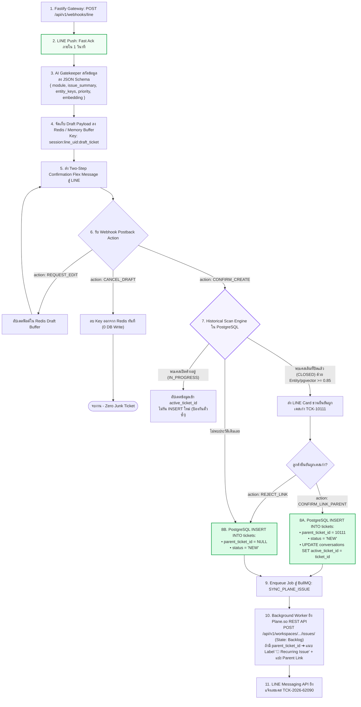

---

#### ⚙️ Dev Subflow 2: Flow 2 - Follow Existing Case Backend Architecture (<5ms Query Engine)
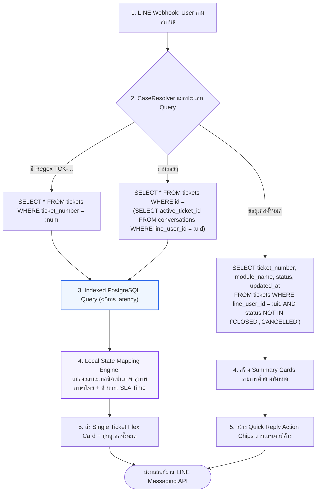

---

#### ⚙️ Dev Subflow 3: Flow 3 - Close Case & UAT Delivery Backend Architecture (Two-Step Close)
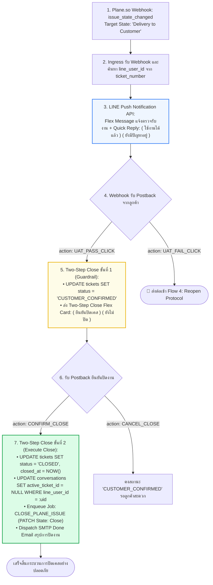

---

#### ⚙️ Dev Subflow 4: Flow 4 - Reopen Case Protocol Backend Architecture (Time Window & Triage)
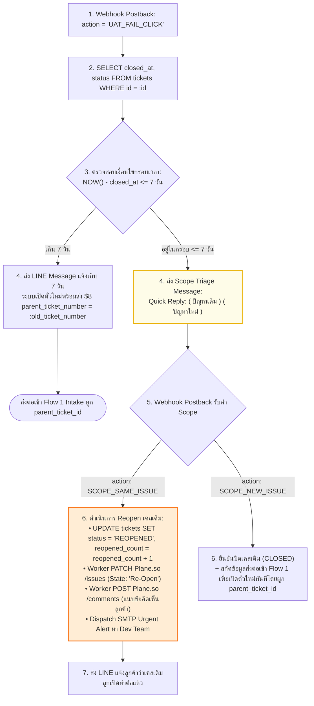

---

#### ⚙️ Dev Subflow 5: Flow 5 - Cancel Case Protocol Backend Architecture (Memory Flush & Status Update)
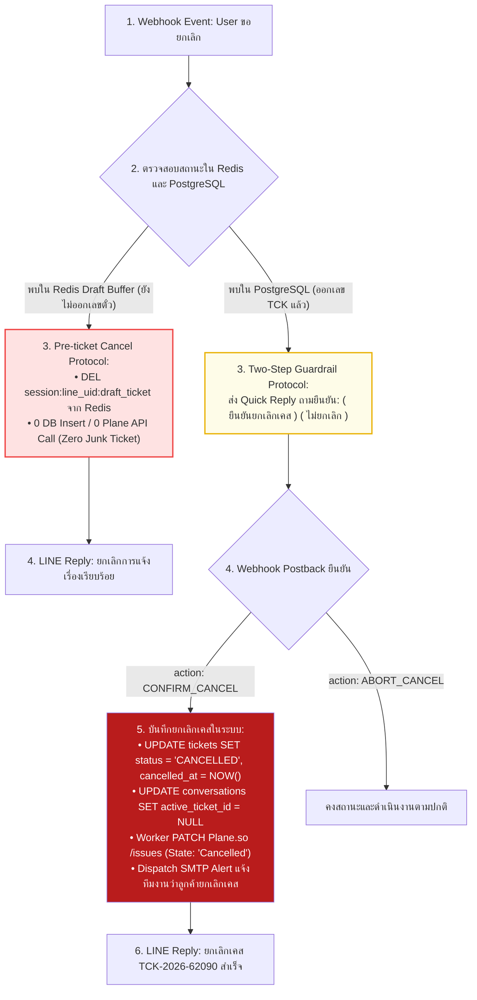

---

#### ⚙️ Dev Subflow 6: Flow 6 - CaseResolver Engine Backend Architecture (Priority Resolution P0 - P7)
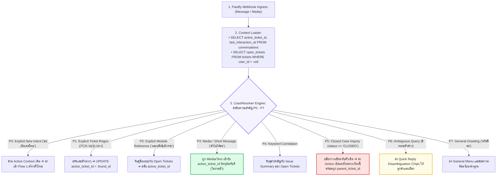

---
## 3. ตารางประกบ 3 มุมมองการทดสอบ (The 3-Way Test Alignment Table)

> **วัตถุประสงค์:** ใช้สำหรับการทดสอบจริง (Live UAT & Testing Session) เพื่อให้ผู้ทดสอบ (Tester), ผู้ใช้งาน (User) และทีมวิศวกร (Developer) เห็นภาพตรงกันแบบช็อตต่อช็อต โดยประกบ:
> 1. **การกระทำของผู้ทดสอบ (Tester Action):** ข้อความที่พิมพ์ หรือ ปุ่มที่กด
> 2. **หน้าจอที่ผู้ใช้เห็น (What User Sees on LINE OA):** ข้อความ การ์ด หรือปุ่มตัวเลือกที่ปรากฏบนมือถือ
> 3. **การทำงานเบื้องหลังระบบ (Developer & System Behind-the-Scenes):** กิจกรรมที่เกิดขึ้นจริงใน Ingress, AI, DB, Focus Session, Plane.so และ Notification

| รหัสทดสอบ | 1. การกระทำของผู้ทดสอบ (Tester Action) | 2. หน้าจอที่ผู้ใช้เห็นบน LINE OA (What User Sees) | 3. การทำงานเบื้องหลังระบบ (Developer & System Flow) |
| :---: | :--- | :--- | :--- |
| **TC-01** | พิมพ์แจ้งปัญหา: *"แจ้งเคสค่ะ ระบบชดใช้เงินยืม ต้องการย้อนสถานะ..."* | ได้รับข้อความตอบรับทันทีภายใน 1 วินาที: *"รับเรื่องแล้วนะคะ ขอเวลาสักครู่ค่ะ"* | Ingress รับ Webhook (POST /line) ➔ ยิง LINE Push Message กลับทันที (<1s) พร้อมส่ง payload ให้ AI Worker |
| **TC-02** | รอประมาณ 2-3 วินาทีหลังข้อความตอบรับแรก | ได้รับการ์ดสรุปปัญหาจาก AI ระบุระบบชดใช้เงินยืม พร้อมปุ่ม 3 ปุ่ม: `(ยืนยัน)` `(ขอแก้ไขข้อมูล)` `(ยกเลิก)` | AI Gatekeeper สกัดฟิลด์ (module, issue, entity_keys, priority) ➔ เก็บลง Redis Draft State ➔ ส่ง Flex Card (Zero Junk Ticket) |
| **TC-03** | แตะปุ่ม `(ขอแก้ไขข้อมูล)` แล้วพิมพ์: *"แก้อาการเป็นเล่มที่ 05 และขอด่วนมาก"* | บอทถามเจาะจง: *"ต้องการแก้ตรงส่วนไหนคะ?"* เมื่อพิมพ์แก้ ได้การ์ดสรุปใหม่ที่อัปเดตข้อมูลถูกต้องโดยไม่ทวนข้อความเดิมซ้ำ | Webhook รับ Postback (REQUEST_EDIT) ➔ อัปเดตข้อมูลใน Redis Draft Buffer ➔ ประกอบ Flex Card ส่งกลับหาผู้ใช้ |
| **TC-04** | แตะปุ่ม `(ยกเลิก)` ในขั้นตอนการตรวจสอบสรุปปัญหา | บอทแจ้ง: *"ยกเลิกการแจ้งเรื่องเรียบร้อยแล้วค่ะ"* หน้าจอพร้อมรับการแจ้งใหม่ | Webhook รับ Postback (CANCEL_DRAFT) ➔ Flush Redis Draft Key ทิ้ง ➔ ไม่มีการรัน INSERT ใน PostgreSQL (ตั๋วขยะ = 0) |
| **TC-05A** | แตะปุ่ม `(ยืนยัน)` ในกรณีที่เป็น **ปัญหาใหม่เอี่ยมที่ไม่เคยมีในระบบมาก่อน** | ได้รับข้อความ: *"ออกเลขเคสใหม่ TCK-2026-62090 เรียบร้อยแล้วค่ะ ทีมงานกำลังเริ่มตรวจสอบ..."* | PostgreSQL Historical Scan ไม่พบประวัติเดิม ➔ INSERT tickets (`parent_ticket_id = NULL`) ➔ UPDATE active_ticket_id ➔ Plane Sync (Backlog) |
| **TC-05B** | แตะปุ่ม `(ยืนยัน)` ในกรณีที่ **ตรวจพบเคสเดิมที่เคยปิดไปแล้วในอดีต (เช่น ปิดไป 3 เดือนก่อน)** | บอททักถาม: *"ตรวจพบว่าอาการนี้เคยได้รับการแก้ไขในเคส TCK-2026-10111 ที่ปิดไปแล้ว ต้องการเปิดเคสใหม่โดยอ้างอิงประวัติจากเคสเดิมใช่ไหมคะ?"* แตะ `(ยืนยันเปิดใหม่อ้างอิงเคสเดิม)` ➔ ได้รับข้อความยืนยันเปิดเคสพร้อมระบุว่าผูกประวัติกับเคสเก่าให้แล้ว | Historical Scan Engine ตรวจพบ Entity Match หรือ pgvector Similarity >= 0.85 ➔ ผู้ใช้ยืนยัน ➔ INSERT tickets (`parent_ticket_id = 10111`) ➔ Plane.so แปะ Label `🔁 Recurring Issue` พร้อมแปะลิงก์เชื่อมตั๋วแม่ |
| **TC-05C** | พิมพ์แจ้งปัญหาที่ **กำลังอยู่ระหว่างดำเนินการ (In Progress)** ซ้ำเข้ามา | บอทแจ้งเตือน: *"เคสนี้กำลังดำเนินการตรวจสอบอยู่ค่ะ (TCK-2026-62090)"* พร้อมแนบข้อความเพิ่มให้ โดยไม่เปิดตั๋วใหม่ซ้ำซ้อน | Historical Scan ตรวจพบ status IN ('BACKLOG','IN_PROGRESS') ➔ บล็อกการ INSERT ใหม่ ➔ นำเข้ากฎ P3 แนบข้อความลงในการ์ดเดิม (Duplicate Prevention) |
| **TC-06** | ส่งรูปภาพ Screenshot หน้าจอโปรแกรมเข้ามาในแช็ตทันที | บอทตอบทันที: *"แนบรูปภาพเข้าเคส TCK-2026-62090 เรียบร้อยแล้วค่ะ"* (ไม่ถามเลขเคสซ้ำ) | Ingress รับ image event ➔ CaseResolver ใช้กฎ P3 ดึง active_ticket_id ➔ INSERT ticket_attachments ➔ Worker แนบรูปเข้า Plane Issue |
| **TC-07** | พิมพ์ถามสถานะ: *"ตามเคส TCK-2026-62090 ให้หน่อยค่ะ"* | ได้รับการ์ดรายงานสถานะภาษาไทยชัดเจนในเสี้ยววินาที (<5ms) พร้อมปุ่ม: `(ดูเคสล่าสุดทั้งหมด)` | CaseResolver กฎ P1 สกัด Regex รหัสตั๋ว ➔ ยิง Indexed SELECT PostgreSQL ตรง (<5ms) ➔ Map สถานะเป็นภาษาไทยและคำนวณ SLA |
| **TC-08** | แตะปุ่ม `(ดูเคสล่าสุดทั้งหมด)` ใต้การ์ดสถานะ | ได้รับการ์ดแสดงรายการตั๋วค้างทั้งหมด พร้อมปุ่มลัดเลขเคสด้านล่าง: `(TCK-62090)` `(TCK-19804)` | Query SELECT tickets WHERE line_user_id = :uid AND status NOT IN ('CLOSED','CANCELLED') ➔ ประกอบ Flex Message + Quick Reply Chips |
| **TC-09** | พิมพ์ถามกว้างๆ: *"แล้วเรื่องระบบรายงานล่ะคะ"* (มีหลายเคสรายงานค้างอยู่) | บอทไม่เดาเอง แต่ส่งปุ่มตัวเลือกมาให้เลือก: `(รายงานกรุงไทย TCK-19804)` `(สิทธิเบิกจ่าย TCK-03834)` | CaseResolver กฎ P6 ตรวจพบความกำกวม (Ambiguity) ➔ ค้นหา Candidate Tickets ➔ ส่ง Quick Reply Disambiguation Chips |
| **TC-10** | แตะเลือกปุ่ม `(รายงานกรุงไทย TCK-19804)` | บอทแจ้ง: *"สลับมาดูแลเคสรายงานกรุงไทยแล้วค่ะ"* | Webhook Postback ➔ CaseResolver อัปเดต conversations.active_ticket_id = TCK-19804 ➔ รีเซ็ต Session Focus สำเร็จ |
| **TC-11** | พิมพ์: *"แอดมินคะ ขอยกเลิกเคส TCK-2026-62090 ค่ะ"* | บอทส่งปุ่มถามยืนยัน 2 ชั้น: `(ยืนยันยกเลิกเคส)` `(ไม่ยกเลิก)` เมื่อกดยืนยัน แจ้งยกเลิกเคสเรียบร้อย | Two-Step Cancel Guardrail ➔ UPDATE tickets SET status='CANCELLED' ➔ เคลียร์ active_ticket_id ➔ Plane PATCH Cancelled ➔ ยิง Email แจ้งทีมงาน |
| **TC-12** | ช่างย้ายการ์ดใน Plane.so ไปที่สถานะ `Delivery to Customer` | มี LINE Push แจ้งเตือนเด้งเตือน: *"ทีมงานแก้ไขเรียบร้อยแล้ว รบกวนตรวจที่ระบบจริงนะคะ"* พร้อม 2 ปุ่ม: `(ใช้งานได้แล้ว)` `(ยังมีปัญหาอยู่)` | Plane.so Webhook ยิงหา Ingress ➔ ดึง line_user_id ➔ LINE Push Notification API ส่ง Flex Message นัดหมายตรวจรับงาน |
| **TC-13** | ทดสอบระบบจริงแล้ว แตะ `(ใช้งานได้แล้ว)` แล้วแตะ `(ยืนยันปิดเคส)` ในขั้นตอนยืนยัน | บอทส่งการ์ดยืนยันปิดงานอีกครั้ง เมื่อกดยืนยัน ได้รับข้อความมาตรฐานขอบคุณและแจ้งปิดงานสมบูรณ์ | Two-Step Close ขั้นที่ 1 ปรับ CUSTOMER_CONFIRMED ➔ ขั้นที่ 2 ปรับ CLOSED, closed_at=NOW() ➔ เคลียร์ active_ticket_id ➔ Plane Close ➔ ยิง Done Email |
| **TC-14** | ทดสอบระบบจริงแล้ว แตะ `(ยังมีปัญหาอยู่)` แล้วแตะเลือก `(ปัญหาเดิม)` | บอทแจ้ง: *"ส่งเรื่องกลับให้ทีมพัฒนาแก้ไขเคสเดิมต่อทันทีเรียบร้อยแล้วค่ะ"* | ตรวจ closed_at <= 7 วัน ➔ Scope Triage ➔ UPDATE status='REOPENED' ➔ Worker PATCH Plane Re-Open + บันทึก Comment ➔ ยิงอีเมลเตือนด่วนหา Dev |
| **TC-15** | พิมพ์ถามถึงเคสที่ปิดสมบูรณ์ไปแล้ว: *"สอบถามเคสรายงานกรุงไทยที่ปิดไปแล้วค่ะ"* | บอทแจ้งเตือนว่าเคสปิดแล้ว ป้องกันการเขียนทับ พร้อมมีปุ่มลัด: `(➕ เปิดเคสใหม่จากเรื่องนี้)` | CaseResolver กฎ P5 ตรวจพบ status == 'CLOSED' ➔ ป้องกันการแก้ข้อมูลเดิม ➔ ส่ง Action Button ให้เปิดตั๋วใหม่โดยสืบทอดบริบทและผูก parent_ticket_id |

---
## 4. แผนภาพเส้นทางประสบการณ์ผู้ใช้ (User Journey Map - Customer-Centric)
> **นิยาม:** แผนภาพเส้นทาง (Journey), จุดสัมผัส (Touchpoints), การกระทำ (Actions), ความคิดและความรู้สึก (Thoughts & Emotions) ของผู้ใช้งานจริงจากมุมมองหน้าบ้าน 100% โดยตัดกล่องเทคนิคการประมวลผลหลังบ้าน (Database, API, Plane.so) ออกทั้งหมด

### 5.1 ภาพรวมเส้นทางประสบการณ์ผู้ใช้ (Grand User Journey Map)

* **Persona:** คุณสมใจ — เจ้าหน้าที่การเงินและพัสดุ สำนักงานสรรพสามิตพื้นที่ (ผู้ใช้งานระบบชดใช้เงินยืมและระบบสิทธิเบิกจ่าย)
* **เป้าหมาย (Goal):** ต้องการแจ้งปัญหาให้ได้รับการแก้ไขอย่างรวดเร็วเพื่อไม่ให้งานราชการสะดุด ไม่ต้องการจำรหัสระบบยุ่งยาก และอยากได้รับการดูแลเหมือนคุยกับเจ้าหน้าที่บริการมืออาชีพ

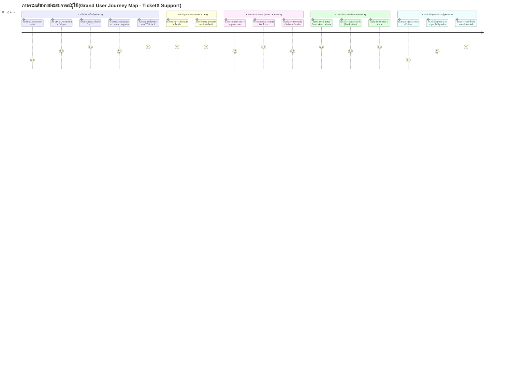

#### ตารางแจกแจงมิติประสบการณ์ผู้ใช้ (Grand Customer Experience Matrix)

| ระยะ (Stage) | เป้าหมายของผู้ใช้ (User Goal) | สิ่งที่ผู้ใช้ทำ (User Actions) | จุดสัมผัส (Touchpoints) | ความคิด & อารมณ์ (Thoughts & Feelings) | ปัญหาเดิมที่ถูกขจัด (Pain Points Eliminated) | จุดสร้างความประทับใจ (Delight Factors) |
| :--- | :--- | :--- | :--- | :--- | :--- | :--- |
| **1. พบปัญหา & เปิดเคส** | อยากส่งเรื่องให้ถึงทีมงานเร็วที่สุด | พิมพ์ภาษาคน เช่น *"แจ้งเคสค่ะ ชดใช้เงินยืมย้อนสถานะไม่ได้"* | LINE OA Chat | 😟 *"กังวลว่าจะตอบช้าไหม ต้องพิมพ์อะไรบ้าง"* ➔ 🙂 มั่นใจเมื่อบอทตอบใน 1 วิ | ไม่ต้องกรอกแบบฟอร์มยาวเหยียด ไม่ต้องจำรหัส Error | AI สรุปเรื่องให้ทันที มีปุ่มกดยืนยันหรือขอแก้ไขได้ |
| **2. แนบหลักฐาน** | ส่งภาพหน้าจอเพื่อยืนยันอาการ | ส่งรูป Screenshot ตามเข้ามาในห้องแช็ต | LINE Media Message | 😐 *"บอทจะรู้เรื่องไหม หรือต้องบอกเลขเคสซ้ำอีก"* | ไม่ต้องพิมพ์ทวนเลขตั๋ว ไม่ต้องเปิดหน้าต่างใหม่ | บอทตอบทันทีว่าแนบรูปเข้าเคสเดิมให้เรียบร้อยแล้ว |
| **3. ติดตามสถานะ** | อยากรู้ว่างานคืบหน้าถึงไหน ช่างดูหรือยัง | พิมพ์ตามงานตรงๆ หรือแตะปุ่ม *(ดูเคสล่าสุดทั้งหมด)* | LINE Chat & Quick Reply | 🤔 *"เรื่องถึงไหนแล้ว จะเสร็จทันรอบเบิกจ่ายไหม"* | ไม่ต้องโทรตาม ไม่ต้องรอแอดมินมาเปิดอ่านข้ามวัน | ได้สถานะล่าสุดทันที และมีปุ่มลัดระบุเลขเคสให้จิ้มตามต่อ |
| **4. สลับเรื่องคุย** | ต้องการถามถึงอีกเรื่องที่มีเคสค้างอยู่ | พิมพ์ถามกว้างๆ เช่น *"แล้วเรื่องรายงานล่ะคะ"* | LINE Chat & Choice Chips | 🧐 *"บอทจะงงไหม มี 2 เรื่องค้างอยู่"* | บอทไม่เดาเองจนตอบผิด ไม่เอาเรื่องมาปนกัน | ส่งปุ่มตัวเลือกเฉพาะเคสที่ค้างอยู่ให้ชี้เป้าได้อย่างแม่นยำ |
| **5. ตรวจรับงาน (UAT)** | ทดสอบบนระบบจริงเพื่อปิดงาน | เข้าไปตรวจสอบที่หน้าจอระบบงานจริง | LINE Push Notification & Confirmation | 😃 *"ดีใจที่ทีมงานแก้เสร็จแล้ว มีข้อความเด้งเตือน"* | ไม่ต้องคอยล็อกอินเข้าเว็บมาสุ่มตรวจเอง | มีปุ่มให้กดเลือก *(ใช้งานได้แล้ว)* หรือ *(ยังมีปัญหาอยู่)* ได้ทันที |
| **6. จบงาน / ทำต่อ** | ปิดเคสอย่างสบายใจ หรือแจ้งแก้งานเดิม | กดปิดเคส หรือ กดแจ้งว่ายังมีปัญหาเดิมอยู่ | LINE Two-Step Confirmation Card | 🥰 *"สบายใจ งานเสร็จเรียบร้อย"* หรือ 😌 *"มั่นใจที่ช่างรับงานต่อทันที"* | ช่างไม่ปิดเคสหนี และไม่ต้องเริ่มเล่าเรื่องใหม่ตั้งแต่ต้น | มีระบบถามยืนยัน 2 ชั้นเพื่อความปลอดภัยในการปิดงาน |

---

### 5.2 เส้นทางประสบการณ์ย่อย 6 ระบบ (Sub-User Journeys)

#### 🔹 Sub-Journey 1: Flow 1 - การเปิดเคสใหม่ (New Case Intake Experience)
* **User Goal:** ต้องการส่งเรื่องปัญหาให้เร็วที่สุดโดยไม่ต้องกรอกฟอร์มซับซ้อน
* **What User Does:** พิมพ์ข้อความแจ้งปัญหาด้วยภาษาพูดปกติของหน่วยงาน
* **What User Sees:**
  1. ข้อความตอบรับอัตโนมัติทันที: *"รับเรื่องแล้วนะคะ ขอเวลาสักครู่ค่ะ"* (ภายใน 1 วินาที)
  2. การ์ดสรุปปัญหาจาก AI แสดง: ชื่อระบบ, สรุปประเด็น, ระดับความเร่งด่วน
  3. ปุ่มลัด 3 ทางเลือก: `( ยืนยัน )` `( ขอแก้ไขข้อมูล )` `( ยกเลิก )`
  4. เมื่อกดยืนยัน ได้รับข้อความ: *"ออกเลขเคส TCK-2026-62090 เรียบร้อยแล้วค่ะ"*
* **User Feeling:** 🤩 ประทับใจในความเร็ว รู้สึกเหมือนคุยกับเจ้าหน้าที่บริการจริง

#### 🔹 Sub-Journey 2: Flow 2 - การติดตามสถานะ (Follow-up Experience)
* **User Goal:** ทราบความคืบหน้าของงานโดยไม่ต้องโทรศัพท์สอบถาม
* **What User Does:** พิมพ์ถามสถานะ เช่น *"ตามเคส TCK-2026-62090 ให้หน่อยค่ะ"* หรือแตะปุ่ม *(ดูเคสล่าสุดทั้งหมด)*
* **What User Sees:** การ์ดรายงานสถานะภาษาสุภาพ เช่น *"ทีมงานกำลังดำเนินการตรวจสอบและแก้ไขปัญหาค่ะ"* พร้อมแจ้งเวลาคาดการณ์ และมีปุ่มลัดเลขเคสอื่นๆ ให้กดติดตามต่อได้ในคลิกเดียว
* **User Feeling:** 😌 รู้สึกโปร่งใส มั่นใจว่าเรื่องไม่ตกหล่น

#### 🔹 Sub-Journey 3: Flow 3 - การตรวจรับงาน & ปิดเคส (Sign-off Experience)
* **User Goal:** ได้รับการแจ้งเตือนเมื่อระบบแก้เสร็จ และได้ทดสอบก่อนปิดงานจริง
* **What User Does:** ได้รับ LINE Push Notification เด้งเตือน ➔ ไปทดสอบที่หน้าจอระบบจริง ➔ แตะปุ่ม `( ใช้งานได้แล้ว )` ➔ แตะปุ่มยืนยันปิดเคส
* **What User Sees:** ข้อความมาตรฐานขอบคุณ พร้อมสรุปการปิดงานอย่างเป็นทางการ
* **User Feeling:** 🥳 ประทับใจที่มีการแจ้งเตือนตรงถึงมือถือ และตนเองเป็นผู้มีอำนาจตรวจรับและกดปิดเคสจริง

#### 🔹 Sub-Journey 4: Flow 4 - การ Reopen เคสเดิม (Issue Persists Experience)
* **User Goal:** ปัญหาเดิมยังแก้ไม่ขาด ต้องการส่งกลับให้ช่างคนเดิมแก้ไขต่อทันที
* **What User Does:** แตะปุ่ม `( ยังมีปัญหาอยู่ )` ➔ แตะเลือก `( ปัญหาเดิม )` พร้อมพิมพ์ระบุอาการเพิ่มเติม
* **What User Sees:** บอทแจ้งทันที: *"ส่งเรื่องกลับให้ทีมพัฒนาแก้ไขเคสเดิมต่อทันทีเรียบร้อยแล้วค่ะ"*
* **User Feeling:** 🛡️ อุ่นใจมากที่ไม่ต้องเสียเวลาเปิดตั๋วใหม่ และไม่ต้องพิมพ์เล่าเรื่องใหม่ตั้งแต่ต้น

#### 🔹 Sub-Journey 5: Flow 5 - การยกเลิกเคส (Cancellation Experience)
* **User Goal:** ปัญหาคลี่คลายแล้ว หรือคุยกับหัวหน้างานแล้วไม่ต้องแก้ ต้องการยกเลิก
* **What User Does:** แตะปุ่มยกเลิก หรือพิมพ์ *"ขอยกเลิกเคส TCK-2026-62090 ค่ะ"* ➔ แตะปุ่มยืนยัน
* **What User Sees:** การ์ดถามยืนยันเพื่อความปลอดภัย เมื่อกดยืนยันระบบแจ้งยกเลิกเคสเรียบร้อย
* **User Feeling:** 🧘 โล่งใจที่จัดการยกเลิกได้เองทันทีโดยไม่ต้องทำหนังสือแจ้งยกเลิก

#### 🔹 Sub-Journey 6: Flow 6 - บริบทหลายเคส & สลับเรื่อง (Multi-Case Switching Experience)
* **User Goal:** ต้องการคุยสลับไปมาหลายปัญหา หรือแนบรูปภาพโดยไม่สับสน
* **What User Does:** ส่งรูป Screenshot หน้าจอโปรแกรม หรือพิมพ์ถามลอยๆ ถึงอีกเรื่องหนึ่ง
* **What User Sees:** บอทผูกรูปเข้าเคสปัจจุบันให้อัตโนมัติ หรือถ้าคำถามก้ำกึ่ง บอทจะส่งปุ่มตัวเลือกมาให้จิ้มเลือกอย่างชัดเจน
* **User Feeling:** 💡 ประทับใจที่บอทฉลาด ไม่งี่เง่า ไม่ถามซ้ำซาก และไม่ทำให้ข้อมูลปนกัน

---

## 5. แผนภาพสถาปัตยกรรมระบบและการไหลเชิงเทคนิค (Technical System Flow & Architecture)
> **นิยาม:** สถาปัตยกรรมเชิงระบบ (System-Centric) แสดงการทำงานเบื้องหลัง Data Flow, State Transitions, API Payloads, Database Schema Mutations, Worker Jobs และ Notification Triggers สำหรับทีมพัฒนาและสถาปัตยกรรมระบบ

### 5.1 แผนภาพลำดับการทำงานเชิงเทคนิคภาพรวม (Grand Technical Architecture Sequence Diagram)

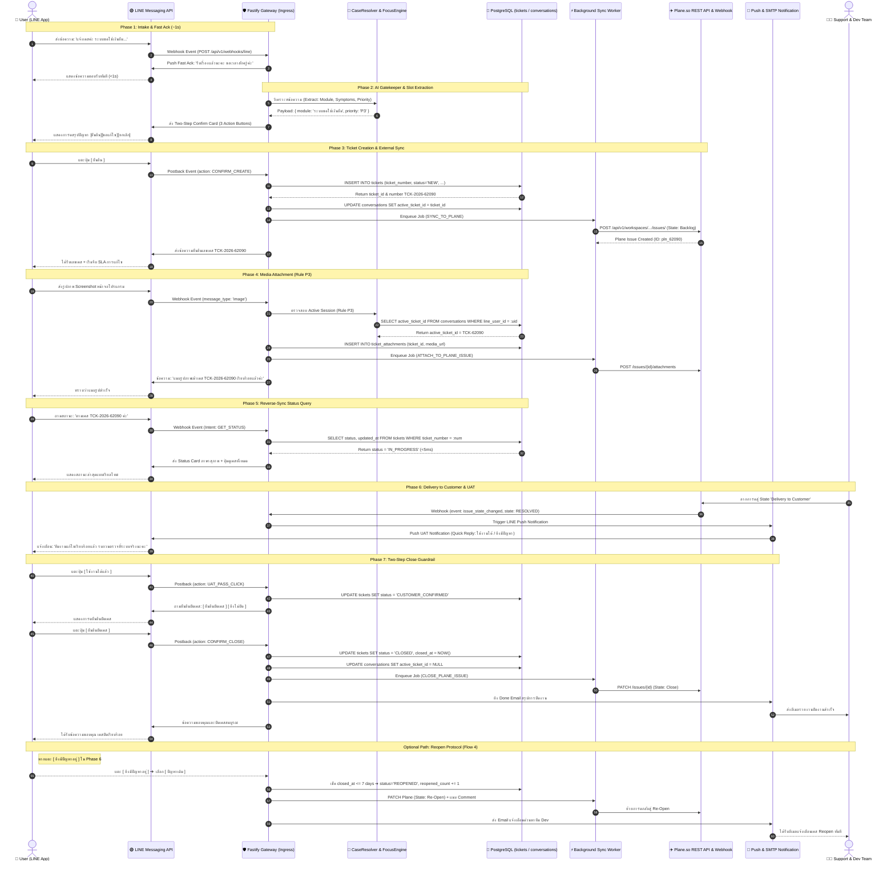

---

### 5.2 ข้อมูลจำเพาะทางเทคนิคและ State Machine ทั้ง 6 โฟลว์ย่อย (Subflow Technical Specs)

#### ⚙️ Tech Spec 1: Flow 1 - New Case Intake
* **API Ingress:** `POST /api/v1/webhooks/line`
* **AI Slot Extraction Schema:**
  ```json
  {
    "extracted_module": "ระบบชดใช้เงินยืม",
    "issue_summary": "ต้องการย้อนสถานะใบเสร็จเล่มที่ 05 จากชำระแล้วเป็นค้างชำระ",
    "priority": "P3",
    "confidence_score": 0.96
  }
  ```
* **Database State Machine:**
  * `INSERT INTO tickets`: `status = 'NEW'`, `source = 'LINE_OA'`, `ticket_number = 'TCK-YYYY-NNNNN'`
  * `UPDATE conversations`: `active_ticket_id = tickets.id`, `last_interaction_at = NOW()`
* **External Sync (Plane.so):**
  * `POST /api/v1/workspaces/{slug}/projects/{id}/issues/`
  * Payload: `{ name: "[TCK-2026-62090] ระบบชดใช้เงินยืม...", state_id: "STATE_BACKLOG", priority: "urgent" }`
* **Zero Junk Ticket Guardrail:** หากผู้ใช้กดยกเลิกในขั้นตอน Two-Step ข้อมูลร่างจะถูกลบออกจาก In-Memory Session ทันทีโดยไม่มีการเขียนลงฐานข้อมูลหรือสร้าง Issue ใน Plane.so

---

#### ⚙️ Tech Spec 2: Flow 2 - Follow Existing Case (Real-time Lookup)
* **Query Latency Target:** $\le 5\text{ ms}$ (ผ่าน Indexed PostgreSQL & Reverse-Sync Architecture)
* **Strategy:**
  1. ถ้าผู้ใช้ระบุเลขเคสตรงๆ: `SELECT * FROM tickets WHERE ticket_number = :tck_num`
  2. ถ้าถามสถานะลอยๆ: `SELECT * FROM tickets WHERE id = (SELECT active_ticket_id FROM conversations WHERE line_user_id = :uid)`
  3. ถ้าขอดูเคสทั้งหมด: `SELECT ticket_number, module_name, status, updated_at FROM tickets WHERE line_user_id = :uid AND status NOT IN ('CLOSED', 'CANCELLED')`
* **State Mapping Matrix (Plane State ➔ Thai Service Presentation):**
  * `Backlog` ➔ *"รับเรื่องเรียบร้อย อยู่ระหว่างรอจัดคิวเจ้าหน้าที่ดำเนินการค่ะ"*
  * `In Progress` ➔ *"ทีมงานกำลังดำเนินการตรวจสอบและแก้ไขปัญหาค่ะ"*
  * `Delivery to Customer` ➔ *"ดำเนินการแก้ไขเรียบร้อยแล้ว อยู่ระหว่างรอผู้แจ้งตรวจรับงานค่ะ"*
  * `Close` ➔ *"ปิดงานเรียบร้อยแล้วค่ะ"*
  * `Cancelled` ➔ *"ยกเลิกเคสเรียบร้อยแล้วค่ะ"*

---

#### ⚙️ Tech Spec 3: Flow 3 - Close Case (UAT & Two-Step Close)
* **Ingress Trigger:** Webhook จาก Plane.so เมื่อ Issue ย้ายเข้าสู่ State `Delivery to Customer`
* **LINE Push API Payload:**
  * Endpoint: `POST https://api.line.me/v2/bot/message/push`
  * Template: Flex Message แจ้งผลการแก้ไข พร้อมปุ่ม Quick Reply: `[ ใช้งานได้แล้ว ]` และ `[ ยังมีปัญหาอยู่ ]`
* **Two-Step Close State Machine:**
  ```mermaid
  stateDiagram-v2
      [*] --> DELIVERY_TO_CUSTOMER: ช่างแก้ไขเสร็จ
      DELIVERY_TO_CUSTOMER --> CUSTOMER_CONFIRMED: แตะ [ ใช้งานได้แล้ว ] (Step 1)
      CUSTOMER_CONFIRMED --> CLOSED: แตะ [ ยืนยันปิดเคส ] (Step 2)
      CUSTOMER_CONFIRMED --> DELIVERY_TO_CUSTOMER: แตะ [ ยังไม่ปิด ] (Rollback)
      DELIVERY_TO_CUSTOMER --> REOPENED: แตะ [ ยังมีปัญหาอยู่ ] (เข้าสู่ Flow 4)
      CLOSED --> [*]: ปลด Focus Session + ยิง Done Email
  ```
* **Cleanup Execution:**
  * `UPDATE tickets SET status = 'CLOSED', closed_at = NOW()`
  * `UPDATE conversations SET active_ticket_id = NULL WHERE line_user_id = :uid`
  * Dispatch SMTP Done-Email รายงานผู้บริหารและทีมงาน

---

#### ⚙️ Tech Spec 4: Flow 4 - Reopen Case Protocol
* **Time-Window Guardrail:**
  $$\Delta t = \text{NOW}() - \text{closed\_at}$$
  * หาก $\Delta t > 7\text{ วัน}$: ปฏิเสธการ Reopen ➔ แนะนำให้เปิดตั๋วใหม่ (ส่งต่อเข้า Flow 1)
  * หาก $\Delta t \le 7\text{ วัน}$: อนุญาตให้ประเมินขอบเขตปัญหา
* **Scope Triage Classification:**
  * `SAME_ISSUE`: อาการเดิมที่ยังไม่หาย ➔ ทำการ Reopen ตั๋วเดิมทันที
  * `NEW_ISSUE`: อาการใหม่ที่เพิ่งพบ ➔ ปิดเคสเดิมเป็น Close และนำข้อมูลอาการใหม่ไปเปิดเป็นตั๋วใบใหม่ใน Flow 1
* **Reopen Execution:**
  * `UPDATE tickets SET status = 'REOPENED', reopened_count = reopened_count + 1 WHERE id = :id`
  * Plane.so Patch: `PATCH /issues/{id}` ➔ State: `Re-Open`
  * Comment Append: `POST /issues/{id}/comments` บันทึกข้อคิดเห็นของลูกค้าลงในการ์ดงานเดิม
  * Emergency Alert: ส่งอีเมล High-Priority Alert ถึงทีมผู้รับผิดชอบทันที

---

#### ⚙️ Tech Spec 5: Flow 5 - Cancel Case
* **Branch 1: Pre-Ticket Cancel (ช่วงคัดกรองก่อนออกตั๋ว):**
  * Event: `CANCEL_RESET`
  * Memory Purge: ล้าง Session Context State Buffer ใน Redis/RAM
  * Database: ไม่มีการรันคำสั่ง `INSERT` (Zero Junk Ticket 100%)
* **Branch 2: Post-Ticket Cancel (หลังออกรหัส TCK แล้ว):**
  * Guardrail: Two-Step Prompt ถามยืนยันเพื่อป้องกันการเผลอกดผิด
  * Database: `UPDATE tickets SET status = 'CANCELLED', cancelled_at = NOW()`
  * Focus Unbind: `UPDATE conversations SET active_ticket_id = NULL`
  * Plane Sync: `PATCH /issues/{id}` ➔ State: `Cancelled`
  * Notification: ยิงอีเมลแจ้งเตือนทีม CS/Dev เพื่อหยุดการดำเนินงาน

---

#### ⚙️ Tech Spec 6: Flow 6 - CaseResolver Engine (ลำดับความสำคัญ P0 - P7)
ระบบวิเคราะห์ความตั้งใจของผู้ใช้ (Intent Resolution) ด้วยลำดับความสำคัญ 8 ชั้น:

| ระดับ (Priority) | กฎการจับคู่ (Resolution Rule) | ตัวอย่างข้อความ / การกระทำ | การทำงานของระบบ (System Action) |
| :---: | :--- | :--- | :--- |
| **P0** | Explicit Intent for New Ticket | *"ขอเปิดเคสใหม่ค่ะ"*, *"แจ้งปัญหาเรื่องใหม่"* | ข้ามเคสเดิมทั้งหมด ➔ สลับเข้าสู่ Flow 1 ทันที |
| **P1** | Explicit Ticket Number | *"ตามเคส TCK-2026-62090"* | สกัด Regex รหัสตั๋ว ➔ ดึงข้อมูลเคสนั้นโดยตรง |
| **P2** | Explicit Module Reference | *"เรื่องระบบสิทธิเบิกจ่ายเป็นอย่างไรบ้าง"* | ค้นหาเคสที่ยังเปิดอยู่ของผู้ใช้ที่ตรงกับ Module นั้น |
| **P3** | Media & Short Message Continuity | ส่งรูปภาพ Screenshot หรือพิมพ์ *"ยังไม่ได้ค่ะ"* | ผูกเข้ากับ `active_ticket_id` ใน Session ปัจจุบันทันทีโดยไม่ถามซ้ำ |
| **P4** | Contextual Keyword Correlation | คำสำคัญที่ตรงกับ Issue Summary ของเคสค้าง | ดึงเคสที่มีความสัมพันธ์สูงสุดมาเป็น Active Context |
| **P5** | Closed Case Protection Guardrail | ถามถึงเคสที่ `status == 'CLOSED'` ไปแล้ว | ป้องกันการเขียนทับตั๋วเดิม ➔ ส่งปุ่ม `[ ➕ เปิดเคสใหม่จากเรื่องนี้ ]` |
| **P6** | Ambiguous Fallback Disambiguation | มีเคสค้างหลายเรื่อง แล้วพิมพ์ถามกว้างๆ เช่น *"แล้วเรื่องรายงานล่ะ"* | ส่ง Quick Reply Chips ระบุชื่อและเลขเคสให้ลูกค้าแตะเลือก |
| **P7** | General Conversation Fallback | ข้อความทักทายทั่วไป *"สวัสดีค่ะ"*, *"ติดต่อเจ้าหน้าที่"* | ส่งข้อความต้อนรับและแสดงเมนูช่วยเหลือหลัก |

---

## 6. สคริปต์สำหรับการอัดคลิปวิดีโอเดโม (Video Demo Recording Script & Storyboard)

### 🎬 คำแนะนำในการจัดหน้าจอ (Setup & Screen Layout)
* **การแบ่งหน้าจอ (Split Screen 50:50):**
  * **ฝั่งซ้าย:** หน้าจอแช็ต LINE OA (บนมือถือหรือ LINE Desktop)
  * **ฝั่งขวา:** หน้าจอกระดานจัดการงาน Plane.so โครงการ Excise และ Database
* **โทนเสียงผู้บรรยาย:** ภาษาไทยธรรมชาติ ชัดเจน เป็นมืออาชีพ เน้นจุดเด่นที่ฉลาดกว่า Chatbot ทั่วไป

---

### ⏱️ ตารางบทพูดและลำดับเหตุการณ์ในคลิปเดโม (10 Scenes - ประมาณ 8-9 นาที)

#### Scene 1: บทนำและภาพรวมระบบ (00:00 - 00:30)
* **หน้าจอ:** แสดง Split Screen ฝั่งซ้ายเป็น LINE OA ฝั่งขวาเป็นกระดาน Plane.so (กระดานจัดการงาน) ของกรมสรรพสามิต (Excise)
* **บทพูดผู้บรรยาย:**
  > *"สวัสดีครับ วันนี้เราจะมาสาธิตระบบ **AutomationX และ TicketX Platform** ซึ่งเป็นระบบ Customer Support อัจฉริยะที่เชื่อมต่อ LINE OA เข้ากับกระดานงาน Plane.so แบบ End-to-End ครบทั้ง 6 กระบวนการทำงาน โดยนำเคสการใช้งานจริงจากโครงการกรมสรรพสามิต (Excise) มาสาธิตให้เห็นการทำงานแบบเรียลไทม์ครับ"*

---

#### Scene 2: Flow 1 เปิดเคสใหม่ & แก้ไขข้อมูล (00:30 - 02:00)
* **หน้าจอ:** ฝั่งซ้ายพิมพ์แจ้งเคสจริง
* **การกระทำ (Action):**
  1. พิมพ์: `"แจ้งเคสค่ะ ระบบชดใช้เงินยืม ต้องการย้อนสถานะ จากชำระแล้ว เป็นค้างชำระค่ะ"`
  2. สังเกตระบบตอบรับอัตโนมัติ (Fast Ack) ตอบกลับภายใน 1 วินาที ตามด้วยการ์ดสรุปปัญหา 3 ปุ่ม `[ยืนยัน][ขอแก้ไขข้อมูล][ยกเลิก]`
  3. แตะปุ่ม `[ ขอแก้ไขข้อมูล ]`
  4. พิมพ์แก้ไข: `"ขอแก้อาการเป็น ย้อนสถานะของใบเสร็จเล่มที่ 05 และขอความเร่งด่วนด่วนมากค่ะ"`
  5. บอทสรุปใหม่ แตะปุ่ม `[ ยืนยัน ]`
  6. สังเกตฝั่งขวา: เกิดการ์ดใหม่ใน Plane.so สถานะ Backlog (รอดำเนินการ) พร้อมเลข `TCK-2026-62090`
* **บทพูดผู้บรรยาย:**
  > *"เริ่มที่ **Flow ที่ 1: การเปิดเคสใหม่** สังเกตว่าผู้ใช้งานพิมพ์แจ้งเคสด้วยภาษาธรรมชาติของหน่วยงาน เช่น 'แจ้งเคสค่ะ ระบบชดใช้เงินยืม ต้องการย้อนสถานะ...' ทันทีที่ส่งข้อความ ระบบจะมี Fast Ack ตอบกลับรับเรื่องทันทีภายใน 1 วินาที จากนั้นระบบ AI จะวิเคราะห์จับชื่อระบบชดใช้เงินยืม พร้อมส่งการ์ดสรุปประเด็นให้ตรวจสอบก่อน เพื่อป้องกันการเกิดตั๋วขยะในระบบ (Zero Junk Ticket)  
  > เมื่อผู้ใช้กด 'ขอแก้ไขข้อมูล' AI จะถามเจาะจงเฉพาะจุดที่ต้องการแก้โดยไม่ทวนข้อความเดิมซ้ำซาก และเมื่อกดยืนยัน ระบบจะออกเลขติดตาม TCK-2026-62090 ทันที พร้อมจดจำเคสนี้ไว้ในแช็ต และสร้างการ์ดในกระดานงาน Plane.so ฝั่งขวาในสถานะ Backlog แบบเรียลไทม์ครับ"*

---

#### Scene 3: Flow 6 (กฎ P3) ส่งรูปภาพต่อเนื่อง (02:00 - 02:45)
* **หน้าจอ:** ฝั่งซ้ายส่งรูปภาพหน้าจอหน้ารายการชดใช้เงินยืม
* **การกระทำ (Action):**
  1. ส่งรูปหน้าจอระบบชดใช้เงินยืมเข้ามาในแช็ต
  2. บอทตอบทันที: *"ได้รับรูปแล้วนะคะ แนบเข้าเคส TCK-2026-62090 ให้เรียบร้อยแล้วค่ะ"*
* **บทพูดผู้บรรยาย:**
  > *"ต่อมาใน **Flow ที่ 6 กฎ P3 (การคุยเคสต่อเนื่อง)**: หากผู้ใช้งานส่งรูปภาพหน้าจอโปรแกรมตามหลังมา ระบบวิเคราะห์บริบทจะเข้าใจทันทีว่าเป็นข้อมูลเพิ่มเติมของเคสที่กำลังคุยอยู่ และนำรูปภาพไปแนบเข้าตั๋วใบนี้ให้อัตโนมัติ โดยไม่ต้องถามซ้ำให้เสียเวลาครับ"*

---

#### Scene 4: Flow 2 ติดตามสถานะ Real-time แบบระบุเลขเคส & ดูรายการเคส (02:45 - 03:45)
* **หน้าจอ:** ฝั่งซ้ายพิมพ์ตามงานแบบคนทำงานจริง
* **การกระทำ (Action):**
  1. พิมพ์แบบระบุเลขตั๋วตรงๆ: `"แอดมินคะ ตามเคส TCK-2026-62090 ให้หน่อยค่ะ ถึงไหนแล้วเอ่ย"`
  2. บอทตอบสถานะเคสล่าสุดทันที พร้อมปุ่ม `[ ดูเคสล่าสุดทั้งหมด ]`
  3. แตะปุ่ม `[ ดูเคสล่าสุดทั้งหมด ]`
  4. บอทแสดงรายการตั๋ว Excise ทั้งหมด พร้อมปุ่มลัดระบุเลขเคส: `[ TCK-2026-62090 ] [ TCK-2026-19804 ]`
  5. แตะปุ่มเลขตั๋ว `[ TCK-2026-19804 ]` บอทรายงานสถานะเคสรายงานกรุงไทยทันที
* **บทพูดผู้บรรยาย:**
  > *"ใน **Flow ที่ 2: การติดตามสถานะ** ในชีวิตจริงลูกค้ามักจะพิมพ์ถามพร้อมระบุเลขเคสตรงๆ เช่น 'ตามเคส TCK-2026-62090 ให้หน่อยค่ะ' ระบบของเราจะจับเลขเคสได้ทันทีและดึงสถานะจากฐานข้อมูลที่เชื่อมกับกระดานงานแบบ Real-time ทำให้ตอบได้เร็วมากในเสี้ยววินาที (<5ms)  
  > และเมื่อกด 'ดูเคสล่าสุดทั้งหมด' ระบบจะสรุปรายการตั๋วค้างในรูปแบบที่อ่านง่าย พร้อมมีปุ่มลัดเลือกเลขเคสด้านล่าง ให้ผู้ใช้งานแตะติดตามต่อได้ในคลิกเดียวครับ"*

---

#### Scene 5: Flow 6 (กฎ P6 & P1) บริบทหลายเคส & สลับเคสเมื่อกำกวม (03:45 - 04:45)
* **หน้าจอ:** ฝั่งซ้ายพิมพ์คำถามก้ำกึ่ง
* **การกระทำ (Action):**
  1. พิมพ์: `"แล้วเรื่องระบบรายงานล่ะคะ มีใครดูให้หรือยัง"`
  2. บอทจับได้ว่ามีเคสรายงานค้างอยู่ ส่งปุ่มทางเลือก: `[ รายงานกรุงไทย TCK-19804 ] [ สิทธิเบิกจ่าย TCK-03834 ] [ เปิดเคสใหม่ ]`
  3. แตะเลือก `[ รายงานกรุงไทย TCK-19804 ]`
  4. บอทแจ้งสลับมาดูแลเคสนี้ทันที
* **บทพูดผู้บรรยาย:**
  > *"อีกหนึ่งความฉลาดคือ **Flow 6 กฎ P6 เมื่อข้อความก้ำกึ่ง**: เมื่อลูกค้ามีตั๋วค้างหลายใบ แล้วพิมพ์ถามกว้างๆ ว่า 'เรื่องรายงานล่ะคะ' ระบบจะไม่เดาเองจนผิดพลาด แต่จะส่งตัวเลือกที่เกี่ยวข้องให้ลูกค้าชี้เป้าได้อย่างแม่นยำ และเมื่อลูกค้าเลือก ระบบจะทำการสลับมาจดจำเคสนั้นเป็นเคสปัจจุบันทันที โดยที่ยังคงคุยต่อเนื่องในห้องแช็ตเดิมได้อย่างราบรื่นครับ"*

---

#### Scene 6: Flow 5 ยกเลิกเคสหลังเปิดตั๋ว (04:45 - 05:30)
* **หน้าจอ:** ฝั่งซ้ายพิมพ์ขอยกเลิกตั๋ว ฝั่งขวาดูการ์ด Plane.so
* **การกระทำ (Action):**
  1. พิมพ์: `"แอดมินคะ ขอยกเลิกเคส TCK-2026-62090 ให้หน่อยค่ะ คุยกับเจ้าหน้าที่แล้วไม่ต้องย้อนสถานะแล้วค่ะ"`
  2. บอทถามยืนยัน: `[ ยืนยันยกเลิกเคส ] [ ไม่ยกเลิก ]`
  3. แตะปุ่ม `[ ยืนยันยกเลิกเคส ]`
  4. ดูฝั่งขวา: การ์ดใน Plane.so ย้ายเป็น `Cancelled` ทันที พร้อมส่งอีเมลแจ้งทีมงาน
* **บทพูดผู้บรรยาย:**
  > *"สำหรับ **Flow ที่ 5: การยกเลิกเคสหลังเปิดตั๋ว** หากลูกค้าคุยกับหน้างานแล้วพบว่าไม่ต้องแก้ไขแล้ว พิมพ์ขอยกเลิกเคส ระบบจะมีขั้นตอนถามยืนยันซ้ำ เมื่อกดยืนยัน ตั๋วในระบบจะถูกปรับเป็น CANCELLED และย้ายการ์ดในกระดานงาน Plane.so ไปช่อง Cancelled ทันที พร้อมปลดการจดจำเคสในห้องแช็ตออกอย่างปลอดภัยครับ"*

---

#### Scene 7: Flow 3 ตรวจรับงาน & ปิดเคส (05:30 - 06:45)
* **หน้าจอ:** ฝั่งขวา CS ย้ายการ์ด Plane ➔ ฝั่งซ้ายได้รับข้อความแจ้งเตือนทาง LINE
* **การกระทำ (Action):**
  1. บน Plane.so (ฝั่งขวา) ลากการ์ดเคส TCK-2026-19804 (รายงานเงินฝากกรุงไทย) ไปที่สถานะ **`Delivery to Customer` (ส่งมอบให้ลูกค้าตรวจรับ)**
  2. ฝั่งซ้าย (LINE) ได้รับข้อความแจ้งเตือนทันที:  
     > *"ขออนุญาต Update เคสค่ะ ทางทีมได้ดำเนินการแก้ไขเรียบร้อยแล้วค่ะ รบกวนตรวจสอบอีกครั้งที่ระบบใช้งานจริงนะคะ"*  
     > *(ปุ่มลัด: [ ใช้งานได้แล้ว TCK-2026-19804 ] [ ยังมีปัญหาอยู่ TCK-2026-19804 ])*
  3. แตะปุ่ม `[ ใช้งานได้แล้ว TCK-2026-19804 ]`
  4. บอทถามยืนยันปิดเคส: `[ ยืนยันปิดเคส ] [ ยังไม่ปิด ]`
  5. แตะปุ่ม `[ ยืนยันปิดเคส ]` ➔ บอทขอบคุณและปิดเคส บน Plane ย้ายเป็น `Close` (ปิดงาน)
* **บทพูดผู้บรรยาย:**
  > *"เข้าสู่ **Flow ที่ 3: การตรวจรับงานและการปิดเคส** เมื่อทีมงานแก้ไขปัญหาและทดสอบภายในเสร็จแล้ว เจ้าหน้าที่จะย้ายการ์ดไปที่ 'Delivery to Customer' ระบบจะส่ง LINE แจ้งเตือนหาผู้แจ้งทันทีด้วยข้อความมาตรฐานว่า 'รบกวนตรวจสอบอีกครั้งที่ระบบใช้งานจริงนะคะ'  
  > เมื่อผู้ใช้กด 'ใช้งานได้แล้ว' ระบบจะไม่ปิดเคสทันที แต่มีระบบถามยืนยันอีกครั้งเพื่อความปลอดภัยสูงสุด เมื่อลูกค้ายืนยัน การ์ดในกระดานงานจะย้ายไปสถานะ Close (ปิดงาน) และส่งอีเมลสรุปการปิดงานทันทีครับ"*

---

#### Scene 8: Flow 4 การ Reopen เคสเดิมทำต่อ (06:45 - 07:45)
* **หน้าจอ:** ฝั่งซ้ายจำลองเคสที่ตรวจรับงานแล้วยังไม่ผ่าน
* **การกระทำ (Action):**
  1. ในเคสตรวจรับงาน แตะปุ่ม `[ ยังมีปัญหาอยู่ TCK-2026-03834 ]`
  2. พิมพ์บอกอาการ: `"ตรวจสอบที่ระบบจริงแล้ว ระดับการศึกษา ปวส. ยังไม่ขึ้นให้เลือกเลยค่ะ"`
  3. บอทถามคัดกรอง: `[ ปัญหาเดิม ] [ ปัญหาใหม่ ]`
  4. แตะปุ่ม `[ ปัญหาเดิม ]`
  5. ฝั่งขวา (Plane): การ์ดย้ายกลับไปสถานะ **`Re-Open`** พร้อมนำข้อความของลูกค้าไปบันทึกเป็น Comment
* **บทพูดผู้บรรยาย:**
  > *"ในทางกลับกัน **Flow ที่ 4: การเปิดเคสเดิมทำต่อ (Reopen Case)** หากลูกค้าทดสอบแล้วพบว่ายังมีปัญหาอยู่ กด 'ยังมีปัญหาอยู่' ระบบจะตรวจสอบกรอบเวลา 7 วัน และถามแยกแยะว่าเป็น 'ปัญหาเดิม' หรือ 'ปัญหาใหม่'  
  > หากเป็นปัญหาเดิม ระบบจะย้ายการ์ดเดิมกลับไปสถานะ 'Re-Open' ในกระดานงานทันที พร้อมนำข้อความของลูกค้าไปบันทึกเป็น Comment และส่งอีเมลแจ้งเตือนด่วนหาทีมพัฒนา เพื่อแก้ไขต่อได้ทันทีโดยไม่ต้องเปิดตั๋วใหม่ให้ซ้ำซ้อนครับ"*

---

#### Scene 9: Flow 6 (กฎ P5) การป้องกันข้อมูลเคสที่ปิดแล้ว (07:45 - 08:30)
* **หน้าจอ:** ฝั่งซ้ายพิมพ์ถามถึงเคสที่ปิดไปแล้ว
* **การกระทำ (Action):**
  1. พิมพ์: `"สอบถามเรื่องเคส TCK-2026-19804 รายงานกรุงไทยที่ปิดไปเมื่อวานหน่อยค่ะ"`
  2. บอทตอบว่าเคสปิดแล้ว และส่งปุ่ม `[ ➕ เปิดเคสใหม่จากเรื่องนี้ ]`
* **บทพูดผู้บรรยาย:**
  > *"สุดท้ายคือ **Flow 6 กฎ P5 การป้องกันข้อมูลเคสที่ปิดแล้ว**: หากลูกค้าพูดถึงเคสที่ปิดสมบูรณ์ไปแล้ว ระบบจะปกป้องข้อมูล ไม่ยอมให้บันทึกทับตั๋วเดิมเด็ดขาด แต่จะแสดงปุ่มให้ลูกค้าสามารถกด 'เปิดเคสใหม่จากเรื่องนี้' เพื่อนำประเด็นเดิมไปเปิดเป็นตั๋วใบใหม่ได้อย่างราบรื่นครับ"*

---

#### Scene 10: บทสรุป (08:30 - 09:00)
* **หน้าจอ:** แสดงหน้าจอภาพรวมระบบ
* **บทพูดผู้บรรยาย:**
  > *"และทั้งหมดนี้คือความสามารถของ **AutomationX และ TicketX Platform** ที่ช่วยยกระดับการให้บริการผู้ใช้งาน ตอบกลับรวดเร็ว ป้องกันข้อผิดพลาดทุกขั้นตอน และเชื่อมโยงการทำงานระหว่างผู้ใช้, ทีมบริการลูกค้า (CS) และทีมพัฒนาได้อย่างสมบูรณ์แบบ ขอบคุณสำหรับการรับชมครับ"*

---

## 7. แผ่นสรุปผลการตรวจรับระบบ (Live UAT Sign-off Matrix)

| รหัสทดสอบ | รายการทดสอบ | เกณฑ์การผ่านที่คาดหวัง (Expected Result) | ผลการตรวจจริง | ผู้ตรวจรับ |
| :---: | :--- | :--- | :---: | :---: |
| **TC-01** | ระบบตอบรับอัตโนมัติ (Fast Ack) | ตอบกลับข้อความแรกทันทีภายใน $\le 1.5$ วินาที | [ ] ผ่าน | __________ |
| **TC-02** | ระบบถามยืนยัน 2 ขั้นตอน | แสดงการ์ดสรุปพร้อม 3 ปุ่มลัด: `[ยืนยัน][ขอแก้ไขข้อมูล][ยกเลิก]` | [ ] ผ่าน | __________ |
| **TC-03** | การแก้ไขข้อมูลร่างก่อนเปิดเคส | กดขอแก้ข้อมูลแล้ว AI ถามเจาะจง ไม่ทวนสรุปเดิมซ้ำ | [ ] ผ่าน | __________ |
| **TC-04** | การยกเลิกก่อนออกตั๋ว (ป้องกันตั๋วขยะ) | พิมพ์ยกเลิกก่อนออกตั๋ว ข้อมูลร่างถูกล้าง ไม่สร้างตั๋วขยะลงระบบ | [ ] ผ่าน | __________ |
| **TC-05** | การออกเลขเคสและเชื่อมโยงกระดานงาน | ได้รหัส `TCK-...` และการ์ดปรากฏในกระดานงาน (Backlog) | [ ] ผ่าน | __________ |
| **TC-06** | แนบรูปภาพเข้าเคสปัจจุบันอัตโนมัติ (P3) | ส่งรูปหน้าจอ แนบเข้าเคสล่าสุดที่คุยอยู่ทันที ไม่ถามซ้ำซ้อน | [ ] ผ่าน | __________ |
| **TC-07** | สอบถามสถานะแบบระบุเลขเคสตรงๆ | ระบุเลขเคสตรงๆ อ่านสถานะล่าสุดได้ทันทีในเสี้ยววินาที (<5ms) | [ ] ผ่าน | __________ |
| **TC-08** | ดูรายการตั๋วค้างและปุ่มลัดเลือกเคส | แสดงรายการสรุปตั๋วค้าง พร้อมปุ่มลัดเลขเคสให้กดต่อได้ทันที | [ ] ผ่าน | __________ |
| **TC-09** | ส่งปุ่มเลือกเคสเมื่อข้อความก้ำกึ่ง (P6) | ถามกว้างๆ แล้วมีหลายเคสค้าง ระบบส่งปุ่มให้เลือก ไม่เดาเอง | [ ] ผ่าน | __________ |
| **TC-10** | การสลับเคสปัจจุบันในการสนทนา | กดเลือกเคสใหม่แล้ว ระบบสลับมาจำเคสใหม่ได้ถูกต้อง | [ ] ผ่าน | __________ |
| **TC-11** | การขอยกเลิกเคสหลังออกตั๋วแล้ว | ขอยกเลิกตั๋ว มีถามยืนยันซ้ำ และกระดานงานปรับเป็น Cancelled | [ ] ผ่าน | __________ |
| **TC-12** | การแจ้งเตือนตรวจรับงาน (UAT Notification) | เมื่อปรับสถานะส่งมอบงาน ระบบส่ง LINE ชวนตรวจรับที่ระบบจริง | [ ] ผ่าน | __________ |
| **TC-13** | การยืนยันปิดเคสอย่างปลอดภัย (2 ชั้น) | กดยืนยันใช้งานได้ มีถามยืนยันปิดซ้ำ และกระดานงานปรับเป็น Close | [ ] ผ่าน | __________ |
| **TC-14** | การเปิดเคสเดิมทำต่อเมื่อยังมีปัญหา (Reopen) | กดปัญหายังมีอยู่ ถามแยกปัญหาเดิม/ใหม่ และกระดานงานเป็น Re-Open | [ ] ผ่าน | __________ |
| **TC-15** | การป้องกันตั๋วปิดแล้วเสนอเปิดเคสใหม่ (P5) | สอบถามถึงเคสที่ปิดแล้ว ไม่เขียนทับ และมีปุ่มให้กดเปิดเคสใหม่ | [ ] ผ่าน | __________ |
