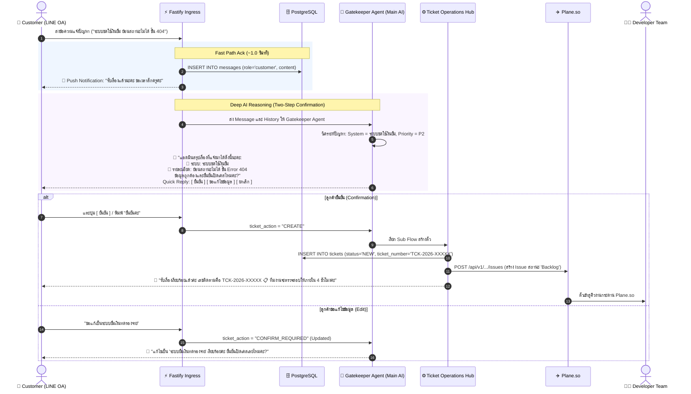
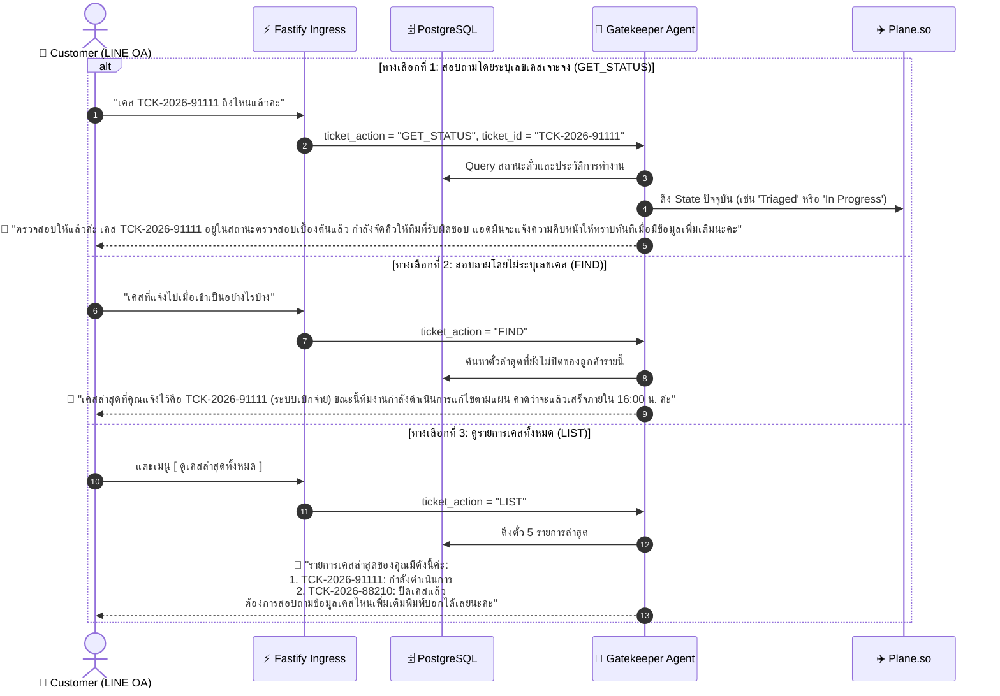
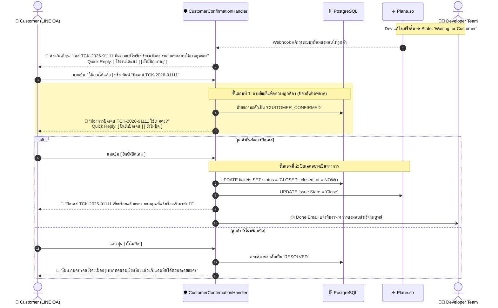
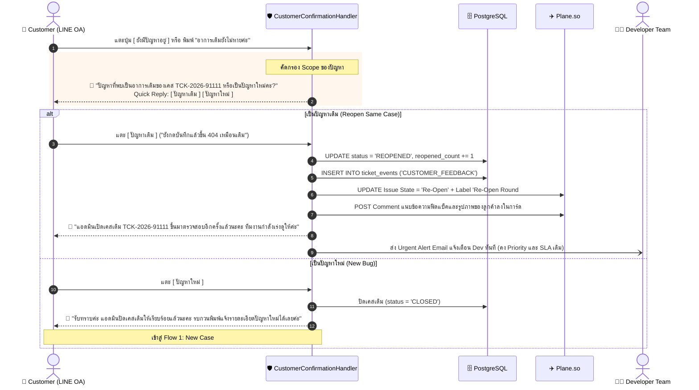
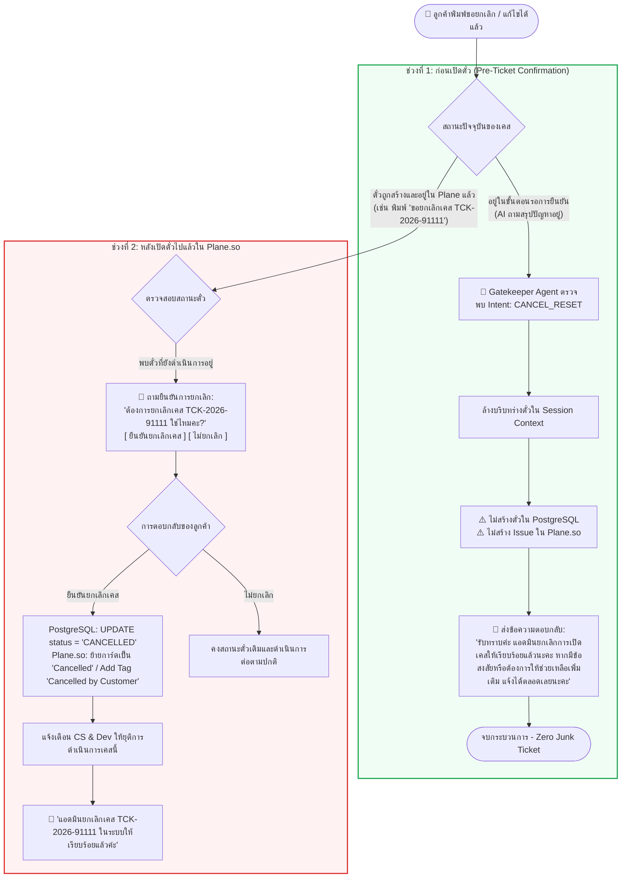
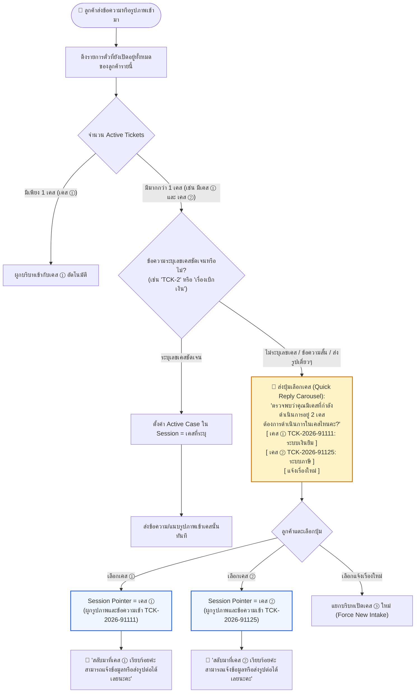
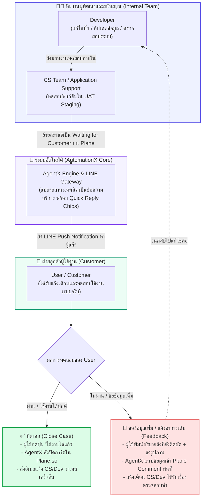

# สถาปัตยกรรมกระบวนการทำงาน 6 Flows และแผนภาพรวมทั้งระบบ (Master E2E Lifecycle Specification)

> **ระบบ:** AutomationX Engine & TicketX Support Automation Platform  
> **เอกสารอ้างอิงหลัก:**  
> - `docs/AUTOMATIONX_WORKFLOW_ARCHITECTURE_EN.md` (Dual-track Fast Ack, Gatekeeper Agent, Domain Subflows)  
> - `docs/AUTOMATIONX_MASTER_E2E_TICKET_LIFECYCLE_FLOW_EN.md` (Plane.so 8 Production States, Two-step Handover)  
> - โค้ดต้นแบบระบบจริง: `system/backend/src/api/routes/lineWebhook.ts`, `CustomerConfirmationHandler.ts`, `TicketStateMachine.ts`, `Main AI Core Flow.json`  
> **วันที่ปรับปรุงล่าสุด:** กันยายน 2026 | สถานะ: ฉบับสมบูรณ์สำหรับสถาปัตยกรรมและทีมพัฒนา

---

## 1. บทสรุปการประเมินความพร้อมของระบบ (System Readiness Matrix)

ระบบปัจจุบันของ **TicketX / AutomationX** รองรับและมีกลไกสำหรับการทำงานของ Flow ต่างๆ ตามรูป Whiteboard โดยมีรายละเอียดการประเมินดังนี้:

| ลำดับ Flow | สถานะปัจจุบัน | ทำได้ทันทีหรือไม่ | กลไกที่มีอยู่แล้วในระบบ | สิ่งที่ต้องพัฒนาเพิ่มเติมเพื่อให้สมบูรณ์ 100% |
| :---: | :--- | :---: | :--- | :--- |
| **1. New Case**<br/>(เปิดเคสใหม่) | **Ready (100%)** | ✅ **ทำได้ทันที** | - Fast Ack Notification (~1s)<br/>- Two-Step Intake Confirmation (`CONFIRM_REQUIRED` ➔ `CREATE`)<br/>- ออกรหัส `TCK-YYYY-NNNNN`<br/>- สร้าง Issue ใน Plane.so สถานะ `Backlog` | ไม่มี (ระบบทำงานสมบูรณ์ครบถ้วน) |
| **2. Follow Existing Case**<br/>(ติดตามเคสเดิม) | **Ready (100%)** | ✅ **ทำได้ทันที** | - Intent `GET_STATUS` (ถามเลขเคสเฉพาะ)<br/>- Intent `FIND` (ถามสถานะเคสของฉัน)<br/>- Intent `LIST` (ดูเคสทั้งหมด)<br/>- ดึงสถานะ Real-time จาก Plane และ DB มาแปลงเป็นภาษาธรรมชาติ | ไม่มี (ระบบดึง State จาก Plane และ DB ตอบกลับได้ทันที) |
| **3. Close Case**<br/>(ปิดเคส) | **Ready (100%)** | ✅ **ทำได้ทันที** | - Two-Step Close Guardrail ใน `CustomerConfirmationHandler`<br/>- ป้องกันปิดผิดเคสด้วยการถามยืนยันซ้ำ<br/>- เปลี่ยนสถานะ `CUSTOMER_CONFIRMED` ➔ `CLOSED`<br/>- Sync Plane เป็น `Close` และส่ง Done Email | ไม่มี (มี Edge Handler ทำงานก่อนถึง AI LLM) |
| **4. Reopen Case**<br/>(เปิดเคสเดิมซ้ำ) | **Ready (100%)** | ✅ **ทำได้ทันที** | - คัดกรอง Scope `[ปัญหาเดิม]` vs `[ปัญหาใหม่]`<br/>- Reopen เคสเดิม (ย้อนหลังไม่เกิน 7 วัน)<br/>- ปรับ Plane เป็น `Re-Open`<br/>- บันทึก Feedback ลง Plane Comment + แจ้งเตือนด่วนหา Dev โดยคง Priority และ SLA เดิม | ไม่มี (มี logic ตรวจจับและอัปเดตลง Plane รองรับแล้ว) |
| **5. Cancel Case**<br/>(ยกเลิกเคส) | **Ready 95%** | ⚠️ **ทำได้เกือบสมบูรณ์ (เพิ่ม 1 จุด)** | - **ก่อนเปิดตั๋ว (Pre-ticket - 100%):** ในช่วงถามยืนยัน ถ้าพิมพ์ "ยกเลิก/แก้ได้แล้ว" ➔ AI จับ `CANCEL_RESET` ล้าง Context ไม่สร้างตั๋ว Zero Junk Ticket | - **หลังเปิดตั๋วแล้ว (Post-ticket):** ต้องเพิ่มคำสั่งให้ `CustomerConfirmationHandler` ตรวจจับคำว่า "ขอยกเลิกเคส TCK-..." ➔ ปรับสถานะเป็น `CANCELLED` ใน Plane โดยตรง |
| **6. Switch Case**<br/>(สลับเคส ① ➔ ②) | **Partial (60%)** | ⚠️ **ต้องเพิ่ม Logic ชัดเจน** | - สกัด `TCK-YYYY-NNNNN` จากข้อความได้<br/>- มีฟังก์ชัน `askWhichCase` โชว์ตั๋วสูงสุด 5 ใบเมื่อมีเคสค้างอยู่ | - **ต้องเพิ่ม:** Session Active Ticket Context Switcher สำหรับลูกค้าที่มีหลายเคสค้าง เพื่อให้รูปภาพและข้อความถัดไปถูกผูกเข้ากับเคสที่เลือกอย่างถูกต้อง |

---

## 2. แผนภาพรวม E2E ทั้งระบบ (Grand Unified Master Architecture Flowchart)

แผนภาพนี้แสดงภาพรวมการทำงานของระบบทั้งหมด ตั้งแต่การรับ Inbound Event จาก LINE OA, การคัดกรองความปลอดภัย, การแยก Fast Path / Deep AI Track, การจัดการทั้ง **6 Flows** ควบคู่ไปกับ **8 สถานะจริงใน Plane.so**, ตลอดจนการทำงานร่วมกันระหว่าง **Dev ➔ CS ➔ AgentX ➔ User**:

```mermaid
flowchart TD
    %% ==========================================
    %% STAGE 0: INGRESS, IDENTITY & ONBOARDING
    %% ==========================================
    subgraph S0["ระยะที่ 0: Ingress Gateway, Identity & Tenant Resolution"]
        UserIn([👤 ผู้ใช้ส่งข้อความ / รูปภาพผ่าน LINE OA]) --> SigCheck{"1. ตรวจสอบ HMAC-SHA256 Signature"}
        SigCheck -- "ไม่ถูกต้อง" --> Reject401([🚫 Reject 401])
        SigCheck -- "ถูกต้อง" --> EventTriage{"2. ประเภท Event"}
        
        EventTriage -- "Unsend" --> SoftDeleteDB["ลบข้อความออกจาก DB"]
        EventTriage -- "Group / Room" --> GroupGateway["ส่งต่อ LINE Group Gateway"]
        EventTriage -- "1:1 Chat (DM)" --> CheckLinked{"3. ผูกข้อมูล Project แล้วหรือยัง?"}
        
        CheckLinked -- "ยังไม่ผูก" --> OnboardingMenu["แสดง Carousel เมนูผูกโปรเจกต์ กรอก Join Code"]
        CheckLinked -- "ผูกเรียบร้อย" --> CheckMediaType{"4. ประเภทเนื้อหา"}
        
        CheckMediaType -- "Sticker" --> IgnoreSticker([🔇 ละเว้น ไม่ส่ง AI])
        CheckMediaType -- "File / Video / Audio" --> WarnFile["แจ้งเตือน: ยังไม่รองรับไฟล์ประเภทนี้"]
        CheckMediaType -- "Text / Image" --> IngestGate["บันทึกข้อความลง DB (Zero Data Loss)"]
    end

    %% ==========================================
    %% STAGE 1: DUAL-TRACK & FAST ACKNOWLEDGEMENT
    %% ==========================================
    subgraph S1["ระยะที่ 1: Dual-Track Processing & Intent Triage"]
        IngestGate --> FastAck["🔔 Fast Path Ack: ยิงข้อความ 'รับเรื่องแล้วนะคะ...' (~1 วินาที)"]
        FastAck --> CheckActiveTickets{"5. ตรวจสอบจำนวนเคสที่เปิดอยู่ (Active Tickets)"}
        
        %% Flow 6: Switch Case Check
        CheckActiveTickets -- "มีเคสค้าง > 1 เคส และข้อความกำกวม" --> Flow6_SwitchPrompt["【Flow 6: Switch Case】<br/>ส่ง Quick Reply: 'ตรวจพบว่ามี 2 เคสค้างอยู่ ต้องการคุยเคสไหนคะ?'<br/>[เคส ①] [เคส ②] [เรื่องใหม่]"]
        Flow6_SwitchPrompt --> UserSelectCase{"ลูกค้าเลือกเคส"}
        UserSelectCase -- "เลือกเคส ①" --> SetSessionCase1["ตั้งค่า Active Case = เคส ①"]
        UserSelectCase -- "เลือกเคส ②" --> SetSessionCase2["ตั้งค่า Active Case = เคส ②"]
        UserSelectCase -- "เลือกเรื่องใหม่" --> ForceNewIntake["ตั้งค่า Force New Case ➔ ส่งต่อไปเปิดเคสใหม่"]
        
        CheckActiveTickets -- "เคสเดียว หรือ ระบุเลขเคสชัดเจน" --> CheckDirectClose{"6. ลูกค้าตอบเรื่องปิดเคส/Reopen หรือไม่?"}
        
        CheckDirectClose -- "เป็นคำตอบปิดเคส / ยืนยัน / ไม่หาย" --> EdgeHandler["🛡️ CustomerConfirmationHandler (ประมวลผลก่อนถึง AI)"]
        CheckDirectClose -- "ข้อความทั่วไป / แจ้งปัญหาใหม่" --> SmallTalkGate{"7. เป็นการทักทาย / ขอบคุณ?"}
        
        SmallTalkGate -- "ใช่ (ข้อความสั้น)" --> FastReply["⚡ Fast Reply: ตอบกลับทันที ไม่เรียก AI"]
        SmallTalkGate -- "ไม่ใช่ (เนื้อหาปัญหา)" --> MainAICore["🤖 Main AI Core Flow (AgentX Gatekeeper Agent)"]
    end

    %% ==========================================
    %% STAGE 2: INTAKE, TWO-STEP CONFIRM & CANCEL
    %% ==========================================
    subgraph S2["ระยะที่ 2: Intake, Two-Step Confirmation & Cancel Protocol"]
        MainAICore --> GateClassifier{"AI Gatekeeper จำแนก Intent"}
        
        %% Human Takeover
        GateClassifier -- "ขอคุยกับคน / โกรธ" --> HumanHandoff["โอนสายหาเจ้าหน้าที่ (Silent Takeover)"]
        
        %% FAQ / Knowledge Search
        GateClassifier -- "สอบถามวิธีใช้งาน / กฎระเบียบ" --> KB_Search["Sub Flow - Project Docs Search (MCP RAG)"]
        KB_Search --> ReplyKB["สังเคราะห์คำตอบจากคลังความรู้ ➔ ส่งให้ลูกค้า"]
        
        %% Status Follow
        GateClassifier -- "ติดตามสถานะเคสเดิม (GET_STATUS / FIND / LIST)" --> Flow2_Follow["【Flow 2: Follow Existing Case】<br/>อ่านสถานะจาก DB & Plane.so ➔ ส่ง Status Report"]
        
        %% Incident Intake
        GateClassifier -- "แจ้งเหตุขัดข้อง / ปัญหาใหม่" --> FreshSummary["สรุปปัญหา + ระดับความรุนแรง (P1-P4)<br/>ถามยืนยัน: 'ข้อมูลถูกต้องไหมคะ ยืนยันเปิดเคสไหม'<br/>[ยืนยัน] [แก้ไข] [ยกเลิก]"]
        
        FreshSummary --> CustDecision{"การตอบกลับของลูกค้า"}
        
        %% Flow 5: Pre-ticket Cancel
        CustDecision -- "ยกเลิก / แก้ได้แล้ว" --> Flow5_PreCancel["【Flow 5: Cancel Case (Pre-ticket)】<br/>Action: CANCEL_RESET<br/>ล้าง Context ไม่เปิดตั๋วใน DB ไม่สร้าง Issue ใน Plane"]
        
        %% Edit
        CustDecision -- "ขอแก้ไขข้อมูล" --> UpdateDraft["ปรับปรุงรายละเอียดปัญหา ➔ ส่งให้ยืนยันใหม่"]
        UpdateDraft --> FreshSummary
        
        %% Flow 1: Create Ticket
        CustDecision -- "ยืนยัน / ถูกต้อง" --> Flow1_Create["【Flow 1: New Case】<br/>Action: CREATE<br/>สร้าง TCK-YYYY-NNNNN ใน PostgreSQL"]
    end

    %% ==========================================
    %% STAGE 3: PLANE.SO PRODUCTION STATES & DEV
    %% ==========================================
    subgraph S3["ระยะที่ 3: ดำเนินการตาม 8 สถานะจริงใน Plane.so & การทำงานทีม Dev"]
        Flow1_Create --> PlaneBacklog["1. State: 'Backlog'<br>(ตั๋วรอจัดคิว / มอบหมายทีม)"]
        
        PlaneBacklog --> PlaneTriaged["2. State: 'Triaged'<br>(CS ตรวจสอบแล้ว กำลังส่งต่อทีม Dev)"]
        
        PlaneTriaged --> PlaneInProgress["3. State: 'In Progress'<br>(ทีม Dev กำลังแก้ไขโค้ดและข้อมูล)<br>• แจ้งเตือนสถานะลูกค้าทุก 1.5 - 2 ชม."]
        
        %% Cancel Case Post-ticket
        PlaneInProgress -.->|"ลูกค้าพิมพ์ 'ขอยกเลิกเคส TCK-...'"| Flow5_PostCancel["【Flow 5: Cancel Case (Post-ticket)】<br/>ย้ายตั๋วเป็น 'CANCELLED' ใน DB และ Plane.so"]
        
        PlaneInProgress --> DevFixed["Dev แก้ไขเสร็จสิ้น ➔ ส่งมอบให้ AppSup ตรวจสอบภายใน"]
        
        %% AppSup Verification
        DevFixed --> AppSupTest{"AppSup ตรวจสอบความถูกต้อง"}
        AppSupTest -- "เทสไม่ผ่าน" --> PlaneTestFailed["4. State: 'Test Failed'<br>(ตีกลับให้ Dev แก้ไขต่อ ลูกค้าไม่ถูกรบกวน)"]
        PlaneTestFailed --> PlaneInProgress
        
        AppSupTest -- "เทสผ่าน" --> PlaneDelivery["5. State: 'Delivery to Customer'<br>(เตรียมส่งมอบงานให้ลูกค้า)"]
        PlaneDelivery --> PlaneWaitCust["6. State: 'Waiting for Customer'<br>(รอลูกค้าเข้าตรวจรับ UAT)"]
    end

    %% ==========================================
    %% STAGE 4: COLLABORATION, UAT, CLOSE & REOPEN
    %% ==========================================
    subgraph S4["ระยะที่ 4: Collaboration Loop, การปิดเคส & Reopen"]
        PlaneWaitCust --> PlaneHook["⚡ Plane Webhook / Poller แจ้งเตือน Backend"]
        PlaneHook --> PushDelivery["ส่ง LINE Push หาผู้แจ้ง:<br>'ทีมงานแก้ไขเรียบร้อยแล้ว รบกวนทดสอบใช้งานนะคะ'<br/>Quick Reply: [ ใช้งานได้แล้ว ] [ ยังมีปัญหาอยู่ ]"]
        
        PushDelivery --> CustUAT{"ผลการตรวจสอบของลูกค้า"}
        
        %% Flow 3: Close Case
        CustUAT -- "ใช้งานได้แล้ว / ปิดเคส" --> EdgeHandler
        EdgeHandler --> AskConfirmClose["【Flow 3: Close Case】<br/>ถามยืนยันซ้ำ: 'ต้องการปิดเคส TCK-... ใช่ไหมคะ?'<br/>[ ยืนยันปิดเคส ] [ ยังไม่ปิด ]"]
        
        AskConfirmClose --> CustFinalClose{"ยืนยันหรือไม่?"}
        CustFinalClose -- "ยืนยันปิดเคส" --> PlaneClose["7. State: 'Close' ใน Plane.so<br>(ตั๋วปิดถาวร + ส่ง Done Email)"]
        PlaneClose --> EndSuccess([✅ จบกระบวนการปิดเคส])
        CustFinalClose -- "ยังไม่ปิด" --> KeepResolved["คงสถานะเปิดไว้ตามเดิม รอลูกค้าพร้อม"]
        
        %% Flow 4: Reopen Case
        CustUAT -- "ยังมีปัญหาอยู่ / ไม่ผ่าน" --> AskReopenScope["【Flow 4: Reopen Case】<br/>ถามแยกแยะ: เป็นปัญหาเดิม หรือ ปัญหาใหม่?<br/>[ ปัญหาเดิม ] [ ปัญหาใหม่ ]"]
        
        AskReopenScope --> ScopeChoice{"การเลือกของลูกค้า"}
        ScopeChoice -- "ปัญหาเดิม (Same Bug)" --> PlaneReOpen["8. State: 'Re-Open' ใน Plane.so<br>(เปิดเคสเดิมขึ้นมาทำต่อ)<br>แนบ Feedback ลง Plane Comment ทันที"]
        PlaneReOpen --> PlaneInProgress
        
        ScopeChoice -- "ปัญหาใหม่ (New Bug)" --> CloseOldOpenNew["ปิดเคสเดิมเป็น Close ➔ ส่งต่อไป Flow 1 เปิดเคสใหม่"]
        CloseOldOpenNew --> FreshSummary
    end

    %% Styles
    style S0 fill:#f8fafc,stroke:#64748b,stroke-width:2px
    style S1 fill:#eff6ff,stroke:#3b82f6,stroke-width:2px
    style S2 fill:#faf5ff,stroke:#a855f7,stroke-width:2px
    style S3 fill:#fefce8,stroke:#eab308,stroke-width:2px
    style S4 fill:#f0fdf4,stroke:#22c55e,stroke-width:2px
    style Flow1_Create fill:#22c55e,color:#fff
    style Flow2_Follow fill:#3b82f6,color:#fff
    style Flow3_Close fill:#10b981,color:#fff
    style PlaneClose fill:#16a34a,color:#fff
    style Flow4_Reopen fill:#f97316,color:#fff
    style PlaneReOpen fill:#ea580c,color:#fff
    style Flow5_PreCancel fill:#ef4444,color:#fff
    style Flow5_PostCancel fill:#b91c1c,color:#fff
    style Flow6_SwitchPrompt fill:#8b5cf6,color:#fff
```



---

## 3. แผนภาพและขั้นตอนการทำงาน E2E ทั้ง 6 ระบบ (แยกเป็นเอกเทศ)

---

### Flow 1: New Case (กระบวนการเปิดเคสใหม่แบบสมบูรณ์)

**แนวคิดหลัก:** ป้องกันการสร้างตั๋วขยะ (Zero Junk Ticket) ด้วย Two-Step Confirmation Protocol พร้อมแจ้ง Fast Path Acknowledgement ภายใน 1 วินาที



---

### Flow 2: Follow Existing Case (กระบวนการติดตามสถานะเคสเดิม)

**แนวคิดหลัก:** ลูกค้าสามารถสอบถามความคืบหน้าของงานได้ตลอดเวลา โดยระบบจะดึงสถานะจริงจาก Plane.so และ DB มาแปลงเป็นภาษาบริการที่สุภาพ



---

### Flow 3: Close Case (กระบวนการปิดเคสแบบ Two-Step Close)

**แนวคิดหลัก:** การปิดเคสจะไม่เกิดขึ้นโดยบังเอิญหรือจากการเดาของ AI แต่ต้องผ่าน **CustomerConfirmationHandler** ที่เป็น Deterministic Guardrail



---

### Flow 4: Reopen Case (กระบวนการเปิดเคสเดิมซ้ำ / ปัญหาเดิมยังไม่หาย)

**แนวคิดหลัก:** หากลูกค้าแจ้งว่าระบบยังใช้งานไม่ได้ ระบบจะแยกแยะว่าเป็น **"ปัญหาเดิม"** หรือ **"ปัญหาใหม่"** เพื่อให้การทำงานใน Plane.so ต่อเนื่อง ไม่สร้างการ์ดซ้ำซ้อน



---

### Flow 5: Cancel Case (กระบวนการยกเลิกเคส)

**แนวคิดหลัก:** รองรับการยกเลิก 2 ช่วงจังหวะ ได้แก่ ก่อนเปิดตั๋ว (Pre-ticket) และ หลังเปิดตั๋วแล้ว (Post-ticket)



---

### Flow 6: Switch Case (กระบวนการสลับเคสเมื่อมีหลายเคสค้างอยู่)

**แนวคิดหลัก:** เมื่อลูกค้าคนเดียวมีหลายเคสที่กำลังดำเนินการพร้อมกัน (Multi-active tickets) ระบบจะต้องมี **Active Ticket Session Pointer** เพื่อป้องกันไม่ให้ข้อความหรือรูปภาพแนบไปผิดตั๋ว



---

## 4. กระบวนการประสานงานข้ามสายงาน (Collaborative Loop: Dev ➔ CS ➔ AgentX ➔ User)

แผนภาพนี้ถอดรหัสจากภาพด้านขวาบน Whiteboard แสดงการเชื่อมต่อระหว่างทีมงานฝ่ายเทคนิค (Dev/CS) กับลูกค้าผ่าน AgentX AI:



---

## 5. แผนการปรับปรุงโค้ดสำหรับทีมพัฒนา (Developer Action Items)

เพื่อให้ทั้ง 6 Flows ทำงานได้อย่างสมบูรณ์แบบไร้รอยต่อ 100% ทีมพัฒนาสามารถดำเนินการต่อใน 2 จุดดังต่อไปนี้:

### 1. การเพิ่มความสามารถ Post-Ticket Cancel ใน `CustomerConfirmationHandler.ts`
- **ปัญหาเดิม:** หากตั๋วถูกสร้างลงใน Plane.so เรียบร้อยแล้ว แล้วลูกค้าพิมพ์ "ขอยกเลิกเคส TCK-XXXX" ระบบอาจตีความเป็นการถามสถานะ หรือส่งไปที่ AI ทั่วไป
- **แนวทางแก้ไข:**
  1. เพิ่ม Pattern การตรวจจับ Intent ใน `CustomerConfirmation.ts`:
     ```typescript
     export const CANCEL_TICKET_PATTERN = /^(?:ขอ)?ยกเลิก(?:เคส|ตั๋ว)?\s*(TCK-\d{4}-\d{4,6})?/i;
     ```
  2. เมื่อพบคำสั่งยกเลิกเคส ให้เปลี่ยนสถานะใน `TicketStateMachine` เป็น `CANCELLED`
  3. เรียก `PlaneService.updateIssueState(ticketId, 'Cancelled')` พร้อมบันทึกเหตุผลว่าลูกค้ายกเลิกเคส

### 2. การเพิ่ม Session Active Ticket Pointer สำหรับ Switch Case
- **ปัญหาเดิม:** `lineWebhook.ts` ใช้ `conversation_id` เป็นขอบเขตของแช็ต หากลูกค้ามีตั๋วเปิดอยู่หลายใบ (เช่น แจ้งเรื่องระบบเงินเดือน และระบบลา) การส่งรูปภาพเดี่ยวๆ อาจถูกผูกเข้ากับตั๋วใบแรกเสมอ
- **แนวทางแก้ไข:**
  1. เพิ่มคอลัมน์ `active_ticket_id` ในตาราง `conversations` หรือเก็บในแคช Redis:
     ```sql
     ALTER TABLE conversations ADD COLUMN active_ticket_id INTEGER REFERENCES tickets(id);
     ```
  2. เมื่อระบบตรวจพบว่าลูกค้ามีตั๋วที่เปิดอยู่มากกว่า 1 ใบ และข้อความไม่มีความชัดเจน ให้ระบบส่ง Quick Reply แสดงรายชื่อตั๋ว
  3. เมื่อลูกค้าแตะเลือกตั๋ว ให้รันคำสั่ง:
     ```typescript
     await pool.query(
       `UPDATE conversations SET active_ticket_id = $1 WHERE id = $2`,
       [selectedTicketId, conversationId]
     );
     ```
  4. ทุกข้อความหรือรูปภาพที่ส่งเข้ามาในเทิร์นถัดไป ให้นำ `active_ticket_id` นี้ไปใช้เป็น Candidate ในการแนบหลักฐานเข้า Plane.so ทันที
