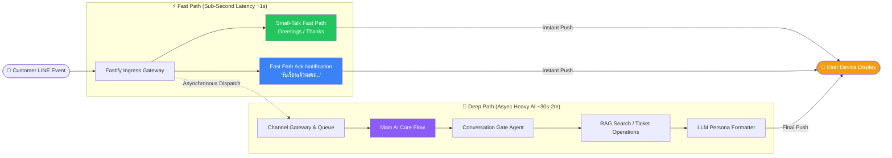
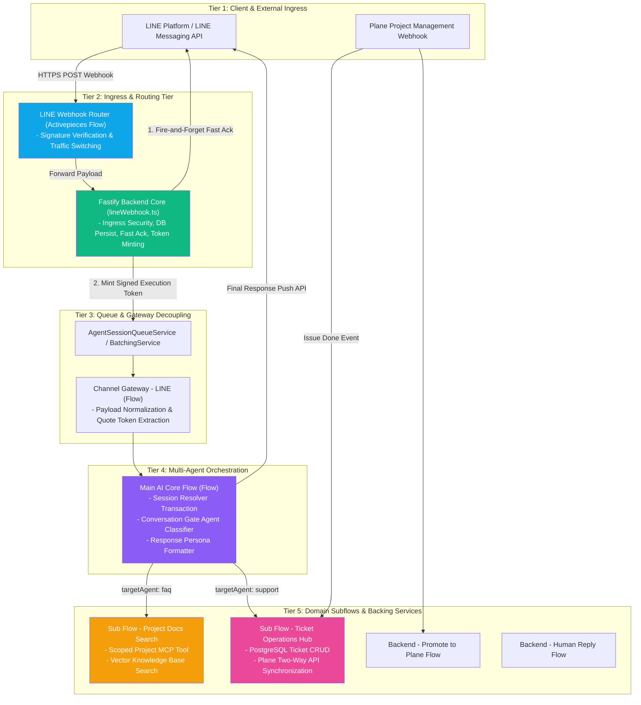
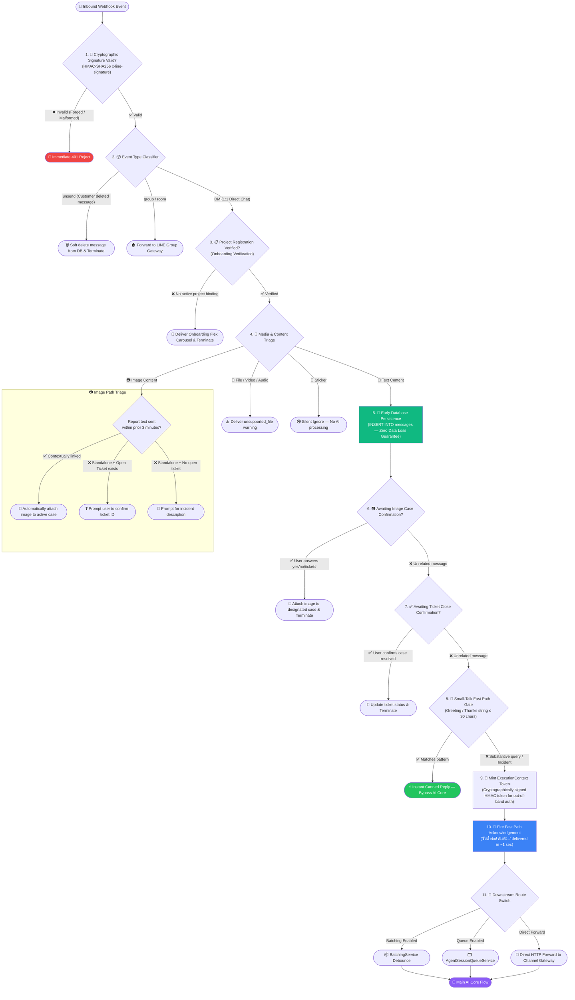
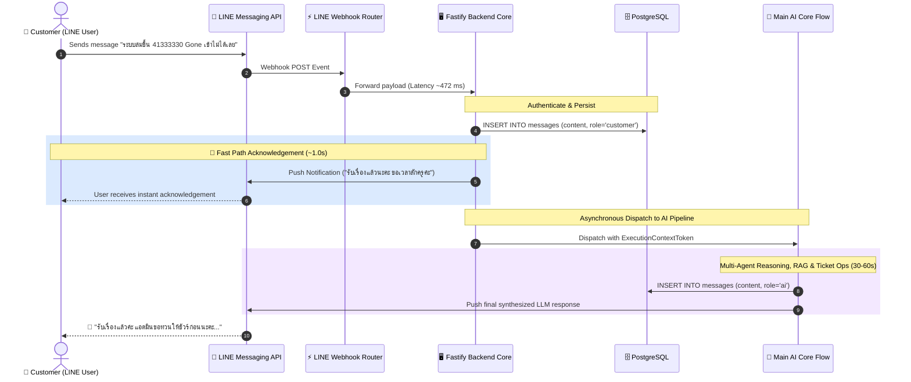
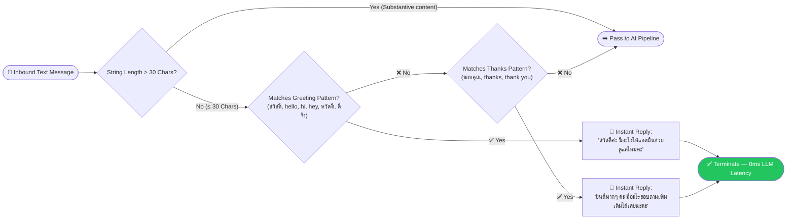
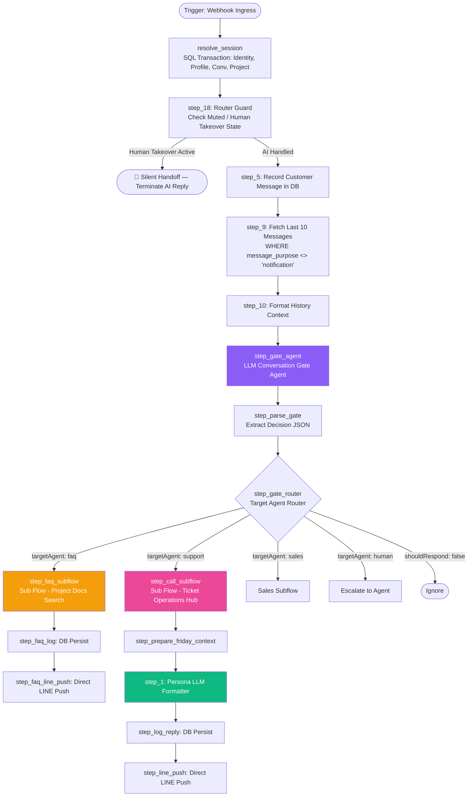

# AutomationX & TicketX End-to-End Workflow Architecture Specification

> **System:** AutomationX Engine & TicketX Support Automation Platform  
> **Target Audience:** Senior Software Engineers, Engineering Leads, System Architects  
> **Last Updated:** September 2026 | Verified against live production Activepieces/PromptX workflows and Fastify backend (`lineWebhook.ts`)

---

## Executive Summary & System Design Philosophy

### 1. The Real-Time Chat Latency Dilemma
In modern conversational customer support (specifically on platforms like **LINE Official Account**), end users expect **sub-second or instant feedback (1–3 seconds)**. A conversational pause exceeding 5–10 seconds induces user drop-off, duplicate message spamming, or the impression that the support bot is broken.

Conversely, the backend and AI orchestration pipeline in **TicketX** executes sophisticated, multi-stage processing:
- Cryptographic verification and session resolution against PostgreSQL
- Multi-agent intent classification and parameter extraction
- Multi-turn conversation retrieval and context formatting
- Enterprise Retrieval-Augmented Generation (RAG) vector searches across project-specific knowledge bases
- Dynamic SLA estimation, transactional ticket creation, and bidirectional synchronization with **Plane Project Management**

This deep processing lifecycle requires **30 to 120 seconds** of compute time.

### 2. Dual-Track Architecture: Fast Path vs. Deep Path
To resolve this latency disparity, AutomationX employs a decoupled, **Dual-Track Processing Pattern**:



---

## System Topology & Component Architecture

The AutomationX ecosystem is organized into five distinct architectural tiers:



---

## Ingress Security & Message Lifecycle Gates

Every event delivered from the LINE webhook is subjected to **11 deterministic security and routing gates** in `lineWebhook.ts` before reaching the AI model:



---

## Deep Dive: Fast Path Acknowledgement System

### 1. Sequence & Timing Diagram
The fast acknowledgement mechanism guarantees immediate feedback while decoupling from downstream execution time:



### 2. The Four Engineering Pillars of Fast Ack

| Guardrail Pillar | Implementation Strategy | Architectural Benefit |
| :--- | :--- | :--- |
| **1. Sub-Second Delivery (~1s)** | Dispatched asynchronously via fire-and-forget notification service directly from Fastify | Completely decouples ingress throughput from LLM inference latency |
| **2. Event Idempotency** | Tied to LINE `webhookEventId` with database deduplication constraint | Prevents redundant acknowledgements during LINE network retries |
| **3. 90-Second Burst Window** | Redis / in-memory cache debounce window tracking user ID | Prevents notification spamming when users send multi-line messages in rapid succession |
| **4. Context Isolation (`message_purpose`)** | Inserted into PostgreSQL with `message_purpose = 'notification'` | History query strictly filters out `WHERE COALESCE(message_purpose, '') <> 'notification'`, **preventing LLMs from seeing self-acknowledgements and hallucinating** |

### 3. Dynamic Thai Template Rotation
To prevent the interaction from appearing robotic, the system dynamically samples from verified natural Thai support templates:
1. *"รับเรื่องแล้วนะคะ ขอเวลาสักครู่ค่ะ"*
2. *"รับเรื่องไว้แล้วค่ะ เดี๋ยวแอดมินดูให้นะคะ"*
3. *"รับทราบค่ะ ขอแอดมินดูสักครู่นะคะ"*
4. *"รับเรื่องค่ะ เดี๋ยวรีบดูให้เลยนะคะ"*

---

## Small-Talk Fast Path Evaluation

To conserve LLM compute tokens and provide instant turnaround for trivial messages, small-talk expressions bypass AI processing entirely:



---

## Main AI Core Flow & Multi-Agent Orchestration

The `Main AI Core Flow` is the central orchestrator coordinating state management, classification, and domain subflows:



### 1. Conversation Gate Agent Schema
The Conversation Gate Agent outputs structured JSON adhering to the following interface:
```typescript
interface GateDecision {
  shouldRespond: boolean;
  targetAgent: "support" | "sales" | "faq" | "human" | "none";
  intent: string;
  confidence: number;
  reason: string;
  ticket_action: "CREATE" | "CONFIRM_REQUIRED" | "CANCEL_RESET" | "GET_STATUS" | "FIND" | "UPDATE" | "CLOSE" | "REOPEN" | "ESCALATE" | "CONFIRM_UPDATE" | "NEED_INFO" | "NONE";
  ticket_id: string;
  subject: string;
  summary: string;
  priority: "P1" | "P2" | "P3" | "P4";
  severity: "Critical" | "High" | "Medium" | "Low";
}
```

### 2. Friday Persona LLM Formatter Guidelines
The final synthesizer applies strict channel-specific formatting rules:
- **No Markdown Formatting**: Headings (`#`) and bold tags (`**`) fail to render cleanly on LINE clients. Line breaks and bullet characters (`• `) are enforced.
- **Zero Internal Jargon**: Never expose internal codes (`P1`, `NEW`, `TRIAGED`, `Plane Sync`). Translate them into natural conversational Thai.
- **Strict Ticket ID Transparency**: Always preserve generated ticket identifiers (e.g. `TCK-2026-48661`).

---

## Two-Step Ticket Confirmation Protocol

To eliminate false-positive incident creations from casual queries, a two-step state machine is enforced:

```mermaid
stateDiagram-v2
    [*] --> Idle: User submits message
    Idle --> FreshIntake: Defect / malfunction detected
    
    FreshIntake --> ConfirmPending: Gate Action = CONFIRM_REQUIRED\n(No ticket created in DB or Plane)
    ConfirmPending --> CustomerPrompt: AI summarizes report & requests confirmation:\n"แอดมินสรุปเรื่องดังนี้... ยืนยันให้เปิดเคสไหมคะ"
    
    state CustomerResponse <<choice>>
    CustomerPrompt --> CustomerResponse: User replies
    
    CustomerResponse --> TicketCreated: User confirms ("ยืนยัน", "ใช่", "ok")\nGate Action = CREATE
    CustomerResponse --> Cancelled: User aborts ("ยกเลิก", "ไม่เป็นไร", "แก้ได้แล้ว")\nGate Action = CANCEL_RESET
    CustomerResponse --> ClarificationNeeded: Vague reply\nGate Action = NEED_INFO
    
    TicketCreated --> PlaneSync: Ticket Operations Subflow creates record\nAssigns TCK-YYYY-NNNNN and syncs to Plane
    PlaneSync --> Notified: Delivers ticket ID and estimated SLA to user
    Cancelled --> CleanReset: Zero state pollution; politely acknowledges cancellation
    
    Notified --> [*]
    CleanReset --> [*]
```



---

## Domain Subflows Architecture

### 1. Sub Flow - Project Docs Search (MCP RAG)
When `targetAgent: "faq"` is selected:
- **`step_get_conv`**: Verifies that the active project holds valid authorizations for the MCP tool `search_project_docs` in `project_mcp_permissions`.
- **`step_resolve_scope`**: Resolves the project-specific metadata tag (e.g., `Excise` for Excise Department systems) to isolate knowledge scope.
- **`step_kb_search`**: Queries vector knowledge base chunks using `scoreThreshold: 0.5` and `topK: 5`.
- **Synthesis**: Combines retrieved semantic chunks with conversation context to answer how-to and policy questions accurately.

### 2. Sub Flow - Ticket Operations Hub & Plane Synchronization
When `targetAgent: "support"` is selected:
- Handles standard ticket actions (`CREATE`, `GET_STATUS`, `FIND`, `UPDATE`, `CLOSE`, `REOPEN`, `ESCALATE`).
- Maintains transactional state across PostgreSQL `tickets` and `ticket_events`.
- Performs real-time bidirectional synchronization with **Plane Project Management REST APIs** (`/api/v1/workspaces/.../issues/`).
- Computes SLA deadlines dynamically based on issue priority (P1 = 2h, P2 = 4h, P3 = 8h, P4 = 24h).

---

## Live Execution Benchmarks & Run Traces

Analysis of real execution traces and telemetry logs captured from production runs:

### Trace 1: Knowledge Base FAQ Inquiry (Accounting Forms ก.ฌ.4 – ก.ฌ.12)
> **Customer Query:** *"สมุดรายงานและทะเบียนทางบัญชีของระบบ ฌกส. ตั้งแต่ 'แบบ ก.ฌ.4 ถึง แบบ ก.ฌ.12' มีความแตกต่างและการใช้งานอย่างไรบ้างครับ"*

| Execution Stage | Responsible Workflow / Node | Latency | Result / Output |
| :--- | :--- | :--- | :--- |
| **Ingress Routing** | `LINE Webhook Router` | **472 ms** | Validated HMAC signature, routed as DM event to Fastify backend |
| **Fast Acknowledgement** | `Fastify Backend Core` | **~1.0 s** | DB insert completed; instant push: *"รับทราบค่ะ ขอแอดมินดูสักครู่นะคะ"* |
| **Channel Gateway** | `Channel Gateway - LINE` | **21 s** | Batch aggregation and ExecutionContext token validation |
| **Knowledge Base Search** | `Sub Flow - Project Docs Search` | **1m 03s** | Vector search against Tag `Excise` returned similarity score `0.79` |
| **AI Core Synthesis** | `Main AI Core Flow` | **2m 06s** | Formatted clean bullet points for ก.ฌ.4–ก.ฌ.12 and pushed to LINE |

---

### Trace 2: Incident Reporting & Ticket Creation via Two-Step Protocol
> **Turn 1 (Intake & Confirmation Prompt):**  
> Customer: *"แจ้งเคสค่ะ ระบบปฏิบัติงานนอกเวลาราชการ ลูกค้าต้องการย้อนรายการสถานะ เป็นรอพิจารณาอนุมัติค่ะ"* (09:46 AM)  
> ➡️ Fast Ack Push (09:47 AM): *"รับเรื่องแล้วนะคะ ขอเวลาสักครู่ค่ะ"*  
> ➡️ AI Confirmation Prompt (09:50 AM): *"แอดมินสรุปเรื่องที่แจ้งมาได้ดังนี้ค่ะ... ยืนยันให้เปิดเคสนี้ได้เลยไหมคะ พิมพ์ 'ยืนยัน' หรือ 'ยกเลิก' ได้เลยนะคะ"*

> **Turn 2 (Confirmation & Plane Synchronization):**  
> Customer: *"ยืนยัน"* (10:20 AM)  
> ➡️ Fast Ack Push (10:20 AM): *"รับเรื่องแล้วนะคะ"*  
> ➡️ Ticket Created & Plane Synced (10:24 AM):  
> *"รับเรื่องการขอคืนสถานะนิสิตเป็นรอพิจารณาอนุมัติในระบบปฏิบัติงานนอกเวลาราชการเรียบร้อยแล้วนะคะ เลขติดตามคือ TCK-2026-48661 ค่ะ แอดมินเปิดเคสให้ทีมงานตรวจสอบแล้ว คาดว่าจะเรียบร้อยภายใน วันนี้ 14:22 น. (อีกประมาณ 4 ชั่วโมง) ค่ะ"*

---

## System Reference Matrices

### 1. Notification Types Reference
| Notification Type | Trigger Condition | Sample Payload / Copy |
| :--- | :--- | :--- |
| `acknowledgement` | Substantive DM queries and defect reports | *"รับเรื่องแล้วนะคะ ขอเวลาสักครู่ค่ะ"* |
| `greeting` | Pure greeting string ≤ 30 characters | *"สวัสดีค่ะ มีอะไรให้แอดมินช่วยดูแลไหมคะ"* |
| `thanks` | Pure appreciation string ≤ 30 characters | *"ยินดีมากๆ ค่ะ มีอะไรสอบถามเพิ่มเติมได้เลยนะคะ"* |
| `image_attached` | Image successfully bound to active ticket | *"แอดมินแนบรูปภาพเข้าเคสเรียบร้อยแล้วค่ะ"* |
| `image_confirm_case` | Standalone image with open ticket active | *"รูปนี้เป็นของเคส #... ใช่ไหมคะ"* |
| `image_need_context` | Standalone image with no active ticket | *"รบกวนอธิบายอาการของปัญหาเพิ่มเติมสักนิดนะคะ"* |
| `unsupported_file` | Unsupported binary attachment (audio/video/zip) | *"ขออภัยค่ะ ระบบยังไม่รองรับไฟล์ประเภทนี้"* |
| `ticket_created` | Ticket record confirmed and synced | *"รับเรื่องเรียบร้อยแล้วค่ะ เลขติดตามคือ TCK-XXXX-XXXXX"* |
| `resolution_confirmation` | Engineering marks ticket resolved | *"ทีมงานแก้ไขเรียบร้อยแล้ว รบกวนทดสอบใช้งานดูนะคะ"* |
| `closed` | Ticket confirmed and closed | *"ปิดเคสเรียบร้อยแล้วค่ะ ขอบคุณที่แจ้งเข้ามานะคะ"* |
| `reopened` | Defect recurrence reported by customer | *"แอดมินเปิดเคสเดิมให้อีกครั้งเพื่อตรวจสอบซ้ำนะคะ"* |

### 2. Priority & SLA Target Matrix
| Priority | Urgency Definition | SLA Target | Persona Phrasing Guideline |
| :--- | :--- | :--- | :--- |
| **P1** | Total system outage / Blocking critical workflow | 2 Hours | *"เรื่องด่วนมาก ทีมงานกำลังเร่งตรวจสอบให้ทันที"* |
| **P2** | Core feature broken with no immediate workaround | 4 Hours | *"เรื่องด่วน ทีมงานกำลังเร่งดำเนินการให้ค่ะ"* |
| **P3** | Normal issue with existing workaround | 8 Hours | Omit urgency labels; state estimated deadline plainly |
| **P4** | Cosmetic defect or general documentation query | 24 Hours | Follow standard operational schedule |

---

*This document is maintained as the authoritative technical reference for the AutomationX and TicketX Engineering Team.*
