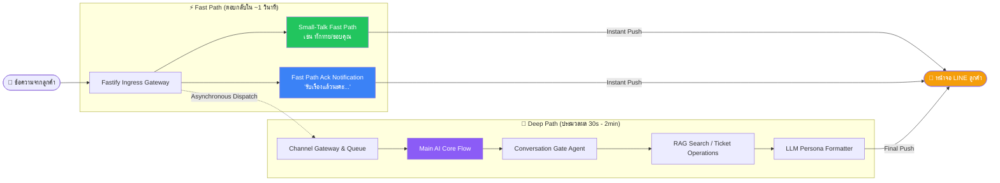
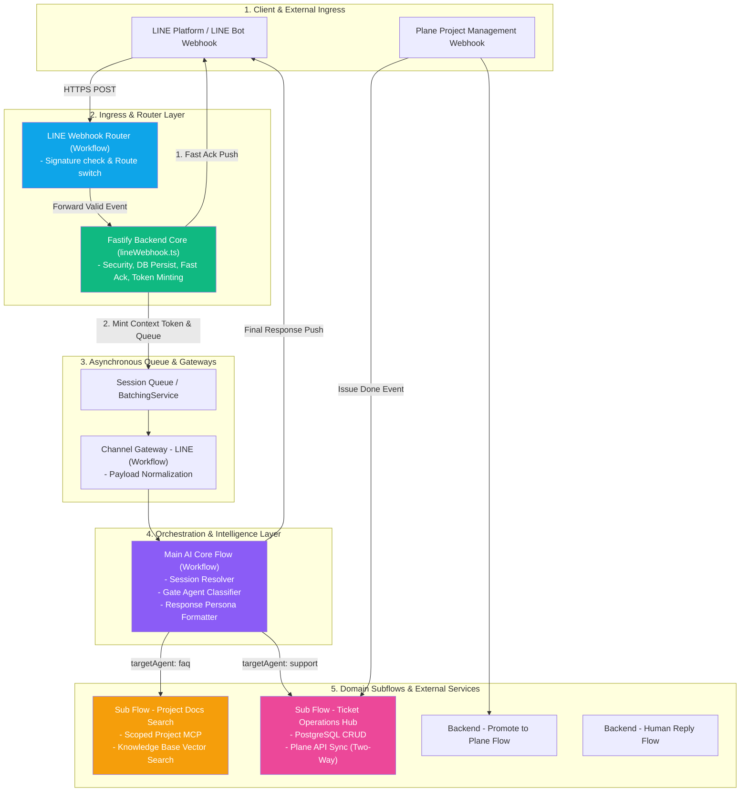
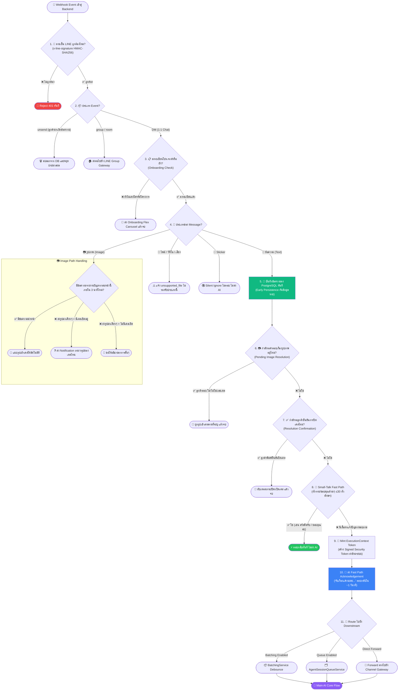
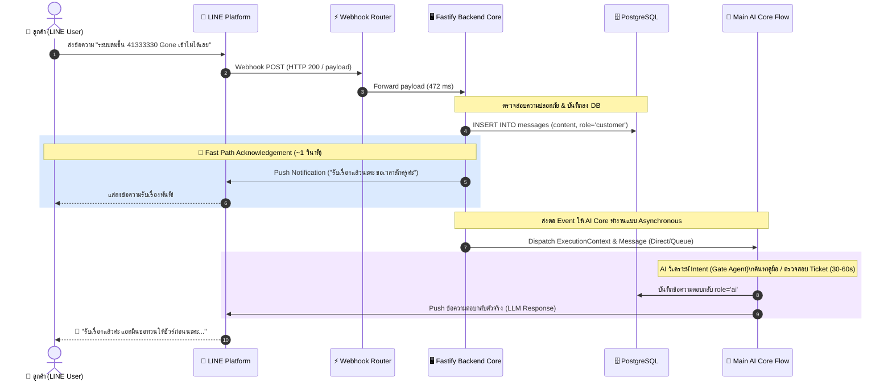
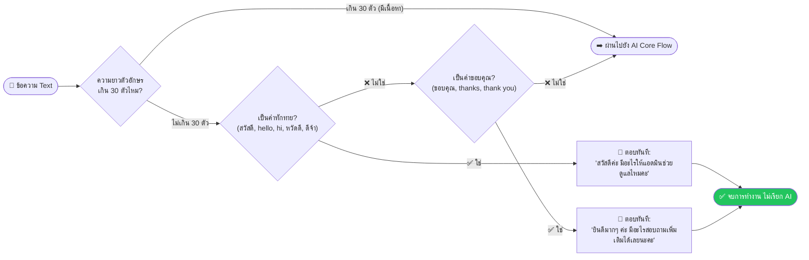
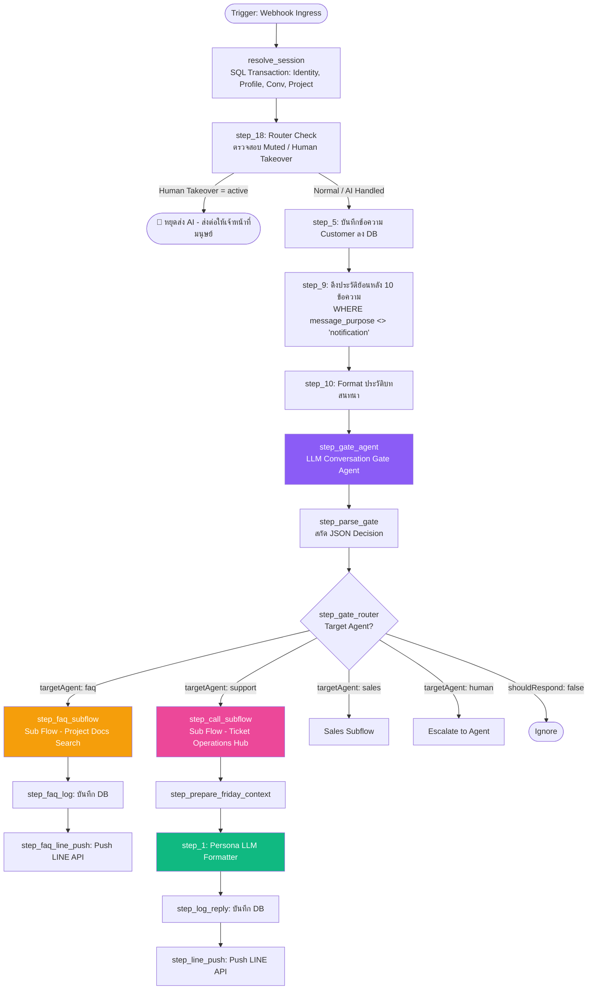
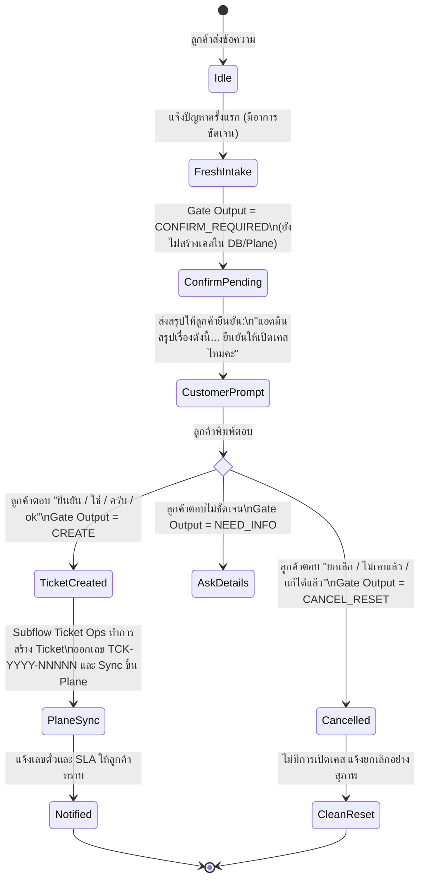

# สถาปัตยกรรมระบบและการทำงานของ Workflow ใน AutomationX / TicketX (ฉบับสมบูรณ์)

> **เอกสารอ้างอิงทางเทคนิค (Technical Architecture Specification)**  
> **ระบบ:** AutomationX Engine & TicketX Support Platform  
> **อัปเดตล่าสุด:** กันยายน 2569 | ตรงกับสถานะ Production และ Workflow Activepieces/PromptX ล่าสุด

---

## สารบัญ (Table of Contents)

1. [บทนำและปรัชญาการออกแบบ (Executive Summary & Design Philosophy)](#1-บทนำและปรัชญาการออกแบบ)
2. [ผังการเชื่อมต่อระบบโดยรวม (End-to-End System Topology)](#2-ผังการเชื่อมต่อระบบโดยรวม)
3. [ด่านตรวจและการเดินทางของข้อความ (Ingress Security & Lifecycle Gates)](#3-ด่านตรวจและการเดินทางของข้อความ)
4. [เจาะลึกระบบ Fast Path Acknowledgement](#4-เจาะลึกระบบ-fast-path-acknowledgement)
5. [ด่านตรวจ Small-Talk Fast Path](#5-ด่านตรวจ-small-talk-fast-path)
6. [สถาปัตยกรรม Main AI Core Flow & Multi-Agent Orchestration](#6-สถาปัตยกรรม-main-ai-core-flow--multi-agent-orchestration)
7. [โปรโตคอลการเปิดเคส 2 ขั้นตอน (Two-Step Ticket Confirmation Protocol)](#7-โปรโตคอลการเปิดเคส-2-ขั้นตอน)
8. [เจาะลึกการทำงานของ Subflows](#8-เจาะลึกการทำงานของ-subflows)
   - [8.1 Sub Flow - Project Docs Search (MCP Knowledge Base RAG)](#81-sub-flow---project-docs-search)
   - [8.2 Sub Flow - Ticket Operations Hub & Plane Synchronization](#82-sub-flow---ticket-operations-hub)
9. [การวิเคราะห์ผลการรันจริงและ Timing Benchmark จากระบบ](#9-การวิเคราะห์ผลการรันจริงและ-timing-benchmark)
10. [ตารางอ้างอิงมาตรฐานระบบ (System Reference Matrix)](#10-ตารางอ้างอิงมาตรฐานระบบ)

---

## 1. บทนำและปรัชญาการออกแบบ

### 1.1 ที่มาและความท้าทาย
ในการให้บริการสนับสนุนลูกค้าผ่านช่องทางสนทนาอย่าง **LINE Official Account** ผู้ใช้งานมีความคาดหวังในระดับ **Instant Gratification (ต้องได้รับการตอบรับทันทีภายใน 1-3 วินาที)** หากปล่อยให้ห้องแชทเงียบเกิน 5-10 วินาที ผู้ใช้งานจะเข้าใจว่าระบบค้าง หรือไม่มีแอดมินดูแล

อย่างไรก็ตาม ในฝั่ง Backend และ AI Engine ของ **TicketX**:
- ต้องทำการวิเคราะห์ข้อความด้วย **Multi-Agent Large Language Models (LLM)**
- ต้องดึงประวัติการสนทนาและเชื่อมโยง Session (Session Resolution)
- ต้องค้นหาเอกสารคู่มือผ่าน **Vector Search / Knowledge Base (RAG)**
- ต้องประมวลผลคำนวณ SLA, เปิด Ticket ในฐานข้อมูล PostgreSQL และซิงค์งานไปยังระบบ **Plane Project Management**
- การทำงานในฝั่ง Deep AI ทั้งหมดนี้ใช้เวลาเฉลี่ย **30 วินาที ถึง 2 นาที**

### 1.2 สถาปัตยกรรมแบบ Dual-Track (Fast Path vs Deep Path)
เพื่อแก้ปัญหาความขัดแย้งของ Latency นี้ AutomationX จึงถูกออกแบบด้วยแนวคิด **แยกเลนการประมวลผล (Dual-Track Architecture)**:



---

## 2. ผังการเชื่อมต่อระบบโดยรวม (End-to-End System Topology)

ระบบประกอบด้วย 5 เลเยอร์หลักที่ทำงานร่วมกันอย่างเป็นระบบ:



---

## 3. ด่านตรวจและการเดินทางของข้อความ (Ingress Security & Lifecycle Gates)

ข้อความทุกข้อความที่ส่งเข้ามาจาก LINE Webhook จะต้องผ่าน **11 ด่านตรวจ** ตามลำดับใน Backend (`lineWebhook.ts`):



---

## 4. เจาะลึกระบบ Fast Path Acknowledgement

### 4.1 ลำดับการทำงาน (Sequence Diagram)
หัวใจสำคัญที่ทำให้ระบบตอบสนองลูกค้าได้อย่างรวดเร็วคือการยิง Notification รับเรื่องทันทีก่อนที่ AI Core Flow จะเริ่มทำงาน:



### 4.2 กลไกความปลอดภัยและ Guardrails (4 เสาหลัก)

| กลไก (Mechanism) | รายละเอียดและการทำงาน | ประโยชน์เชิงเทคนิค |
| :--- | :--- | :--- |
| **1. Sub-Second Response (~1 วินาที)** | Backend ส่งข้อความแจ้งเตือนผ่าน LINE Push API แบบ Fire-and-forget ทันทีหลังบันทึก DB เสร็จ | ลูกค้าได้รับการตอบรับทันที ไม่รู้สึกว่าระบบค้าง |
| **2. Idempotency & Deduplication** | ผูก Idempotency Key ด้วย `webhookEventId` จาก LINE Event | หาก LINE ส่ง Webhook ซ้ำ (Retry) ระบบจะไม่ส่ง Ack ซ้ำเด็ดขาด |
| **3. Burst Control Window (90 วินาที)** | หากลูกค้าพิมพ์หลายข้อความติดต่อกันรัวๆ (เช่น พิมพ์ทีละบรรทัด 5 ข้อความใน 1 นาที) | ระบบจะส่ง Ack ให้เพียง **ครั้งแรกครั้งเดียว** ในช่วง 90 วินาที เพื่อไม่ให้เป็นการสแปมผู้ใช้ |
| **4. Context Isolation (`message_purpose`)** | บันทึกข้อความ Ack ลงในตาราง `messages` โดยใส่ `message_purpose = 'notification'` | ในคิวรีดึงประวัติของ AI Core มีเงื่อนไข `WHERE COALESCE(message_purpose, '') <> 'notification'` ทำให้ **AI ไม่เห็นข้อความ Ack ของตัวเอง** ป้องกันการเกิด Hallucination สับสน หรือพูดซ้ำ |

### 4.3 ข้อความ Ack แบบสุ่มหมุนเวียน (Dynamic Rotation)
ระบบสุ่มเลือกข้อความจากชุด Template ภาษาไทยธรรมชาติ เพื่อไม่ให้ดูเป็นบอทอัตโนมัติที่ซ้ำซาก:
1. *"รับเรื่องแล้วนะคะ ขอเวลาสักครู่ค่ะ"*
2. *"รับเรื่องไว้แล้วค่ะ เดี๋ยวแอดมินดูให้นะคะ"*
3. *"รับทราบค่ะ ขอแอดมินดูสักครู่นะคะ"*
4. *"รับเรื่องค่ะ เดี๋ยวรีบดูให้เลยนะคะ"*

---

## 5. ด่านตรวจ Small-Talk Fast Path

สำหรับข้อความที่เป็นเพียงคำทักทายหรือคำขอบคุณสั้นๆ ระบบจะไม่ส่งไปยัง AI Core เพื่อประหยัด Token ค่าใช้จ่าย และตอบกลับได้ในเสี้ยววินาที:



**ตัวอย่างการประเมิน:**
- `สวัสดี` ➡️ ⚡ ตอบทักทายทันที (0 ms AI Latency)
- `ขอบคุณมากๆ ค่า` ➡️ ⚡ ตอบขอบคุณทันที (0 ms AI Latency)
- `สวัสดีค่ะ ระบบออกใบเสร็จค้าง` ➡️ 🔔 ส่ง Fast Ack + ส่งต่อไปยัง AI Core (เนื่องจากมีคำแจ้งปัญหา)

---

## 6. สถาปัตยกรรม Main AI Core Flow & Multi-Agent Orchestration

เมื่อข้อความถูกส่งเข้าสู่ `Main AI Core Flow` จะผ่านการประมวลผลตามโหนดต่างๆ ดังนี้:



### 6.1 โครงสร้าง JSON Output ของ Conversation Gate Agent
Gate Agent ทำหน้าที่เป็นสมองส่วนหน้าในการตัดสินใจ โดยคืนค่า JSON Schema:
```json
{
  "shouldRespond": true,
  "targetAgent": "support",
  "intent": "INCIDENT",
  "confidence": 0.95,
  "reason": "ลูกค้าขอยืนยันเปิดเคสย้อนสถานะในระบบปฏิบัติงานนอกเวลาราชการ",
  "ticket_action": "CREATE",
  "ticket_id": "",
  "subject": "ระบบปฏิบัติงานนอกเวลาราชการ - ขอย้อนรายการสถานะเป็นรอพิจารณาอนุมัติ",
  "summary": "ลูกค้าขอเปิดเคสเพื่อขอย้อนสถานะเป็นรอพิจารณาอนุมัติในระบบปฏิบัติงานนอกเวลาราชการ",
  "priority": "P3",
  "severity": "Medium"
}
```

### 6.2 กฎ Persona ของ LLM Response Formatter (Friday Guidelines)
คำตอบสุดท้ายที่ส่งให้ลูกค้าผ่าน LINE จะถูกจัดระเบียบผ่าน Formatter:
1. **ห้ามใช้ Markdown Heading หรือ Asterisk**: เนื่องจากแอปพลิเคชัน LINE ไม่รองรับ `**bold**` หรือ `# Heading` ให้ใช้การขึ้นบรรทัดใหม่และ Bullet `• ` แทน
2. **ห้ามแสดงศัพท์เทคนิคภายใน**: เช่น `P1`, `P2`, `NEW`, `IN_PROGRESS`, `Plane`, `DB ID` ให้แปลงเป็นภาษาไทยธรรมชาติ (เช่น P1 ➡️ "เรื่องด่วนมาก")
3. **บังคับระบุ Ticket ID**: หาก context มีเลขตั๋ว เช่น `TCK-2026-48661` ต้องระบุให้ลูกค้าทราบอย่างชัดเจน
4. **ความอบอุ่นแบบมืออาชีพ**: แทนตัวเองว่า "แอดมิน" ลงท้ายด้วย "ค่ะ/นะคะ" อย่างเป็นธรรมชาติ

---

## 7. โปรโตคอลการเปิดเคส 2 ขั้นตอน (Two-Step Ticket Confirmation Protocol)

เพื่อป้องกันการเปิดเคสขยะโดยไม่ได้ตั้งใจ (False-positive creation) ระบบใช้กระบวนการยืนยัน 2 ขั้นตอน:



---

## 8. เจาะลึกการทำงานของ Subflows

### 8.1 Sub Flow - Project Docs Search (MCP Knowledge Base RAG)
เมื่อ Gate Agent ตีความว่าเป็นคำถามเกี่ยวกับคู่มือหรือระเบียบการ (`targetAgent: "faq"`):
1. **`step_get_conv`**: ค้นหาข้อมูล Conversation และตรวจสอบสิทธิ์เครื่องมือ MCP `search_project_docs` จากตาราง `project_mcp_permissions`
2. **`step_resolve_scope`**: ดึง `project_tag` ประจำโครงการ (เช่น `Excise` สำหรับกรมสรรพสามิต) เพื่อกักขอบเขตเอกสาร
3. **`step_kb_search`**: ค้นหา Semantic Chunk ใน Vector Knowledge Base โดยใช้ `scoreThreshold: 0.5` และ `topK: 5`
4. **Subflow Response**: ส่งข้อมูลสรุปจากเอกสารกลับไปยัง AI Core เพื่อตอบคำถามอย่างแม่นยำ

### 8.2 Sub Flow - Ticket Operations Hub & Plane Synchronization
เมื่อมีการดำเนินการเกี่ยวกับ Ticket (`targetAgent: "support"`):
- รองรับ Action: `CREATE`, `GET_STATUS`, `FIND`, `UPDATE`, `CLOSE`, `REOPEN`, `ESCALATE`
- ทำการบันทึกลง PostgreSQL (`tickets`, `ticket_events`)
- ทำการส่ง HTTP Request แบบ Two-Way Synchronization ไปยัง **Plane Project Management API** (`/api/v1/workspaces/.../issues/`)
- คำนวณวันกำหนดส่ง (Due Date / SLA) เช่น P1 = 2 ชม., P2 = 4 ชม., P3 = 8 ชม.
- ส่งคืน `ticket_id`, `plane_issue_id`, `due_date` และสถานะการซิงค์กลับไปยัง Main Flow

---

## 9. การวิเคราะห์ผลการรันจริงและ Timing Benchmark

จากข้อมูล Log และภาพ Screenshot ในโฟลเดอร์รันจริง:

```
[หลักฐาน Execution Benchmark จากระบบ Production จริง]
```

### เคสที่ 1: การสอบถามเอกสารคู่มือทั่วไป (FAQ Knowledge Base)
> **คำถามลูกค้า:** *"สมุดรายงานและทะเบียนทางบัญชีของระบบ ฌกส. ตั้งแต่ 'แบบ ก.ฌ.4 ถึง แบบ ก.ฌ.12' มีความแตกต่างและการใช้งานอย่างไรบ้างครับ"*

| ลำดับขั้นตอน (Step) | Workflow / Node ที่ทำงาน | เวลาที่ใช้ (Duration) | รายละเอียดสิ่งที่เกิดขึ้น |
| :--- | :--- | :--- | :--- |
| 1. Ingress Router | `LINE Webhook Router` | **472 ms** | รับ Webhook ตรวจ Signature และ Forward เข้า Backend |
| 2. Fast Ack Push | `Fastify Backend Core` | **~1 วินาที** | บันทึกข้อความลง DB และยิง Push: *"รับทราบค่ะ ขอแอดมินดูสักครู่นะคะ"* |
| 3. Channel Gateway | `Channel Gateway - LINE` | **21 วินาที** | รวม Batch Payload, ตรวจสอบ Context Token และส่งต่อ |
| 4. Knowledge Search | `Sub Flow - Project Docs Search` | **1 นาที 3 วินาที** | Vector Search หาเอกสาร Tag `Excise` ได้คะแนนความตรง 0.79 |
| 5. AI Main Core | `Main AI Core Flow` | **2 นาที 6 วินาที** | สรุปคำตอบรายงานแบบ ก.ฌ.4–ก.ฌ.12 และ Push ข้อความให้ลูกค้า |

---

### เคสที่ 2: การแจ้งปัญหาและสร้าง Ticket ด้วย Two-Step Confirmation
> **รอบที่ 1 (Intake & Prompt Confirmation):**  
> ลูกค้า: *"แจ้งเคสค่ะ ระบบปฏิบัติงานนอกเวลาราชการ ลูกค้าต้องการย้อนรายการสถานะ เป็นรอพิจารณาอนุมัติค่ะ"* (09:46 น.)  
> ➡️ Fast Ack (09:47 น.): *"รับเรื่องแล้วนะคะ ขอเวลาสักครู่ค่ะ"*  
> ➡️ AI Prompt (09:50 น.): *"แอดมินสรุปเรื่องที่แจ้งมาได้ดังนี้ค่ะ... ยืนยันให้เปิดเคสนี้ได้เลยไหมคะ พิมพ์ 'ยืนยัน' หรือ 'ยกเลิก' ได้เลยนะคะ"*

> **รอบที่ 2 (Confirmation & Plane Sync):**  
> ลูกค้า: *"ยืนยัน"* (10:20 น.)  
> ➡️ Fast Ack (10:20 น.): *"รับเรื่องแล้วนะคะ"*  
> ➡️ Ticket Created & Plane Synced (10:24 น.):  
> *"รับเรื่องการขอคืนสถานะนิสิตเป็นรอพิจารณาอนุมัติในระบบปฏิบัติงานนอกเวลาราชการเรียบร้อยแล้วนะคะ เลขติดตามคือ TCK-2026-48661 ค่ะ แอดมินเปิดเคสให้ทีมงานตรวจสอบแล้ว คาดว่าจะเรียบร้อยภายใน วันนี้ 14:22 น. (อีกประมาณ 4 ชั่วโมง) ค่ะ"*

---

## 10. ตารางอ้างอิงมาตรฐานระบบ (System Reference Matrix)

### 10.1 Notification Types ทั้งหมดที่ Backend รองรับ
| Notification Type | เงื่อนไขการส่ง (Trigger Condition) | ตัวอย่างข้อความ |
| :--- | :--- | :--- |
| `acknowledgement` | ข้อความ DM ทุกข้อความที่มีเนื้อหาแจ้งปัญหา/สอบถาม | *"รับเรื่องแล้วนะคะ ขอเวลาสักครู่ค่ะ"* |
| `greeting` | ข้อความทักทายล้วน ≤30 ตัวอักษร | *"สวัสดีค่ะ มีอะไรให้แอดมินช่วยดูแลไหมคะ"* |
| `thanks` | ข้อความขอบคุณล้วน ≤30 ตัวอักษร | *"ยินดีมากๆ ค่ะ มีอะไรสอบถามเพิ่มเติมได้เลยนะคะ"* |
| `image_attached` | แนบรูปภาพเข้าเคสสำเร็จ | *"แอดมินแนบรูปภาพเข้าเคสเรียบร้อยแล้วค่ะ"* |
| `image_confirm_case` | ส่งรูปเดี่ยวมาในขณะที่มีเคสเปิดอยู่ | *"รูปนี้เป็นของเคส #... ใช่ไหมคะ"* |
| `image_need_context` | ส่งรูปเดี่ยวมาโดยไม่มีเคสในระบบ | *"รบกวนอธิบายอาการของปัญหาเพิ่มเติมสักนิดนะคะ"* |
| `unsupported_file` | ส่งไฟล์เสียง/วิดีโอ/เอกสารที่ไม่รองรับ | *"ขออภัยค่ะ ระบบยังไม่รองรับไฟล์ประเภทนี้"* |
| `ticket_created` | เมื่อ AI ดำเนินการเปิดเคสสำเร็จ | *"รับเรื่องเรียบร้อยแล้วค่ะ เลขติดตามคือ TCK-XXXX-XXXXX"* |
| `resolution_confirmation` | ทีมงานแก้ไขเสร็จและส่งให้ลูกค้าตรวจสอบ | *"ทีมงานแก้ไขเรียบร้อยแล้ว รบกวนทดสอบใช้งานดูนะคะ"* |
| `closed` | เคสได้รับการปิดอย่างสมบูรณ์ | *"ปิดเคสเรียบร้อยแล้วค่ะ ขอบคุณที่แจ้งเข้ามานะคะ"* |
| `reopened` | เคสถูกเปิดใหม่อีกครั้ง | *"แอดมินเปิดเคสเดิมให้อีกครั้งเพื่อตรวจสอบซ้ำนะคะ"* |

### 10.2 Status Mapping & Priority SLAs
| Priority | ระดับความเร่งด่วน | SLA Target | คำแปลสำหรับลูกค้า |
| :--- | :--- | :--- | :--- |
| **P1** | Critical / Outage | 2 ชั่วโมง | *"เรื่องด่วนมาก ทีมงานกำลังเร่งตรวจสอบให้ทันที"* |
| **P2** | High / Major Bug | 4 ชั่วโมง | *"เรื่องด่วน ทีมงานกำลังเร่งดำเนินการให้ค่ะ"* |
| **P3** | Medium / Normal | 8 ชั่วโมง | ไม่ระบุคำว่าด่วน แจ้งเวลาคาดการณ์ตามจริง |
| **P4** | Low / Cosmetic / Query | 24 ชั่วโมง | แจ้งผลตามรอบการทำงานปกติ |

---

*เอกสารฉบับนี้จัดทำขึ้นสำหรับ AutomationX & TicketX Engineering Team เพื่อใช้เป็นคู่มืออ้างอิงสถาปัตยกรรมและการตรวจสอบ Flow ระบบ*
