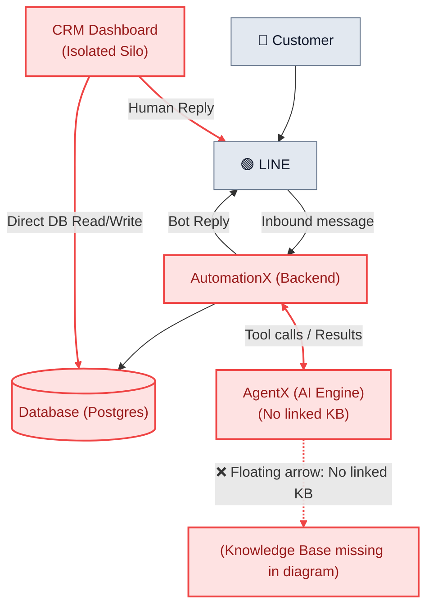

# 📊 Architectural Flow Comparison: Old (Whiteboard) vs. Proposed New Flow (English Edition)

> **Side-by-Side Architectural Evaluation & Evolution Report**  
> **Purpose:** Executive comparison demonstrating structural weaknesses in the initial whiteboard flow and the enterprise value delivered by the new unified architecture.  
> **Version:** `3.6.0 Enterprise Snapshot`  
> **Date:** August 26, 2026  

---

## 1. Side-by-Side Visual Comparison

### 🔴 Old Flow (Whiteboard Sketch Baseline)
*Key Gaps: CRM operates in an isolated silo; Knowledge Base is unlinked (floating arrow); no closed-loop learning.*



---

### 🟢 Proposed New Flow (Unified Enterprise Architecture)
*Key Upgrades: Central 3-Layer Knowledge Base (SOPs + Git Code + Graphify), CRM & AgentX linked via AI Copilot, closed-loop feedback, and Plane.so engineering integration.*

```mermaid
flowchart TD
    classDef client fill:#06C755,stroke:#048538,stroke-width:2px,color:#fff;
    classDef autox fill:#1E293B,stroke:#334155,stroke-width:2px,color:#fff;
    classDef agentx fill:#6366F1,stroke:#4F46E5,stroke-width:2px,color:#fff;
    classDef kb fill:#0EA5E9,stroke:#0284C7,stroke-width:2px,color:#fff;
    classDef crm fill:#F59E0B,stroke:#D97706,stroke-width:2px,color:#fff;
    classDef db fill:#475569,stroke:#334155,stroke-width:2px,color:#fff;
    classDef plane fill:#3B82F6,stroke:#1D4ED8,stroke-width:2px,color:#fff;
    classDef human fill:#10B981,stroke:#059669,stroke-width:2px,color:#fff;

    Customer["👤 Customer"]:::client
    LINE["🟢 LINE OA"]:::client

    AutomationX["🚀 AutomationX Core (Fastify)"]:::autox
    AgentX["🧠 AgentX (AI Engine)"]:::agentx
    
    KB[("📚 Central Knowledge Base\n- Layer 1: SOP & Docs RAG\n- Layer 2: Git Codebase Search\n- Layer 3: Knowledge Graph")]:::kb
    
    DB[("🐘 PostgreSQL Database\n(Timeline, Tickets, Outbox)")]:::db

    CRM["💻 CRM Web Dashboard"]:::crm
    Agent["👨‍💼 Support Agent (Human)"]:::human
    Plane["🎯 Plane.so (Engineering Tracker)"]:::plane

    %% Main Flow
    Customer -->|1. Sends issue / inquiry| LINE
    LINE -->|2. Inbound webhook| AutomationX
    AutomationX -->|3. Record timeline| DB
    AutomationX <-->|4. Dispatch context for AI reasoning| AgentX
    
    %% AI & Knowledge Base
    AgentX <-->|5. Vector search SOPs / Git code / Graph| KB
    AutomationX -->|6. Automated Customer Reply (Bot Reply)| LINE
    LINE --> Customer

    %% Plane Integration
    AutomationX -->|7. Forward sync work item| Plane
    Plane -.->|8. Reverse status sync on completion| AutomationX

    %% Smart CRM & Copilot
    AutomationX <-->|9. Push live chat + AI Insights| CRM
    Agent <-->|10. Workspace operations| CRM
    CRM <-->|11. Direct SOP & code lookups| KB
    CRM -->|12. Human Takeover Reply| AutomationX

    %% Closed-Loop Learning
    CRM -.->|13. Ingest resolved solution to KB| KB
```

---

## 2. Detailed Dimension Comparison Matrix

| Evaluation Dimension | Old Flow (Whiteboard Baseline) | Proposed New Flow | Value Delivered & Code Evidence |
|---|---|---|---|
| **1. Knowledge Source** | ⚠️ **Unspecified in diagram** (floating arrow) | ✅ **Unified 3-Layer Knowledge Base**<br>1. SOP/Manual RAG<br>2. Git Codebase Search<br>3. Knowledge Graph | AI resolves system errors down to source-code level.<br>*(Evidence: `KnowledgeService.ts`, `SearchCodebaseTool.ts`, `graphify`)* |
| **2. CRM ➔ AI Integration** | ❌ **Completely disconnected**<br>Agents blind to AI thoughts & prior tool calls | ✅ **Connected via AI Copilot**<br>CRM displays AI Insights & provides "Draft with AI" button | Operators understand case context instantly; resolves tickets 3x faster |
| **3. Agent Lookup Tools** | ❌ **None**<br>Agents search external wiki/code tabs manually | ✅ **Embedded Knowledge Search Panel** in CRM | All operational workflows contained in a Single Pane of Glass |
| **4. AI Continuous Evolution** | ❌ **Static AI**<br>Human resolutions are lost in raw DB tables | ✅ **Closed-Loop Learning**<br>One-click solution ingestion to Knowledge Base | AI intelligence compounds automatically with every resolved case |
| **5. Outbound Message Flow** | ⚠️ **Collision Risk**<br>Bot and human replies independently target LINE | ✅ **AutomationX as Single Gatekeeper**<br>Deterministic 15-min takeover lease control | Guarantees 100% collision-free customer delivery |
| **6. Dev Team Collaboration** | ❌ **No external tracking** | ✅ **Bidirectional Plane.so Sync**<br>Auto-creates tickets & syncs completed states back | Full traceability across Support and Engineering teams |

---

## 3. Executive Value Summary

* **Old Baseline**: Traditional, fragmented chatbot setup where AI and human agents operate in disconnected silos with no linked knowledge representation.
* **New Proposed Flow**: An **AI-Human Collaborative Platform** that channels the full power of a **3-Layer Knowledge Base (SOPs + Git Code + Knowledge Graph)** across **Customers ➔ AI (AgentX) ➔ Support Operators (CRM) ➔ Engineering (Plane.so)**.
