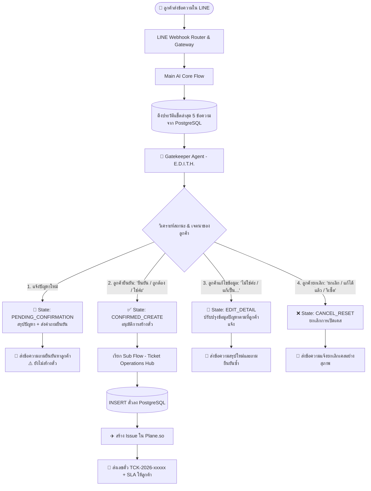
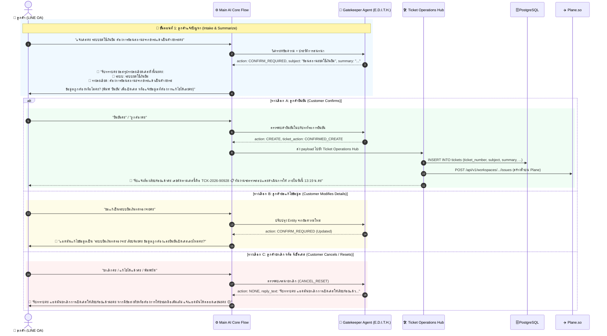

# TicketX / AutomationX: สถาปัตยกรรมระบบยืนยันและรีเซ็ตปัญหาก่อนเปิดตั๋ว (Two-Step Ticket Confirmation & Reset Flow)

> **เอกสารข้อกำหนดการออกแบบสถาปัตยกรรม Flow และ Prompt ประจำระบบ TicketX / AutomationX**  
> **หัวข้อ:** กระบวนการสรุปปัญหาและถามยืนยันกับลูกค้า พร้อมการรองรับการแก้ไขและรีเซ็ตเคสก่อนเปิดตั๋ว (Pre-Ticket Confirmation, Correction & Reset System)  
> **วันที่จัดทำ:** 31 สิงหาคม 2026  
> **สถานะ:** Proposal & Engineering Specification (ฉบับสมบูรณ์)

---

## 1. ที่มาและปัญหาเดิม (Background & Problem Statement)

### ❌ ปัญหาของระบบเดิม (Before - Immediate Ticket Creation):
ในสถาปัตยกรรมเดิม เมื่อลูกค้าส่งข้อความแจ้งเหตุขัดข้องหรือปัญหาในระบบ (เช่น *"แจ้งเคสค่ะ ระบบชดใช้เงินยืม ต้องการย้อนสถานะ จากชำระแล้ว เป็นค้างชำระค่ะ"*):
1. **บอทสร้างตั๋วทันทีในข้อความแรก:** ระบบจะเรียก `step_create_ticket` เพื่อ Insert ข้อมูลลงใน PostgreSQL และ Sync ตั๋วเข้าสู่ Plane.so (`TCK-2026-XXXXX`) โดยไม่มีขั้นตอนการทบทวน
2. **เกิดปัญหาตั๋วขยะ (Junk / Misclassified Tickets):** หากลูกค้าพิมพ์ผิด, ระบุระบบผิด, หรือเปลี่ยนใจ/แก้ไขปัญหาได้เองแล้ว ตั๋วจะถูกสร้างค้างอยู่ในระบบและแจ้งเตือนไปยังทีมผู้พัฒนา/เจ้าหน้าที่เรียบร้อยแล้ว
3. **ขาดความยืดหยุ่นในการรีเซ็ต (No Reset / Edit Capability):** ลูกค้าไม่มีโอกาสในการกดยกเลิก หรือแก้ไขข้อความก่อนที่งานจะถูกส่งต่อไปยังทีมงาน Developer

### 🎯 เป้าหมายของระบบใหม่ (After - Pre-Ticket Confirmation & Reset Flow):
1. **Intake & Summarize First:** เมื่อลูกค้าแจ้งปัญหา บอทจะทำการสกัดข้อมูลสำคัญ (ระบบ, อาการ, ความรุนแรง) แล้วสรุปให้ลูกค้าอ่านอย่างกระชับ พร้อมถามยืนยัน **(ยังไม่สร้างตั๋วลง Database)**
2. **Confirm to Create:** เมื่อลูกค้ายืนยัน (*"ยืนยัน", "ถูกต้อง", "ใช่ค่ะ", "เปิดเคสเลย"*) ➔ บอทจึงจะสร้างตั๋วใน PostgreSQL, Sync เข้า Plane.so และแจ้งเลขตั๋ว `TCK-2026-xxxxx` พร้อมกำหนดเวลา SLA
3. **Support Correction:** หากลูกค้าพิมพ์แก้ไข (*"ไม่ใช่ค่ะ เป็นระบบยืมเงินทดรองจ่าย"*) ➔ บอทจะอัปเดตข้อมูลและส่งสรุปใหม่ให้ยืนยัน
4. **Support Cancellation / Reset:** หากลูกค้าขอยกเลิก (*"ยกเลิกค่ะ", "ทำได้แล้วค่ะ", "รีเซ็ต"*) ➔ บอทจะล้างข้อมูลและยกเลิกกระบวนการเปิดตั๋วอย่างสุภาพโดยไม่บันทึกลง Database

---

## 2. แผนภาพสถาปัตยกรรมระบบ (System Architecture Flowchart)



---

## 3. แผนภาพลำดับการทำงาน (Detailed Sequence Diagram)



---

## 4. แผนผังการเปลี่ยนสถานะการสนทนา (State Transition Machine)

| สถานะปัจจุบัน (State) | ข้อความของลูกค้า (Incoming Input) | การตัดสินใจของ AI (AI Decision) | สถานะถัดไป (Next State) | ผลลัพธ์ในระบบ (System Action) |
|---|---|---|---|---|
| **IDLE** (ไม่มีเคสค้าง) | รายงานเหตุขัดข้อง / ปัญหาใหม่ | `CONFIRM_REQUIRED` | **PENDING_CONFIRMATION** | สรุปปัญหาและส่งคำถามยืนยันให้ลูกค้า (ไม่สร้างตั๋ว) |
| **PENDING_CONFIRMATION** | "ยืนยัน", "ถูกต้อง", "ใช่ครับ", "โอเค" | `CONFIRMED_CREATE` | **TICKET_CREATED** | เรียก Sub Flow สร้างตั๋วลง DB + Plane.so + แจ้งเลข TCK |
| **PENDING_CONFIRMATION** | "ไม่ใช่ค่ะ", "ขอเปลี่ยนเป็น...", "พิมพ์ผิด" | `CONFIRM_REQUIRED` | **PENDING_CONFIRMATION** | อัปเดตรายละเอียดใหม่ และส่งสรุปให้ยืนยันรอบใหม่ |
| **PENDING_CONFIRMATION** | "ยกเลิก", "ไม่แจ้งแล้ว", "ทำได้แล้ว", "รีเซ็ต" | `CANCEL_RESET` | **IDLE** | ยกเลิกการเปิดตั๋ว และล้าง Context ปัญหา |
| **IDLE** | คำถามทั่วไป / ขอความช่วยเหลือด้านคู่มือ | `DOCS_INQUIRY` | **IDLE** | ค้นหาและตอบจากฐานความรู้ (Project Docs) |
| **IDLE** | ขอคุยกับเจ้าหน้าที่ / ไม่คุยกับบอท | `HUMAN_REQUEST` | **HUMAN_TAKEOVER** | แจ้งเตือนแอดมินผ่าน `/human_notify` และโอนสาย |

---

## 5. การปรับแต่ง Prompt สำหรับ Gatekeeper Agent (`E.D.I.T.H.`)

ในการนำไปปรับใช้จริง ให้เพิ่มชุดคำสั่งการจัดการ **Confirmation & Reset Flow** เข้าไปใน System Prompt ของ Gatekeeper:

```markdown
# TWO-STEP TICKET CONFIRMATION & RESET RULES

1. IF the customer reports a NEW malfunction/incident AND there is no pending confirmation in history:
   - Output 'ticket_action': "CONFIRM_REQUIRED"
   - Output 'targetAgent': "support"
   - Extract 'subject', 'summary', 'priority', 'severity'
   - Do NOT create a ticket yet. The system will ask the customer for confirmation.

2. IF the previous assistant message asked for confirmation AND the customer replies with confirmation:
   (e.g., "ยืนยัน", "ถูกต้อง", "ใช่ค่ะ", "ใช่ครับ", "โอเค", "เปิดเคสเลย", "ครับ", "ค่ะ")
   - Output 'ticket_action': "CREATE"
   - Output 'targetAgent': "support"
   - Include the confirmed 'subject' and 'summary' from context.

3. IF the previous assistant message asked for confirmation AND the customer provides corrections:
   (e.g., "ไม่ใช่ค่ะ เป็นระบบ...", "ขอแก้เป็น...", "ข้อมูลผิดค่ะ")
   - Output 'ticket_action': "CONFIRM_REQUIRED"
   - Update the 'summary' and 'subject' with the new details.

4. IF the customer requests to CANCEL or RESET:
   (e.g., "ยกเลิก", "ไม่แจ้งแล้ว", "แก้ได้แล้ว", "รีเซ็ต", "พิมพ์ผิด")
   - Output 'ticket_action': "NONE"
   - Output 'intent': "CANCEL_RESET"
   - Set 'reply_text' to a polite cancellation acknowledgement.
```

---

## 6. สรุปคุณประโยชน์ของระบบใหม่ (Key Business Benefits)

1. 🛡️ **กำจัดตั๋วขยะ (Zero Junk Tickets):** ลดปัญหาการเปิดตั๋วโดยไม่ตั้งใจ หรือข้อมูลผิดพลาดได้ 100%
2. 🎯 **ความถูกต้องของข้อมูลสูงขึ้น (Higher Data Quality):** ผู้ใช้งานได้ทบทวนชื่อระบบและอาการก่อนบันทึก ทำให้ทีม Developer ได้รับข้อมูลที่ถูกต้องตั้งแต่แรก
3. 🤝 **ประสบการณ์ผู้ใช้เป็นธรรมชาติ (Human-Centric UX):** ลูกค้ารู้สึกอุ่นใจที่ระบบใส่ใจและทวนข้อมูลให้อย่างรอบคอบ ไม่ใช่ระบบอัตโนมัติที่รีบยิงข้อมูลไปโดยไม่ตรวจสอบ
4. ⚡ **รองรับการทำงานอัตโนมัติร่วมกับ Plane.so อย่างไร้รอยต่อ:** ลดภาระการกดลบ/Archive ตั๋วที่ผิดพลาดบนกระดานงานของทีมพัฒนา
