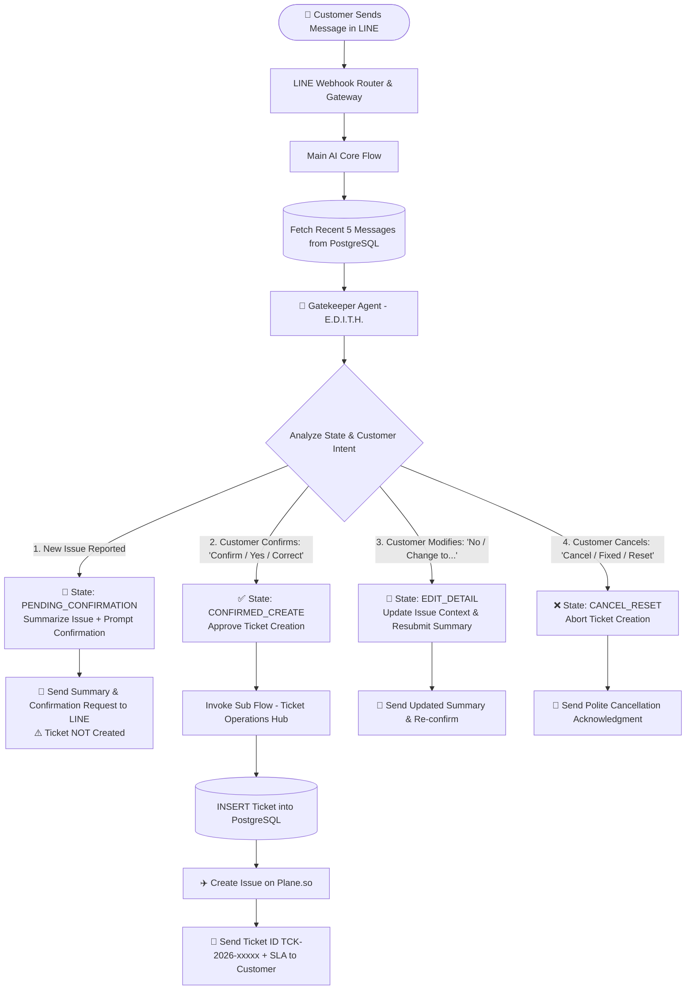
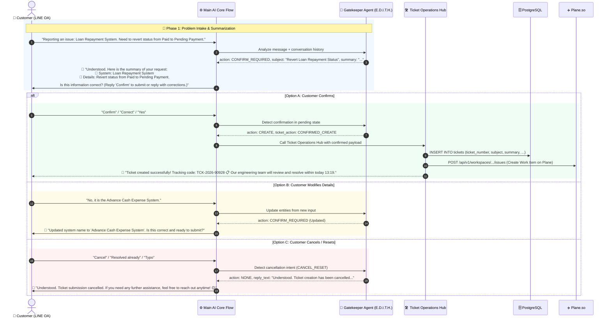

# TicketX / AutomationX: Pre-Ticket Confirmation & Reset Architecture (Two-Step Flow)

> **System Architecture & Flow Prompt Engineering Specification**  
> **Topic:** Customer Issue Summarization, Confirmation Gating, Modification & Reset Before Ticket Creation  
> **Date:** August 31, 2026  
> **Status:** Proposal & Engineering Specification (Complete Edition)

---

## 1. Background & Problem Statement

### ❌ Legacy System Problem (Immediate Ticket Creation):
In the legacy architecture, whenever a customer reports a malfunction or incident (e.g. *"Reporting an issue: Loan Repayment System. Need to revert status from Paid to Pending Payment"*):
1. **Immediate Ticket Creation on First Message:** The system instantly invoked `step_create_ticket` in PostgreSQL and synced to Plane.so (`TCK-2026-XXXXX`) without any verification or confirmation step.
2. **Junk & Misclassified Tickets:** If the user made a typo, mentioned the wrong subsystem, or resolved the issue on their own, the ticket was already permanently registered in the database and notified to engineering.
3. **No Correction or Reset Capability:** Customers lacked the ability to modify details or cancel the report before it landed on the developer board.

### 🎯 Objectives of the New System (Two-Step Confirmation & Reset):
1. **Intake & Summarize First:** Extract key entities (Module, Symptom, Severity) and present a structured summary asking the customer to confirm **(NO database record created yet)**.
2. **Confirm to Create:** Only when the customer explicitly confirms (*"Confirm", "Correct", "Yes", "Open ticket"*) does the system create the ticket in PostgreSQL, sync to Plane.so, and return `TCK-2026-XXXXX` with the SLA commitment.
3. **Support Real-Time Correction:** If the customer corrects details (*"No, it is the Advance Payment System"*), the AI updates the pending entity context and re-confirms.
4. **Support Cancellation / Reset:** If the customer cancels (*"Cancel", "Fixed already", "Nevermind", "Reset"*), the AI aborts the workflow gracefully with zero database footprint.

---

## 2. System Architecture Flowchart



---

## 3. Sequence Diagram



---

## 4. Conversation State Transition Table

| Current State | Incoming Customer Input | AI Classification Decision | Next State | System Action |
|---|---|---|---|---|
| **IDLE** (No pending case) | Reports new error / system malfunction | `CONFIRM_REQUIRED` | **PENDING_CONFIRMATION** | Summarize issue & prompt for confirmation in LINE (No DB insert). |
| **PENDING_CONFIRMATION** | "Confirm", "Correct", "Yes", "OK" | `CONFIRMED_CREATE` | **TICKET_CREATED** | Invoke Sub Flow to create ticket in DB + Plane.so + return TCK code. |
| **PENDING_CONFIRMATION** | "No", "Change to...", "Typo" | `CONFIRM_REQUIRED` | **PENDING_CONFIRMATION** | Update issue details and resend updated summary for confirmation. |
| **PENDING_CONFIRMATION** | "Cancel", "Nevermind", "Resolved", "Reset" | `CANCEL_RESET` | **IDLE** | Abort ticket creation & clear pending context. |
| **IDLE** | Manual / policy / FAQ inquiry | `DOCS_INQUIRY` | **IDLE** | Search and reply from project documents (Project Docs Sub Flow). |
| **IDLE** | Ask for human agent / manager | `HUMAN_REQUEST` | **HUMAN_TAKEOVER** | Dispatch `human_notify` webhook & hand over to operator. |

---

## 5. Gatekeeper Prompt Configuration (`E.D.I.T.H.`)

```markdown
# TWO-STEP TICKET CONFIRMATION & RESET RULES

1. NEW INCIDENT INTAKE:
   - When customer reports a new malfunction/outage/issue AND no pending confirmation in history:
   - Output 'ticket_action': "CONFIRM_REQUIRED"
   - Extract 'subject', 'summary', 'priority', 'severity'
   - The system will summarize and ask the customer to confirm before creating the ticket.

2. CUSTOMER CONFIRMATION:
   - When previous message asked for confirmation AND customer confirms ("Confirm", "Correct", "Yes", "OK", "Proceed"):
   - Output 'ticket_action': "CREATE"
   - Output 'targetAgent': "support"
   - Pass accumulated subject and summary to create the ticket.

3. CUSTOMER CORRECTION:
   - When customer modifies details ("No, it is...", "Change to..."):
   - Output 'ticket_action': "CONFIRM_REQUIRED" with updated summary.

4. CUSTOMER CANCELLATION / RESET:
   - When customer says "Cancel", "Nevermind", "Resolved", "Reset":
   - Output 'ticket_action': "NONE"
   - Output 'intent': "CANCEL_RESET"
   - Set 'reply_text' to a polite cancellation acknowledgement.
```

---

## 6. Key Business Benefits

1. 🛡️ **Zero Junk Tickets:** Eliminates accidental or incorrect ticket submissions completely.
2. 🎯 **Higher Data Accuracy:** Gives users the chance to verify subsystem names and symptoms, ensuring developers get actionable reports on the first attempt.
3. 🤝 **Human-Centric UX:** Provides a courteous, thoughtful conversational experience that builds user trust.
4. ⚡ **Clean Plane.so Project Boards:** Keeps developer backlogs clutter-free from orphaned or invalid tickets.
