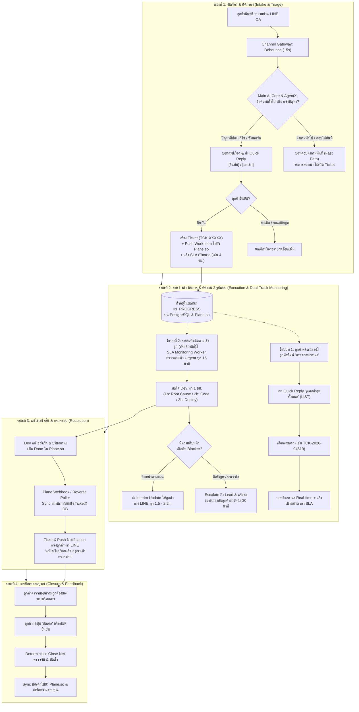
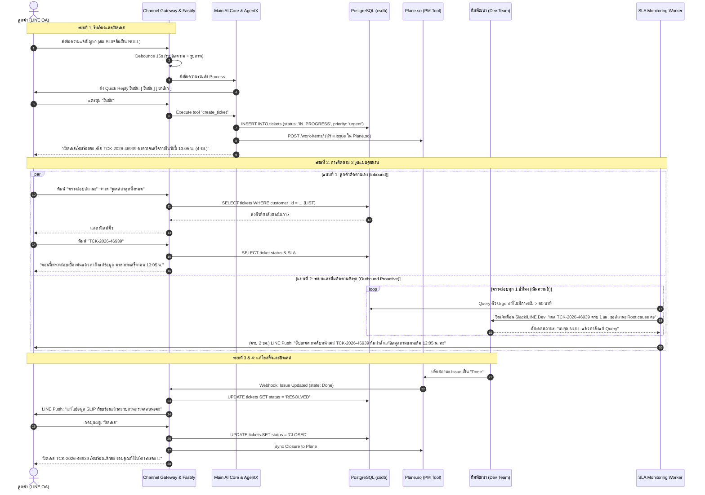

# พิมพ์เขียว Master End-to-End Flow: AutomationX & TicketX Lifecycle
**ระบบ:** AutomationX / TicketX Service Management Platform  
**ขอบเขต:** ตั้งแต่ลูกค้าส่งข้อความแรก (Intake) ➔ คัดกรอง/เปิดเคส ➔ การติดตามสถานะ 2 รูปแบบ (Self-service & Proactive) ➔ แก้ไข & ทดสอบ ➔ ปิดเคส (Case Closure)  
**วันที่บันทึก:** 2026-09-04  

---

## 1. ผังรวมภาพใหญ่ตลอดวงจรชีวิตของตั๋วงาน (Master E2E Lifecycle)

---

## 2. ลำดับการทำงานข้ามระบบแบบละเอียด (Cross-System Sequence Diagram)

---

## 3. เจาะลึกการวางระบบและการทำงานในแต่ละระยะ (Architecture Components)

### ระยะที่ 1: Intake & Smart Triage (การรับเรื่องและคัดกรอง)
1. **Channel Ingestion (LINE Debounce Service):**
   - ดักจับ Event จากลูกค้า ถ้าลูกค้าส่งข้อความติดต่อกันหลายบรรทัดหรือส่งรูปพร้อมข้อความ ระบบจะหน่วงเวลาไว้ **15 วินาที** (`LineMessageBatchingService`) เพื่อรวบรวมเป็นก้อนเดียว ก่อนส่งเข้าสมองกล AI
2. **AI Intent Classification (AgentX):**
   - **Fast Path (คำถามทั่วไป/FAQ):** หากเป็นคำถามที่ AI มีข้อมูลตอบได้ (เช่น สอบถามระเบียบ, ขั้นตอนการขอเอกสาร) บอทจะตอบทันทีและ **ไม่สร้างตั๋วงาน** เพื่อไม่ให้รกระบบ
   - **Case Creation Path (แจ้งปัญหา/ข้อผิดพลาด):** หากเป็นปัญหาเชิงเทคนิค (เช่น สลิปแสดงค่า NULL) AI จะสรุปข้อมูล:
     - *Subject:* หัวข้อปัญหาที่กระชับ
     - *Description:* รายละเอียดและผลกระทบ
     - *Priority:* ประเมินความเร่งด่วน (Urgent / High / Normal)
     - *Confirmation Gate:* ส่งปุ่ม Quick Reply ให้ลูกค้ากด **"ยืนยัน"** หรือ **"ยกเลิก"**
3. **Ticket Provisioning & Promotion:**
   - เมื่อลูกค้ายืนยัน ระบบเรียก internal tool `create_ticket`:
     - บันทึกลง PostgreSQL ในตาราง `tickets` ได้เลข `TCK-YYYY-NNNNN`
     - ยิง API เชื่อมต่อไปยัง **Plane.so** สร้าง Work Item ส่งต่อไปให้ทีม Dev ทันที พร้อมแนบรูปลิงก์จาก S3
     - คำนวณ SLA Due Time (เช่น เคสด่วน = 4 ชั่วโมงข้างหน้า) แล้วตอบยืนยันลูกค้า

---

### ระยะที่ 2: Dual-Track Monitoring (การติดตามสถานะ 2 ช่องทาง)

#### รูปแบบที่ 1: ลูกค้าติดตามด้วยตนเอง (Customer Self-Service)
- **พฤติกรรม:** ลูกค้าเป็นฝ่ายทักเข้ามาเพราะอยากทราบสถานะปัจจุบัน
- **Flow การทำงาน:**
  1. ลูกค้าพิมพ์หรือกด Rich Menu คำว่า **"ตรวจสอบสถานะ"**
  2. ระบบตอบกลับพร้อมปุ่ม Quick Reply พิเศษ **"ดูเคสล่าสุดทั้งหมด"**
  3. เมื่อแตะปุ่ม ระบบจะส่งข้อความชะลอการรอ *"รับเรื่องแล้วค่ะ รอสักครู่นะคะ"* และเรียกฟังก์ชัน `LIST` จาก Hub ดึงเฉพาะตั๋วที่ยัง Active ของผู้ใช้คนนั้น
  4. บอทแสดงรายการตั๋วพร้อม Bullet Point
  5. ลูกค้าส่งรหัสตั๋วที่ต้องการ ➔ ระบบตอบรายละเอียดสถานะล่าสุด พร้อมข้อความสัญญาเวลา SLA ล่วงหน้า

#### รูปแบบที่ 2: ระบบและทีมงานติดตามเชิงรุก (Proactive Internal Follow-up)
- **พฤติกรรม:** ลูกค้าไม่ต้องเอ่ยปากถาม ระบบและทีมงานคอยสะกิดตามงานและรายงานผลเป็นระยะ
- **กลไกการทำงาน (เพิ่มความถี่สำหรับเคสด่วน 4 ชม.):**
  1. **สะกิด Dev ทุก 1 ชั่วโมง (Internal Push):**
     - *ชั่วโมงที่ 1 (10:05 น.):* เช็คว่าวิเคราะห์ Root Cause เจอหรือยัง ต้องการ Log หรือ Data เพิ่มไหม
     - *ชั่วโมงที่ 2 (11:05 น.):* เช็คความคืบหน้าการแก้ Code/Database ปลดล็อกเกอร์ทันที
     - *ชั่วโมงที่ 3 (12:05 น.):* เช็คสถานะ Build, Deployment และผลเทส
  2. **รายงานลูกค้าทุก 1.5 – 2 ชั่วโมง (Customer Interim Push):**
     - ระบบยิง LINE Push Notification ส่งข้อความสรุปความคืบหน้าให้ลูกค้าทราบตามรอบ
  3. **การจัดการความเสี่ยง (SLA Pre-breach Management):**
     - หากถึงชั่วโมงที่ 3 แล้วงานยังไม่เรียบร้อย ทีมงานจะแจ้ง **ขอขยายเวลาอย่างเป็นทางการล่วงหน้า 30-45 นาที** (ห้ามปล่อยให้เลยกำหนดโดยไม่แจ้ง)

---

### ระยะที่ 3: Resolution & Sync (การแก้ไขและตรวจรับ)
1. **Dev Resolved:** ทีมพัฒนาทำ Patch ขึ้นระบบเสร็จสิ้น และเปลี่ยนสถานะใน Plane.so เป็น `Done`
2. **Reverse Poller / Webhook:** 
   - `PlaneWebhookService` ใน TicketX Backend จะรับ Webhook ทันทีที่มีการเปลี่ยนสถานะ
   - อัปเดตสถานะในตาราง `tickets` เป็น `RESOLVED`
3. **Notify Customer:**
   - ระบบส่ง Push Message แจ้งลูกค้าทาง LINE พร้อมคำแนะนำให้ตรวจสอบข้อมูลในระบบ

---

### ระยะที่ 4: Deterministic Case Closure (การปิดเคสสมบูรณ์)
1. **Onboarding / Menu Integration:**
   - ลูกค้าสามารถแตะการ์ดเมนู **"ปิดเคส"** หรือพิมพ์บอกว่าตรวจสอบเรียบร้อยแล้ว
2. **Deterministic Close Net:**
   - ระบบตรวจจับบริบทการปิดเคสอย่างแม่นยำ ไม่สับสนกับการถามสถานะ
   - ปรับสถานะในฐานข้อมูลเป็น `CLOSED` และส่งสถานะไปปิด Issue ใน Plane.so
3. **Closure Farewell:**
   - ส่งข้อความยืนยันปิดเคสอย่างสุภาพ (ลงท้ายด้วย "ค่ะ/นะคะ") และบันทึกประวัติการสนทนาเข้าฐานข้อมูลอย่างสมบูรณ์

---

## 4. ตารางสรุปหน้าที่และความรับผิดชอบของแต่ละส่วนในระบบ

| ส่วนประกอบ (Component) | บทบาทในระยะที่ 1 (Intake) | บทบาทในระยะที่ 2 (Tracking) | บทบาทในระยะที่ 3-4 (Close) |
| :--- | :--- | :--- | :--- |
| **LINE Official Account** | หน้าด่านรับข้อความ และแสดงปุ่ม Quick Reply ยืนยัน | รองรับเมนูตรวจสอบสถานะ / รับข้อความ Push แจ้งเตือน | รับคำสั่งปิดเคส / แสดงข้อความขอบคุณ |
| **Channel Gateway & Fastify** | ทำ Debounce 15 วิ และตรวจจับ Signature | บริหารคิวข้อความ (Agent Session Queue) | จัดการ Webhook และสิทธิ์การเข้าถึง |
| **Main AI Core & AgentX** | คัดกรอง Intent (ทั่วไป vs เปิดเคส) | แปลงคำถามสถานะ (`LIST` / `GET_STATUS`) | ตรวจจับคำสั่งปิดเคส (Deterministic Close Net) |
| **PostgreSQL (`csdb`)** | บันทึก `tickets`, `messages`, `attachments` | บันทึกประวัติการอัปเดตสถานะและ SLA Due Date | ปรับสถานะเป็น `RESOLVED` / `CLOSED` |
| **Plane.so** | รับ Work Item ไปจัดคิวให้ทีม Dev | ติดตามความคืบหน้าของ Task ใน Sprint | รับการปิดตั๋วเมื่อเคสเสร็จสมบูรณ์ |
| **SLA Monitoring Worker** | คำนวณกรอบเวลา SLA ตามระดับความด่วน | วนลูปสะกิด Dev ทุก 1 ชม. & ยิงเตือนก่อนหลุด SLA | สรุปเวลาที่ใช้ในการแก้ไข (Resolution Time) |
