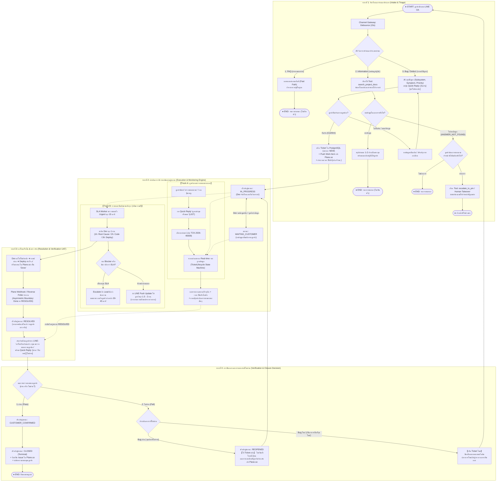
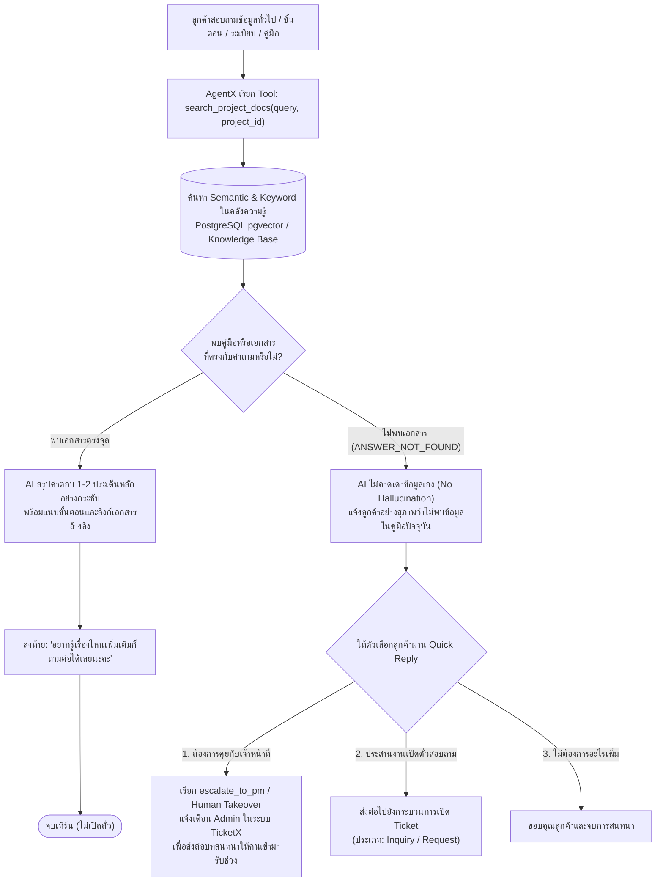
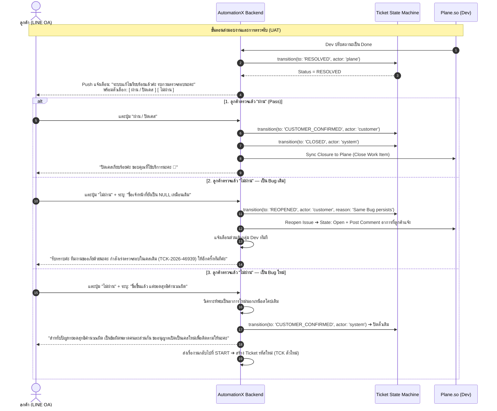

# พิมพ์เขียว Master End-to-End Flow: AutomationX & TicketX Lifecycle (ฉบับสมบูรณ์ที่สุด)
**ระบบ:** AutomationX / TicketX Service Management Platform  
**อ้างอิงโค้ดฐานข้อมูลและสเตทแมชชีนจริง:** `TicketLifecycle.ts`, `TicketStateMachine.ts`, `search_project_docs`, `PlaneWebhookService.ts`  
**ขอบเขต:** ครอบคลุมครบทุกเส้นทาง 100% ไม่มีจุดลอยหรือเส้นขาด:  
1. **Intake & Multi-Path Triage:** FAQ, Information (ค้นหาคลังความรู้ `search_project_docs` + ส่งต่อเจ้าหน้าที่ `Human Takeover`), และ Bug / Defect  
2. **Confirmation & Provisioning:** สรุปปัญหา ➔ ยืนยัน ➔ สร้างตั๋ว (`NEW` ➔ `IN_PROGRESS`)  
3. **Dual-Track Monitoring & Status Engine:** การติดตามคู่ขนาน ทั้งฝั่ง Dev (สะกิดทุก 1 ชม.), ฝั่งลูกค้าติดตามเชิงรุก (Interim update), และฝั่งลูกค้ากดดูเอง (Inbound Check Status) ซึ่งเชื่อมโยงกับสถานะจริงในระบบ (`IN_PROGRESS`, `WAITING_CUSTOMER`, `WAITING_INTERNAL`)  
4. **Resolution (Asymmetric Boundary):** Dev Done ใน Plane.so ➔ ซิงค์เป็น `RESOLVED` ➔ ส่งแจ้งเตือนลูกค้าตรวจรับ (UAT)  
5. **Verification & Closure Decision:**  
   - **ผ่าน (Pass):** `CUSTOMER_CONFIRMED` ➔ `CLOSED` ➔ ซิงค์ปิด Plane.so ➔ จบกระบวนการ  
   - **ไม่ผ่าน (Fail - Bug เดิม):** `REOPENED` ➔ วนกลับไปที่ `IN_PROGRESS` ให้ Dev แก้ไขต่อใน Ticket เดิม  
   - **ไม่ผ่าน (Fail - Bug ใหม่):** แยกเป็นเคสใหม่ ➔ วนกลับไปที่จุดเริ่มต้น `START` เพื่อเปิดตั๋วใหม่  

---

## 1. ผังรวมระดับ Master E2E Flow (เชื่อมโยงสมบูรณ์ทุกสถานะ)

---

## 2. เจาะลึก Flow ปัญหาประเภท "Information" (พร้อมคลังเอกสาร & Human Takeover)

ในระบบ AutomationX ปัญหาประเภท `Information` ไม่ใช่แค่ตอบข้อความเปล่าๆ แต่มี Sub-flow ที่สมบูรณ์ตามมาตรฐานระบบ:

---

## 3. วงจรชีวิตของสถานะตั๋ว (Ticket Lifecycle State Machine)

ในโค้ด `system/backend/src/domain/ticket/TicketLifecycle.ts` และ `TicketStateMachine.ts` สถานะของตั๋วถูกควบคุมอย่างเข้มงวด ดังนี้:

| สถานะใน TicketX (Customer Lifecycle) | ความหมายและบริบทการทำงาน | สถานะที่เชื่อมกับ Plane.so | ใครเป็นคนเปลี่ยนสถานะได้ (Actor) |
| :--- | :--- | :--- | :--- |
| `NEW` | ตั๋วถูกสร้างขึ้นในระบบ รอการจัดคิว | `Backlog` | System / Operator |
| `TRIAGED` | ผ่านการคัดกรองและประเมินเบื้องต้นแล้ว | `Backlog` | Operator / System |
| `IN_PROGRESS` | ทีม Dev กำลังดำเนินการตรวจสอบและแก้ไข | `Open` | Dev (Plane) / Operator |
| `WAITING_CUSTOMER` | ทีมงานขอข้อมูลเพิ่มเติมจากลูกค้า (เช่น ขอรูป Log เพิ่ม) | `Open` | Operator / System |
| `WAITING_INTERNAL` | รอการประสานงานภายในระหว่างทีม | `Open` | Operator / System |
| **`RESOLVED`** | **Dev แก้ไขเสร็จ (Done ใน Plane) ➔ ส่งให้ลูกค้าตรวจรับ (UAT)** | **`Done`** | **Plane / System (ไม่ใช่ Closed!)** |
| `CUSTOMER_CONFIRMED` | ลูกค้าตรวจสอบแล้วยืนยันว่า "ผ่าน" | `Done` | **Customer เท่านั้น** |
| **`CLOSED`** | ตั๋วถูกปิดอย่างเป็นทางการ (Terminal State) | **`Done`** | **Customer / System** |
| **`REOPENED`** | **ลูกค้าแจ้ง "ไม่ผ่าน" (Bug เดิม) ➔ วนกลับไปแก้ต่อ** | **`Open`** | **Customer / Operator** |
| `CANCELLED` | ยกเลิกเคส (เช่น ลูกค้าแจ้งยกเลิกก่อนเริ่มงาน) | `Cancelled` | Customer / Operator |

> [!IMPORTANT]
> **หลักการ Asymmetric Boundary (ความปลอดภัยของสถานะ):**  
> เมื่อทีม Dev แก้ไขงานเสร็จใน Plane.so และปรับสถานะเป็น `Done` ระบบจะเปลี่ยนสถานะใน TicketX เป็น **`RESOLVED` เท่านั้น (ห้ามเปลี่ยนเป็น `CLOSED` เด็ดขาด)**  
> เพราะ *"การที่ Dev ทำเสร็จ ไม่ได้แปลว่าปัญหาได้รับการแก้ไขถูกต้องในมุมมองของลูกค้า"* ตั๋วจะปิดเป็น `CLOSED` ได้ก็ต่อเมื่อ **ลูกค้าเป็นผู้ยืนยันตรวจรับด้วยตนเอง** เท่านั้น!

---

## 4. รายละเอียดจุดเชื่อมโยงของการตรวจสอบสถานะ (Track A ที่ไม่ขาดตอน)

จากข้อสังเกตเรื่องสถานะที่หายไป เมื่อลูกค้ากดดูสถานะในแชต:
1. **เมื่อลูกค้าพิมพ์ `"ตรวจสอบสถานะ"` ➔ กด `"ดูเคสล่าสุดทั้งหมด"`:**
   - ระบบจะ Query รายการตั๋วที่ยังไม่ปิด (`status NOT IN ('CLOSED', 'CANCELLED')`)
2. **เมื่อเลือกรหัสตั๋ว เช่น `TCK-2026-46939`:**
   - ระบบอ่านค่าจาก `TicketStateMachine`
   - **ถ้าสถานะคือ `IN_PROGRESS`:** บอทจะรายงานความคืบหน้า + เวลา SLA เป้าหมาย + แจ้งว่าทีมงานกำลังเร่งดำเนินการ
   - **ถ้าสถานะคือ `WAITING_CUSTOMER`:** บอทจะขึ้นข้อความเตือนว่า *"ทีมงานกำลังรอข้อมูล [เรื่องที่ขอ] เพิ่มเติมจากคุณลูกค้าอยู่นะคะ"*
   - **ถ้าสถานะคือ `RESOLVED` (งานเสร็จแล้วรอลูกค้าตรวจ):** บอทจะไม่ใช่แค่บอกสถานะ แต่จะ **แนบปุ่มยืนยันผลตรวจรับ UAT ทันที**:
     - ปุ่ม **[ ตรวจสอบแล้ว ถูกต้อง (ปิดเคส) ]**
     - ปุ่ม **[ ยังพบปัญหา (ไม่ผ่าน) ]**
   - **ทำให้เส้นทางของลูกค้า (Track A) เชื่อมโยงกลับเข้าสู่กระบวนการปิดเคส (Stage 4) ได้ทันทีโดยไม่มีจุดตัน!**

---

## 5. การจัดการตอนปิดเคสแบบละเอียด: "ผ่าน" vs "ไม่ผ่าน (Bug เดิม vs Bug ใหม่)"

