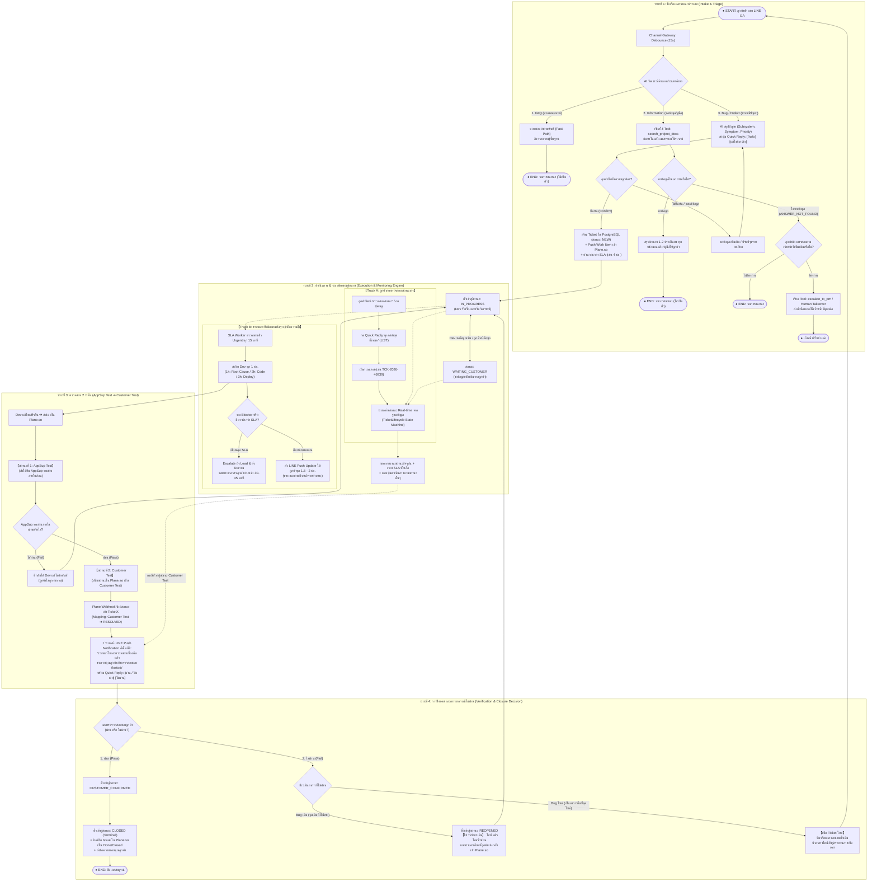
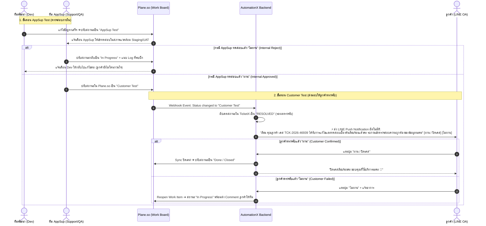

# พิมพ์เขียว Master End-to-End Flow: AutomationX & TicketX Lifecycle (ฉบับสมบูรณ์ที่สุด)
**ระบบ:** AutomationX / TicketX Service Management Platform  
**อ้างอิงข้อกำหนดเพิ่มเติมจากทีม AppSup:**  
เมื่อ Dev แก้ไขปัญหาเสร็จ จะมีขั้นตอนการตรวจสอบ 2 ระดับใน Plane.so ก่อนส่งถึงลูกค้า:
1. **`AppSup Test`:** ให้ทีม AppSup ตรวจสอบความถูกต้องภายในก่อน (หากไม่ผ่าน ตีกลับให้ Dev แก้ต่อทันที โดยลูกค้าไม่ต้องรับรู้)
2. **`Customer Test`:** เมื่อ AppSup ตรวจผ่าน จะเปลี่ยนสถานะเป็น `Customer Test` ซึ่งระบบจะ **ทริกเกอร์ส่ง LINE Push แจ้งเตือนลูกค้าให้เข้าตรวจรับ (UAT)**  
**วันที่ปรับปรุง:** 2026-09-07  

---

## 1. ผังรวมระดับ Master E2E Flow (พร้อมขั้นตอน AppSup Test ➔ Customer Test)



---

## 2. ลำดับขั้นตอนการทำงานในช่วง AppSup Test ➔ Customer Test



---

## 3. ตารางสถานะที่เชื่อมโยงระหว่าง Plane.so และ TicketX

| ขั้นตอนการทำงาน | สถานะใน Plane.so | สถานะใน TicketX | การกระทำของระบบ (System Action) |
| :--- | :--- | :--- | :--- |
| รับเรื่อง / เปิดเคส | `Backlog` / `Todo` | `NEW` / `TRIAGED` | สร้างตั๋วงาน แจ้งเลขเคสและ SLA แก่ลูกค้า |
| Dev กำลังแก้ปัญหา | `In Progress` | `IN_PROGRESS` | ระบบวนลูปสะกิด Dev ทุก 1 ชม. / ส่ง Interim Update ลูกค้า |
| Dev ทำเสร็จ ส่งตรวจภายใน | **`AppSup Test`** | `WAITING_INTERNAL` | **AppSup ทำการทดสอบระบบภายใน (ยังไม่แจ้งลูกค้า)** |
| AppSup เทสไม่ผ่าน | `In Progress` | `IN_PROGRESS` | ตีกลับให้ Dev แก้ต่อทันที โดยลูกค้าไม่เสียเวลา |
| AppSup เทสผ่าน | **`Customer Test`** | **`RESOLVED`** | **ระบบยิง LINE Push เตือนลูกค้าให้ตรวจรับทันที!** |
| ลูกค้ายืนยันว่า "ผ่าน" | `Done` / `Closed` | `CUSTOMER_CONFIRMED` ➔ `CLOSED` | ปิดเคสสมบูรณ์ บันทึกประวัติและส่งข้อความขอบคุณ |
| ลูกค้าแจ้ง "ไม่ผ่าน" (Bug เดิม) | `In Progress` / `Reopened` | `REOPENED` ➔ `IN_PROGRESS` | นำข้อมูลลูกค้าส่งต่อให้ Dev แก้ไขต่อในตั๋วเดิม |
| ลูกค้าแจ้ง "ไม่ผ่าน" (Bug ใหม่) | `Done` (ตั๋วเดิม) / เปิดใหม่ | `CLOSED` (เดิม) / `NEW` (ใหม่) | ปิดตั๋วเดิม และเปิดตั๋วใหม่สำหรับอาการใหม่ |

---

## 4. ตัวอย่างข้อความแจ้งเตือนเมื่อเข้าสู่สถานะ `Customer Test`

เมื่อทีม AppSup เปลี่ยนสถานะใน Plane.so เป็น `Customer Test` บอทจะยิงข้อความเข้า LINE ลูกค้าทันที:

```text
เรียน คุณลูกค้า (แจ้งผลการแก้ไขเพื่อตรวจสอบ: TCK-2026-46939) 📌

ขณะนี้ทีมงานได้ดำเนินการแก้ไขปัญหาข้อมูลใบรับรองการจ่ายเงินเดือน (SLIP) และผ่านการตรวจสอบความถูกต้องเบื้องต้นจากทีมสนับสนุนระบบ (AppSup) เรียบร้อยแล้วค่ะ

🔹 รายละเอียดเคส: TCK-2026-46939
🔹 สถานะปัจจุบัน: Customer Test (พร้อมให้คุณลูกค้าเข้าตรวจรับ)

รบกวนคุณลูกค้าเข้าตรวจสอบความถูกต้องของข้อมูลในระบบได้ตามปกติค่ะ เมื่อตรวจสอบเรียบร้อยแล้ว สามารถกดปุ่มด้านล่างเพื่อยืนยันได้เลยนะคะ:
[ ตรวจสอบแล้ว ถูกต้อง (ปิดเคส) ]   [ ยังพบปัญหา (ไม่ผ่าน) ]

หากมีข้อติดขัดประการใด สามารถแจ้งทีมงานกลับมาได้ทันทีนะคะ ขอบคุณค่ะ 🙏
```
