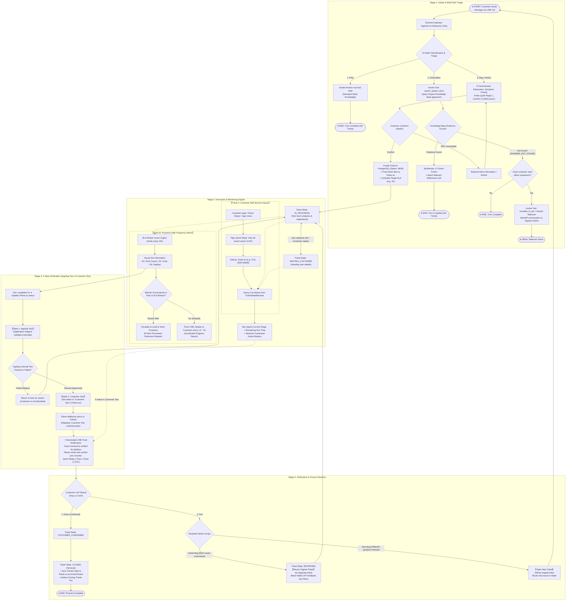
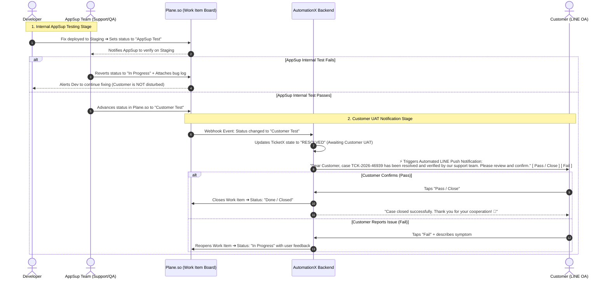

# Master End-to-End Ticket Lifecycle Blueprint: AutomationX & TicketX (100% Complete Edition)
**System:** AutomationX / TicketX Service Management Platform  
**Specification Update:** Incorporating 2-Step Staging Verification defined by Application Support (AppSup):  
1. **`AppSup Test`:** Internal verification by Application Support / QA team before customer handoff (if failed, returned to Dev without disturbing the customer).  
2. **`Customer Test`:** Once AppSup approves, the status transitions to `Customer Test`, which **triggers an automated LINE Push Notification prompting the customer to perform UAT**.  
**Date:** September 7, 2026  

---

## 1. Master E2E Lifecycle Flowchart (With AppSup Test & Customer Test)

---

## 2. Sequence Diagram: AppSup Test to Customer Test Transition

---

## 3. Plane.so to TicketX State Mapping Table

| Operational Stage | Plane.so State | TicketX Lifecycle State | System Action & Customer Impact |
| :--- | :--- | :--- | :--- |
| Intake & Creation | `Backlog` / `Todo` | `NEW` / `TRIAGED` | Generates TCK ID and SLA commitment to user. |
| In Development | `In Progress` | `IN_PROGRESS` | Hourly dev alerts; customer interim updates. |
| Dev Completed | **`AppSup Test`** | `WAITING_INTERNAL` | **AppSup tests internally. Customer is NOT alerted yet.** |
| AppSup Rejected | `In Progress` | `IN_PROGRESS` | Returned to Dev internally. |
| AppSup Approved | **`Customer Test`** | **`RESOLVED`** | **Automated LINE Push sent prompting customer for UAT.** |
| Customer Confirmed | `Done` / `Closed` | `CUSTOMER_CONFIRMED` ➔ `CLOSED` | Closes case cleanly; sends thank-you message. |
| Customer Failed (Same Bug) | `In Progress` / `Reopened` | `REOPENED` ➔ `IN_PROGRESS` | Resumes work on original ticket; urgent alert to team. |
| Customer Failed (New Bug) | `Done` (Original) / New Ticket | `CLOSED` (Original) / `NEW` (New) | Closes original ticket; routes new issue to Intake. |
