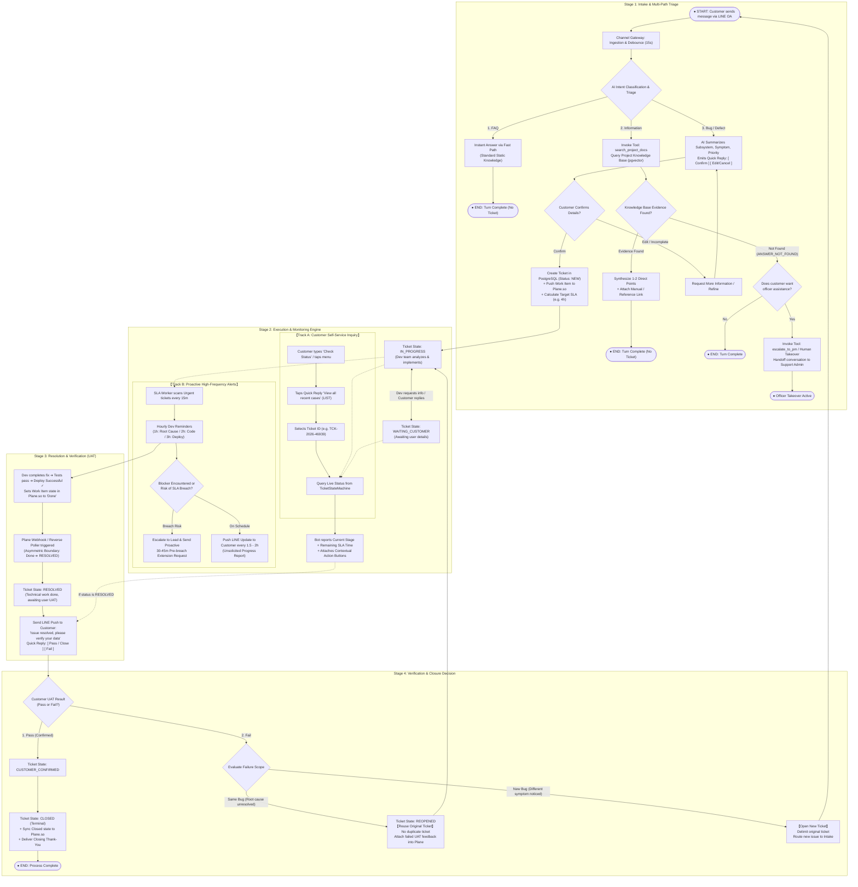
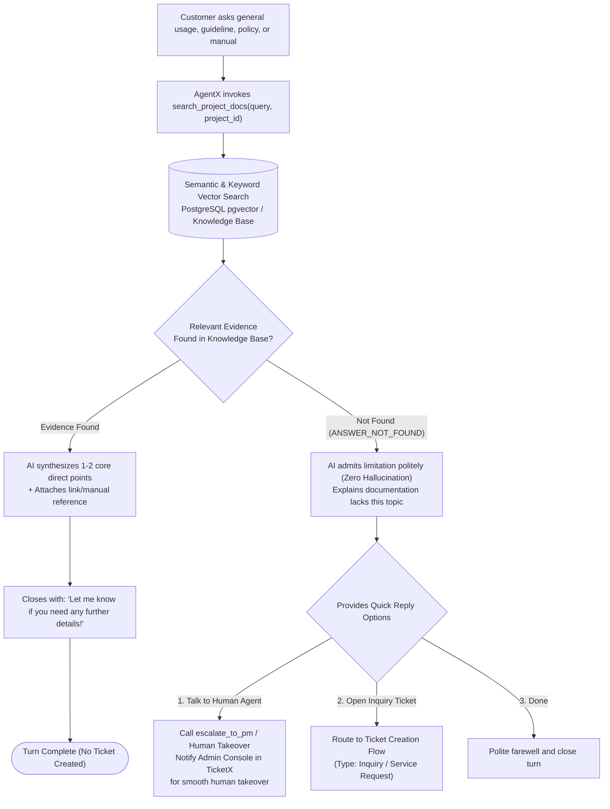

# Master End-to-End Ticket Lifecycle Blueprint: AutomationX & TicketX (100% Complete Edition)
**System:** AutomationX / TicketX Service Management Platform  
**Codebase Sources of Truth:** `TicketLifecycle.ts`, `TicketStateMachine.ts`, `search_project_docs`, `PlaneWebhookService.ts`  
**Scope:** 100% Complete & Unbroken End-to-End Flow:  
1. **Intake & Multi-Path Triage:** FAQ, Information (via `search_project_docs` & `Human Takeover`), Bug / Defect  
2. **Confirmation & Provisioning:** Summarize ➔ Confirmation Gating ➔ Ticket Creation (`NEW` ➔ `IN_PROGRESS`)  
3. **Execution & Real-Time Status Engine:** Hourly Dev Reminders, Customer Proactive Push, and Customer Self-Service Inquiry seamlessly connected to live lifecycle states (`IN_PROGRESS`, `WAITING_CUSTOMER`, `WAITING_INTERNAL`)  
4. **Resolution (Asymmetric Boundary):** Plane `Done` ➔ `RESOLVED` ➔ Automatic UAT Prompt to Customer  
5. **Verification & Closure Decision:**  
   - **Pass:** `CUSTOMER_CONFIRMED` ➔ `CLOSED` (Terminal) ➔ Sync Done to Plane.so  
   - **Fail (Same Bug):** `REOPENED` ➔ Reuse Original Ticket ➔ Back to `IN_PROGRESS`  
   - **Fail (New Bug):** Isolate / Close original ➔ Route to `START` for New Ticket Creation  
**Date:** September 7, 2026  

---

## 1. Master E2E Lifecycle Flowchart (100% Connected)

---

## 2. Dedicated "Information" Flow (Knowledge Retrieval & Escalation)

---

## 3. Ticket Lifecycle State Machine Architecture

From `TicketLifecycle.ts` and `TicketStateMachine.ts`:

| State in TicketX | Description & Role | Mapped State in Plane.so | Permitted Transition Actor |
| :--- | :--- | :--- | :--- |
| `NEW` | Fresh ticket created in database | `Backlog` | System / Operator |
| `TRIAGED` | Assessed and categorized | `Backlog` | Operator / System |
| `IN_PROGRESS` | Engineering actively investigating and resolving | `Open` | Dev (Plane) / Operator |
| `WAITING_CUSTOMER` | Waiting for additional info/screenshots from user | `Open` | Operator / System |
| `WAITING_INTERNAL` | Waiting for cross-team or vendor dependency | `Open` | Operator / System |
| **`RESOLVED`** | **Engineering Done in Plane.so ➔ Waiting for Customer UAT** | **`Done`** | **Plane / System (Never auto-closed!)** |
| `CUSTOMER_CONFIRMED` | Customer verifies and confirms fix | `Done` | **Customer Only** |
| **`CLOSED`** | Ticket permanently closed (Terminal State) | **`Done`** | **Customer / System** |
| **`REOPENED`** | **Customer reports Fail (Same Bug) ➔ Reopens ticket** | **`Open`** | **Customer / Operator** |
| `CANCELLED` | Ticket cancelled by customer or operator | `Cancelled` | Customer / Operator |

> [!IMPORTANT]
> **The Asymmetric Boundary Principle:**  
> When engineering marks an issue `Done` in Plane.so, TicketX transitions the ticket to **`RESOLVED`**, NEVER directly to `CLOSED`.  
> Engineering completing work does not mean the customer agrees the problem is solved. Only the customer can transition the ticket past `RESOLVED` into `CUSTOMER_CONFIRMED` ➔ `CLOSED` or `REOPENED`.

---

## 4. Unbroken Status Inquiry Track (Track A)

1. **Customer Inquires Status:** Customer taps *"Check Status"* ➔ *"View all recent cases"* (`LIST`).
2. **Selecting Ticket:** The system queries `TicketStateMachine`:
   - If `IN_PROGRESS`: Reports current stage and hours left to SLA.
   - If `WAITING_CUSTOMER`: Informs the user what information the team is waiting for.
   - **If `RESOLVED`:** Directly presents UAT decision chips:
     - **[ Verified & Correct (Close Case) ]**
     - **[ Still Broken (Fail) ]**
   - **This directly connects Track A into Stage 4 (Verification & Closure) without any broken or dead-end paths.**
