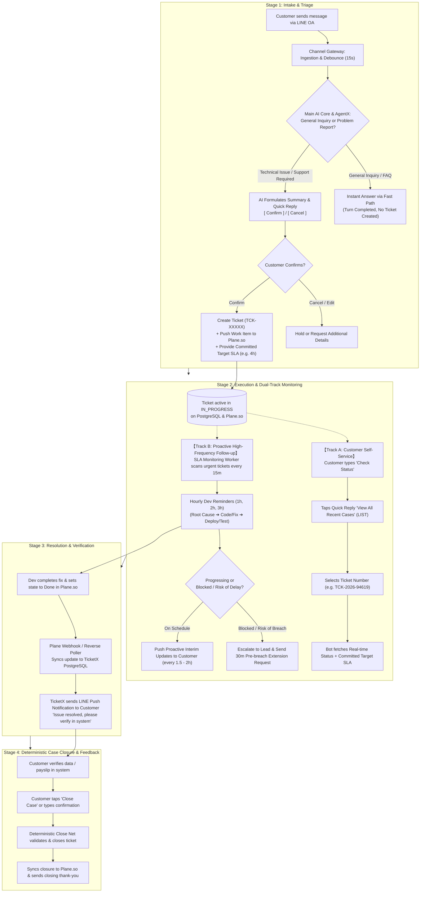
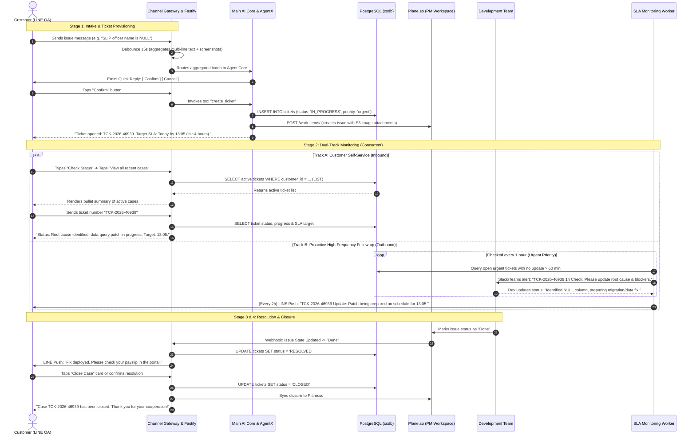

# Master End-to-End Ticket Lifecycle Blueprint: AutomationX & TicketX
**System:** AutomationX / TicketX Service Management Platform  
**Scope:** Complete Lifecycle — From Initial Customer Inbound (Intake) ➔ Triage/Creation ➔ Dual-Track Monitoring (Self-Service & Proactive) ➔ Resolution ➔ Deterministic Case Closure  
**Date:** 2026-09-04  

---

## 1. Master E2E Lifecycle Flowchart



---

## 2. Cross-System Sequence Diagram



---

## 3. Detailed Architecture Stages

### Stage 1: Intake & Smart Triage
1. **15-Second Debounce Window (`LineMessageBatchingService`):**
   - Buffers fragmented incoming messages and late screenshots within a 15-second window, preventing multiple redundant AI execution turns.
2. **AI Intent Classification (AgentX):**
   - **Fast Path (General Inquiry):** If the user asks general questions (e.g. system usage, guidelines, office hours), AgentX replies immediately with verified knowledge. **Zero tickets are created.**
   - **Problem Path (Incident / Bug Report):** If an actionable technical defect is reported (e.g. salary certificate showing `NULL`), AgentX formulates a structured incident description and serves native LINE Quick Reply buttons: **[ Confirm ]** and **[ Cancel ]**.
3. **Ticket Provisioning & Plane Promotion:**
   - Once confirmed, the system calls `create_ticket`:
     - Inserts the record into PostgreSQL `tickets` with identifier `TCK-YYYY-NNNNN`.
     - Promotes the ticket to **Plane.so** as a tracked Work Item, uploading and embedding customer screenshots.
     - Calculates the target SLA timestamp (e.g. 4 hours for urgent tickets) and sends confirmation to the user.

---

### Stage 2: Dual-Track Monitoring

#### Track A: Customer Self-Service (Inbound Tracking)
- **User Action:** Customer taps the menu or types *"Check Status"*.
- **Mechanism:**
  1. Bot responds with quick reply chip: *"View all recent cases"*.
  2. Tapping the chip triggers the `LIST` action on `Ticket Operations Hub`.
  3. Returns a concise bulleted list of the customer's open cases with case number, title, and current stage.
  4. The customer types the target case number (e.g. `TCK-2026-94619`).
  5. The bot executes `GET_STATUS` and responds with the live stage, reassurance, and the committed target SLA.

#### Track B: Proactive High-Frequency Follow-up (Outbound Tracking)
- **Problem Solved:** Prevents developers from forgetting updates and prevents customers from feeling abandoned.
- **Hourly Dev Cadence (Urgent 4-Hour SLA):**
  - **Hour 1 (T+60m):** Check if Root Cause has been identified; ask if extra database logs/dumps are needed.
  - **Hour 2 (T+120m):** Review coding/data fixing progress; verify if unit/integration testing has started.
  - **Hour 3 (T+180m):** Check build readiness, deployment pipeline, and verify whether completion by 13:05 is achievable.
- **Proactive Customer Push (Every 1.5 – 2 Hours):**
  - Sends a progress update to the customer via LINE Push without requiring the customer to ask.
- **Pre-breach SLA Management:**
  - If Hour 3 indicates that testing cannot finish by 13:05, an **Extension Request is proactively sent to the customer at least 30–45 minutes prior to breach**.

---

### Stage 3: Resolution & Verification
1. **Dev Resolution:** The engineer deploys the fix and marks the Work Item as `Done` in Plane.so.
2. **Reverse Poller & Webhook Sync:**
   - `PlaneWebhookService` captures the state change and updates the database record to `RESOLVED`.
3. **Customer Alert:**
   - `CustomerNotificationService` pushes a notification to the customer explaining the resolution and asking them to verify their records.

---

### Stage 4: Deterministic Case Closure
1. **Close Trigger:**
   - The customer taps the dedicated *"Close Case"* menu card or sends a message confirming that the issue is fixed.
2. **Deterministic Close Net:**
   - The system intercepts the closing context safely and sets `status = 'CLOSED'`.
3. **Downstream Synchronization:**
   - Updates Plane.so, releases active takeover leases, and delivers a polite closing message.

---

## 4. Ready-to-Use Message Templates (English)

### 4.1 Internal Developer Reminders (Hourly Cadence)

#### [Hour 1 Reminder - T+60m] Root Cause Check
```text
[URGENT ⚠️ SLA Check-in: 1-Hour Mark]
📌 Ticket ID: TCK-2026-46939 (SLIP officer name NULL) | Target SLA: Today at 13:05
Hi Dev Team, please provide a quick status update:
1. Has the root cause been identified?
2. Do you require any additional logs, queries, or database extracts from support?
```

#### [Hour 2 Reminder - T+120m] Implementation Check
```text
[URGENT ⏱️ SLA Check-in: 2-Hour Mark]
📌 Ticket ID: TCK-2026-46939 | 2 hours remaining until target delivery (13:05)
1. What is the current implementation status (data patch / code fix / testing)?
2. Have test runs been initiated?
(Information will be used for the interim progress update to the customer. Thank you!)
```

#### [Hour 3 Reminder - T+180m] Pre-Deployment & Readiness Check
```text
[CRITICAL 🚨 Pre-Deadline Check: 3-Hour Mark]
📌 Ticket ID: TCK-2026-46939 | 1 hour remaining until SLA deadline (13:05)
1. Is the patch ready for production deployment?
2. Can we meet the 13:05 delivery deadline?
3. If not, please estimate the new completion time immediately so we can proactively request an extension from the customer.
```

---

### 4.2 Proactive Customer Interim Updates

#### [2-Hour Interim Update] Progressing On Schedule
```text
Dear Valued Customer (Status Update: TCK-2026-46939) 📌

We would like to provide an interim update regarding the payroll certificate (SLIP) officer name issue:

🔹 Current Status: Our engineering team has identified the cause and is actively applying the necessary data corrections and verification tests.
🔹 Expected Completion: Today at 13:05 (as scheduled).

Our team is monitoring this closely. We will notify you as soon as the service is fully restored. Thank you! 🙏
```

#### [Pre-Breach Warning - Sent 35m in advance] Extension Notice
```text
Dear Valued Customer (Status Update: TCK-2026-46939) 📌

We are writing to provide an update on your case. The technical fix has been applied, and our team is conducting rigorous system-wide verification across all payroll records to ensure data integrity and avoid side effects.

To ensure complete accuracy, we would like to request an extension of our delivery time to [e.g. 14:00 today].

We sincerely apologize for the delay and are working diligently to finalize the update. Thank you for your patience! 🙏
```

#### [Resolution Notice] Ready for Verification
```text
Dear Valued Customer (Resolution Notice: TCK-2026-46939) ✅

The payroll certificate (SLIP) issue has been successfully resolved. The paying officer information is now displaying correctly.

You may now log into the portal to review your records. If you experience any further issues, please do not hesitate to reach out to us.

Thank you for your cooperation! 🙏
```

---

## 5. Architectural Component Responsibility Matrix

| Component | Stage 1 (Intake & Triage) | Stage 2 (Dual-Track Monitoring) | Stage 3-4 (Resolution & Closure) |
| :--- | :--- | :--- | :--- |
| **LINE Official Account** | Ingests raw input; displays confirmation buttons | Serves "Check Status" menu; delivers proactive push alerts | Displays "Close Case" menu; delivers closing message |
| **Gateway & Fastify** | 15s Debounce; signature verification | Manages session queue; handles webhook rate limits | Manages reverse webhook ingress from Plane.so |
| **Main AI Core & AgentX** | Classifies intent (General vs. Ticket Creation) | Routes status inquiries (`LIST`, `GET_STATUS`) | Deterministic Close Net intercepts close intent |
| **PostgreSQL (`csdb`)** | Stores tickets, messages, attachments | Tracks interim checkpoint timestamps & SLA due dates | Updates state to `RESOLVED` and `CLOSED` |
| **Plane.so** | Receives synced Work Item for sprint backlog | Tracks engineer progress and status transitions | Receives final closure synchronization |
| **SLA Monitoring Worker** | Computes SLA targets based on ticket priority | Executes hourly dev check-ins & triggers pre-breach alerts | Measures final resolution time & SLA compliance metrics |
