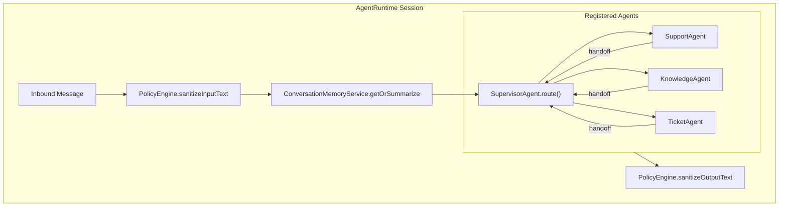
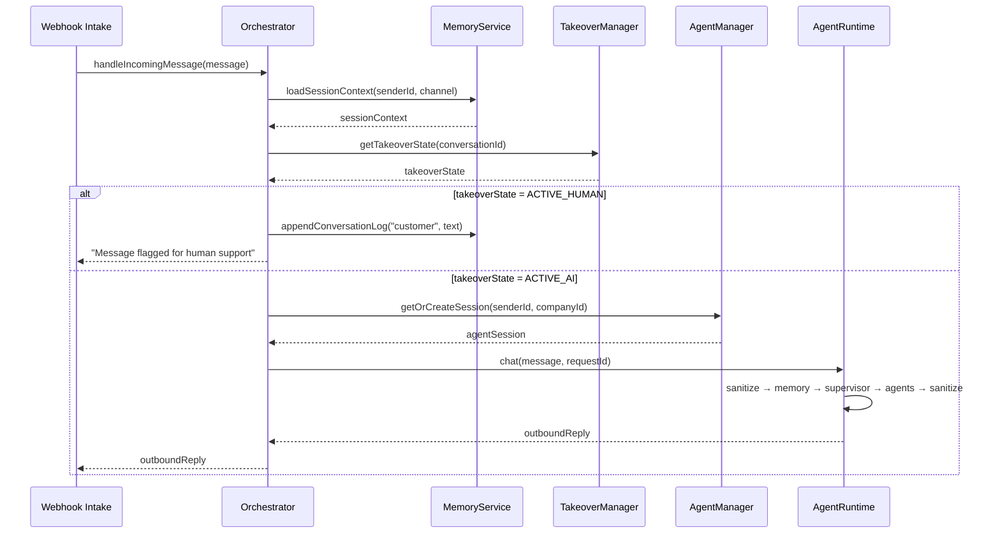
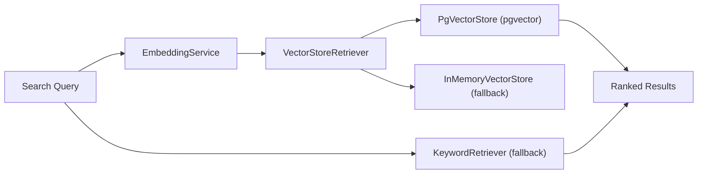
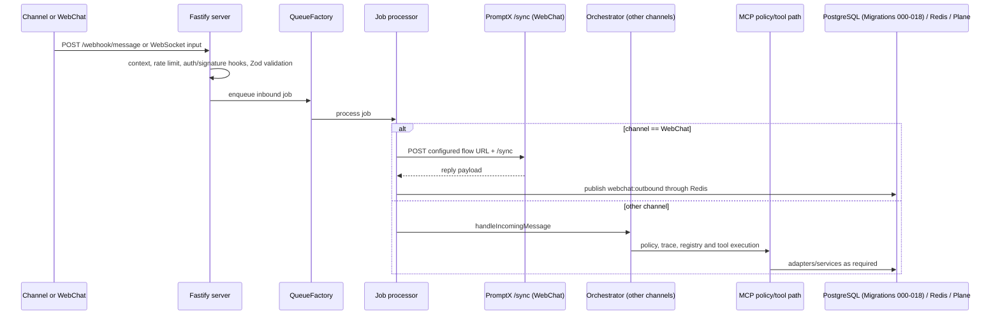

# AutomationX V3: End-to-End System Flow and Platform Architecture Specification

> Documentation Status
>
> - Last repository synchronization: 2026-07-22
> - Repository branch: `กูคอมมิตแล้วไอ้สาสสสสสสสสสสสสสสสสสส`
> - Repository commit: `66b72fe38c35701c30c2593a99571812628ac363`
> - Evidence basis: implementation, database migrations 000-018, seed scripts, logs, and project memory
> - Document scope: End-to-End System Flow & Runtime Specification (English)
> - Current-state confidence: High for repository source & local database; Medium for production deployment topology

This specification documents the production-grade architecture, asynchronous execution pipelines, context scoping patterns, and data persistence models of the **AutomationX V3 Platform**. It details the evolution from V2 monolithic structures to the V3 Project-Centric Monorepo.

## Current Implementation Status (2026-07-23)

- `IMPLEMENTED BUT UNVERIFIED`: the backend contains the Milestone 6 notification path. The `escalate_to_pm` tool validates the optional ticket/conversation relationship and posts structured escalation context to `/api/v1/webhooks/human_notify`; a human operator can reply after takeover.
- `PARTIALLY VERIFIED`: LINE human-reply delivery, message persistence, and required uniqueness migration were locally verified on 2026-07-20. Deployed PromptX flows and external notification delivery for every channel are not verified by this document.
- `PLANNED`: on-call rotation, acknowledgement workflow, per-recipient notification receipts, and the `on_call_rosters` / `notification_logs` tables are not implemented. Do not infer those capabilities from the existing escalation webhook.
- The current database catalog is maintained in [database_reference_v3_en.md](database_reference_v3_en.md). It is derived from the frozen PostgreSQL snapshot in `system/backend/database/migrations(win)/` plus forward migrations `019` and `020`; applied state in every environment remains `Unknown - verification required.`

---


## 1. End-to-End System Flow Diagram

The diagram below details the entire flow starting from incoming customer messages (LINE, WhatsApp, Email, WebChat) down to the AI Agent logic and outbound delivery channels in the V3 Platform.

```mermaid
graph TD
    %% Source Channels
    subgraph Channels["1. Client Channels"]
        LINE_OA["LINE OA"]
        WhatsApp_App["WhatsApp"]
        Email_SMTP["Email Client / API"]
        WebChat["Web Chat Widget"]
    end

    %% Channel Gateways (Activepieces)
    subgraph Gateways["2. Channel Gateways (Activepieces)"]
        GW_LINE["Channel Gateway - LINE"]
        GW_WA["Channel Gateway - WhatsApp"]
        GW_Email["Channel Gateway - Email"]
        GW_WebChat["WebChat Gateway (Fastify WS)"]
    end

    %% Main Webhook Engine
    subgraph Main_Flow["3. Main AI Core Flow (Orchestrator)"]
        AI_Webhook["Main AI Webhook Intake"]
        Search_Ident["Search Identity (GET /internal/identities/search)"]
        Check_Ident{"Identity Exists?"}
        
        Link_Profile["Link to Existing Profile"]
        New_Profile["Create New Identity & Profile"]
        
        Search_Conv["Search Active Conversation"]
        Check_Conv{"Found Conversation?"}
        
        Reuse_Conv["Reuse Conversation ID"]
        Create_Conv["Create Conversation"]
        
        Check_Takeover{"handled_by?"}
        Save_Cust_Msg["Save Customer Message"]
        Load_History["Load & Summarize History"]
        
        Agent_Runtime["AgentRuntime Reasoning Loop"]
    end

    %% PromptX Tool Calling / Routing
    subgraph Agent_Out["4. Agent Outcomes & Actions"]
        Agent_Runtime -->|Tool: search_project_docs| Tool_Search["MCP: search_project_docs"]
        Agent_Runtime -->|Tool: create_ticket| Tool_Create["MCP: create_ticket"]
        Agent_Runtime -->|Tool: escalate_to_pm| Tool_Escalate["MCP: escalate_to_pm"]
        
        Agent_Runtime -->|Action: Direct Reply| Reply_Cust["Reply Customer"]
    end

    %% Actions & Save State
    subgraph Outbound["5. Action Delivery & Persistence"]
        Tool_Search -->|Query vector DB| Knowledge_Base[("Knowledge Base")]
        Tool_Create -->|Calculate SLA & Insert| Ticket_Table[("tickets Table")]
        Tool_Escalate -->|Flag session & escalate| Escalation_Flow["Human Reply Flow"]
        
        Reply_Cust -->|Save reply to DB| Save_AI_Reply["Save AI Reply"]
        Save_AI_Reply -->|Send Push Message| Push_LINE["LINE Push / WS Reply"]
    end

    %% Connections
    LINE_OA -->|Incoming Message| GW_LINE
    WhatsApp_App -->|Incoming Message| GW_WA
    Email_SMTP -->|Incoming Message| GW_Email
    WebChat -->|WebSocket| GW_WebChat

    GW_LINE -->|Normalize & Forward| AI_Webhook
    GW_WA -->|Normalize & Forward| AI_Webhook
    GW_Email -->|Normalize & Forward| AI_Webhook
    GW_WebChat -->|Normalize & Forward| AI_Webhook

    AI_Webhook --> Search_Ident
    Search_Ident --> Check_Ident
    
    Check_Ident -->|Yes| Link_Profile
    Check_Ident -->|No| New_Profile
    
    Link_Profile --> Search_Conv
    New_Profile --> Search_Conv
    
    Search_Conv --> Check_Conv
    Check_Conv -->|Yes| Reuse_Conv
    Check_Conv -->|No| Create_Conv
    
    Reuse_Conv --> Check_Takeover
    Create_Conv --> Check_Takeover
    
    Check_Takeover -->|human| Escalation_Flow
    Check_Takeover -->|ai| Save_Cust_Msg
    
    Save_Cust_Msg --> Load_History
    Load_History --> Agent_Runtime

    style Main_Flow fill:#1a1a2e,stroke:#162447,stroke-width:2px;
    style Gateways fill:#0f3460,stroke:#162447,stroke-width:2px;
    style Agent_Out fill:#e94560,stroke:#162447,stroke-width:2px;
```



---

## 2. Directory & Flow Components Map (PromptX Activepieces V3 Workflow Registry)

The Activepieces integration flows are structured into four authoritative functional layers: **Gateways & Routers**, **Core Reasoning**, **Backend Delivery & Sync**, and **PromptX MCP Tools (PostgreSQL V3)**. These assets are consolidated under `workflow-tooling/promptx_tools/workflow/Workflow latest (Good)` and `Workflow latest (เงอะบะ)`.

---

### 📁 2.1 Gateway & Router Layer (Channel Ingestion & Normalization)

#### 1. `LINE Webhook Router` (`Flow ID: 6iYgDIve8gYRr37lW6SAA`)
* **Trigger Type**: `catch_webhook` (@activepieces/piece-webhook)
* **Execution Mode**: Synchronous
* **Role**: Primary intake router for all incoming LINE webhook events. Inspects payload metadata to differentiate Direct Messages (DMs) from Group/Room chats.
* **Execution Pipeline**:
  * **Intake LINE Event**: Captures HTTP POST payload from LINE Bot Platform.
  * **Event Type Inspection**: Checks `event.source.type` (`user` vs `group` / `room`).
  * **Forwarding Dispatch**: Routes DM events to `Channel Gateway - LINE` (`/P7g2NqRKrC8ctzjo71xBi`) and group events to `Channel Gateway - LINE Group` (`/dRV0RN5vXQLDZ67t9VROo`).

#### 2. `Channel Gateway - LINE` (`Flow ID: P7g2NqRKrC8ctzjo71xBi`)
* **Trigger Type**: `catch_webhook`
* **Execution Mode**: Synchronous
* **Role**: Ingestion gateway for LINE Direct Messages. Normalizes metadata, extracts customer identity, and forwards to the Main AI Core Flow.
* **Execution Pipeline**:
  * **Normalize LINE DM Payload**: Standardizes fields (`channel: "line"`, `customer_ref: event.source.userId`, `message: event.message.text`, `replyToken`, `quoteToken`).
  * **Forward to Main AI Core**: Executes HTTP POST to `Main AI Core Flow (PostgreSQL V3)`.
  * **Deliver LINE Response**: Pushes AI response text or native quoted reply back to customer via LINE Messaging API (`POST https://api.line.me/v2/bot/message/reply`).

#### 3. `Channel Gateway - LINE Group` (`Flow ID: dRV0RN5vXQLDZ67t9VROo`)
* **Trigger Type**: `catch_webhook`
* **Execution Mode**: Synchronous
* **Role**: Ingestion gateway for shared LINE Group chats with mention filtering and multi-user isolation.
* **Execution Pipeline**:
  * **Mention Filter**: Inspects message content for bot mention trigger (e.g. `@AI` or bot display name). If mention is absent, flow halts cleanly.
  * **Group Payload Normalization**: Strips mention tag string, extracts `groupId` and sender `userId` as combined `customer_ref`.
  * **Forward to Main Core & Group Push**: Dispatches normalized payload to Main Core Flow and pushes response back to the shared LINE group.

#### 4. `Channel Gateway - WhatsApp`
* **Trigger Type**: `catch_webhook`
* **Execution Mode**: Synchronous
* **Role**: Ingestion gateway for Meta WhatsApp Cloud API webhooks.
* **Execution Pipeline**: Normalizes sender phone number, extracts message body, forwards to Main AI Core, and dispatches WhatsApp session/template replies.

#### 5. `Channel Gateway - Email`
* **Trigger Type**: `catch_webhook`
* **Execution Mode**: Synchronous
* **Role**: Ingestion gateway for SMTP/IMAP email webhooks (Mailgun, SendGrid).
* **Execution Pipeline**: Normalizes sender email address, strips email headers, forwards to Main AI Core, and dispatches SMTP email reply.

---

### 📁 2.2 Core Reasoning & Orchestration Layer

#### 6. `Main AI Core Flow (PostgreSQL V3)`
* **Trigger Type**: `catch_webhook`
* **Execution Mode**: Synchronous
* **Role**: Master AI conversational orchestrator. Handles identity proofing, profile linkage, conversation state lookup, takeover lock verification, history summarization, and AgentRuntime execution.
* **Execution Pipeline**:
  * **Step 1 - Search Identity**: `GET /api/v1/internal/identities/search` using `channel` and `customer_ref`.
  * **Step 2 - Extract Identity & Profile ID**: Parses search results; creates new Identity/Profile if unrecognised.
  * **Step 2b & 2c - Hydrate Profile & Company Context**: `GET /api/v1/internal/profiles/details` and `GET /api/v1/internal/companies/details`.
  * **Step 3 - Search Active Conversation**: `GET /api/v1/internal/conversations/search` by `identityId`.
  * **Step 4 - Ensure Conversation Session**: Resolves active conversation or initializes new PostgreSQL conversation record (`POST /api/v1/internal/conversations`).
  * **Step 18 - Takeover State Check (`handled_by`)**:
    * **If `handled_by == "human"`**: Flow exits immediately without invoking LLM, preserving human operator takeover.
    * **If `handled_by == "ai"`**: Proceeds to log customer message (`POST /api/v1/internal/messages`), load history (`GET /api/v1/internal/messages/history`), invoke PromptX Agent (`Talk to Agent`), persist AI reply, and return response text to Gateway.

---

### 📁 2.3 Backend Delivery & Sync Layer

#### 7. `Backend - Human Reply Flow (PostgreSQL V3)`
* **Trigger Type**: `catch_webhook`
* **Execution Mode**: Synchronous
* **Role**: Asynchronous delivery worker relaying human operator replies written in Admin UI out to customer channels.
* **Execution Pipeline**:
  * **Intake Operator Message**: Receives reply payload from `POST /api/admin/conversations/:id/reply`.
  * **Channel Identity Lookup**: Retrieves target customer identity and channel reference.
  * **Outbound Push Dispatch**: Invokes channel push API (LINE Push / WebChat WebSocket Broadcast) and records delivery audit.

#### 8. `Backend - Promote to Plane Flow (PostgreSQL V3)`
* **Trigger Type**: `catch_webhook`
* **Execution Mode**: Synchronous
* **Role**: External issue-tracker synchronization flow linking PostgreSQL tickets to Plane.so project management workspaces.
* **Execution Pipeline**:
  * **Intake Ticket Promotion**: Accepts request from `POST /api/v1/internal/tickets/promote`.
  * **Plane Workspace Sync**: Creates Plane issue via REST API, maps priority/severity, and updates `plane_issue_id` in `tickets` table.

---

### 📁 2.4 PromptX MCP Tools Layer (PostgreSQL V3 Workflows)

These Model Context Protocol (MCP) tool flows are dynamically exposed to PromptX AI Agents via `@activepieces/piece-mcp` triggers:

#### 9. `MCP Tool - create_ticket (PostgreSQL V3)` (`Flow ID: fPu3KWJRoIzPMqE0i47BO`)
* **Trigger Type**: `mcp_tool`
* **Input Schema**: `subject` (string), `summary` (string), `severity` (Critical/High/Medium/Low), `conversationId` (string/int)
* **Execution Pipeline**: Calculates SLA `dueDate` based on severity rules, generates ticket number (`TCK-YYYY-[random]`), inserts record into PostgreSQL `tickets` table (`POST /api/v1/internal/tickets`), and returns created ticket details to PromptX Agent.

#### 10. `MCP Tool - search_project_docs (PostgreSQL V3)` (`Flow ID: vvc21GpzmwPrhSd8nSR9r`)
* **Trigger Type**: `mcp_tool`
* **Input Schema**: `query` (string), `projectId` (string/int)
* **Execution Pipeline**: Executes semantic vector search (`pgvector`) over project knowledge base (`POST /api/v1/internal/knowledge/search`) and returns relevant document chunks to Agent context.

#### 11. `MCP Tool - escalate_to_pm (PostgreSQL V3)` (`Flow ID: VDdc7f3g0j4U0Eo3UxBMP`)
* **Trigger Type**: `mcp_tool`
* **Input Schema**: `conversationId` (string/int), `reason` (string), `ticketId` (optional)
* **Execution Pipeline**: Updates conversation state `handled_by` to `"human"`, flags takeover lock, triggers human escalation webhook (`POST /api/v1/webhooks/human_notify`), and returns handoff confirmation to Agent.

#### 12. `MCP Tool - get_ticket_status (PostgreSQL V3)` (`Flow ID: c08uBXk7xs1vyUd4CLtuA`)
* **Trigger Type**: `mcp_tool`
* **Input Schema**: `ticketId` (string/int)
* **Execution Pipeline**: Fetches ticket status, priority, Plane sync state, and due date from PostgreSQL (`GET /api/v1/internal/tickets/status`) and returns status report to Agent.

#### 13. `MCP Tool - assign_ticket (PostgreSQL V3)`
* **Trigger Type**: `mcp_tool`
* **Input Schema**: `ticketId` (string/int), `assigneeId` / `teamId` (string)
* **Execution Pipeline**: Assigns ticket to target operator or support team in PostgreSQL (`POST /api/v1/internal/tickets/assign`), records `ticket_events` audit, and returns update confirmation.

#### 14. `MCP Tool - close_ticket (PostgreSQL V3)`
* **Trigger Type**: `mcp_tool`
* **Input Schema**: `ticketId` (string/int), `resolutionSummary` (string)
* **Execution Pipeline**: Marks ticket status as `Resolved` / `Closed` in PostgreSQL, sets completion timestamp, updates linked conversation state, and returns resolution summary to Agent.

#### 15. `MCP Tool - find_ticket (PostgreSQL V3)`
* **Trigger Type**: `mcp_tool`
* **Input Schema**: `customerRef` / `email` / `ticketNumber` (string)
* **Execution Pipeline**: Queries PostgreSQL `tickets` table for matching active or past support tickets linked to customer profile, returning matching list to Agent.

#### 16. `MCP Tool - merge_ticket (PostgreSQL V3)`
* **Trigger Type**: `mcp_tool`
* **Input Schema**: `sourceTicketId` (string/int), `targetTicketId` (string/int), `reason` (string)
* **Execution Pipeline**: Merges duplicate support ticket into target master ticket, links historical messages, logs `ticket_events` merge audit, and returns merge status.

#### 17. `MCP Tool - update_summary (PostgreSQL V3)`
* **Trigger Type**: `mcp_tool`
* **Input Schema**: `ticketId` (string/int), `updatedSummary` (string)
* **Execution Pipeline**: Updates summary and AI enrichment state of ticket in PostgreSQL, syncing changes to Plane.so issue tracker if linked.

---

## 3. Executive System Topology: The Multi-Project Agentic OS

### 3.1 Directory Structure & Boundaries
The AutomationX V3 workspace is structured as a Clean Domain-Driven Architecture Monorepo, establishing boundary isolation across the project:

```
TicketX/                                       # Root Monorepo
├── system/
│   ├── Backend/                               # Core API & Queue Workers (Fastify + BullMQ)
│   │   ├── src/
│   │   │   ├── domain/                        # Pure Aggregate Entities & Repository Interfaces
│   │   │   │   ├── entities/                  # Conversation, Ticket, Message, Identity, Profile, WebChatSession
│   │   │   │   ├── repositories/              # IConversationRepository, ITicketRepository, IMessageRepository, etc.
│   │   │   │   └── strategies/                # DuplicateDetectionStrategy
│   │   │   ├── application/                   # Use Cases, BullMQ Workers, Application Ports
│   │   │   │   ├── usecases/                  # ProcessIncomingMessageUseCase
│   │   │   │   ├── jobs/                      # ProcessIncomingMessageWorker, TicketSummaryWorker, PlaneSyncWorker, DuplicateDetectorWorker
│   │   │   │   └── ports/                     # Application port interfaces
│   │   │   ├── infrastructure/                # PostgreSQL Repositories, Redis Cache, BullMQ Queue
│   │   │   │   ├── db/                        # PostgresConversationRepository, PostgresTicketRepository, etc.
│   │   │   │   ├── cache/                     # RedisActiveSessionCache, RedisTakeoverManager, RedisLockService
│   │   │   │   └── queue/                     # BullMQJobQueue, BullMQEventPublisher
│   │   │   ├── presentation/                  # WebChat Gateway (Fastify WebSocket)
│   │   │   │   └── http/routes/               # WebChatGateway.ts
│   │   │   ├── api/                           # Fastify Server bootstrap & Admin Routes
│   │   │   │   ├── server.ts                  # Main Fastify server
│   │   │   │   ├── routes/admin.ts            # All admin API endpoints
│   │   │   │   └── GracefulShutdownService.ts # Graceful shutdown handler
│   │   │   ├── kernel/                        # AsyncLocalStorage RequestContext (re-exports from shared/)
│   │   │   ├── shared/                        # Shared utilities & context definitions
│   │   │   │   └── context/                   # RequestContext.ts, RequestContextHolder.ts
│   │   │   ├── agent/                         # Multi-Agent Runtime & Supervisor Pattern
│   │   │   │   ├── AgentRuntime.ts            # Agent session manager & handoff loop
│   │   │   │   └── supervisor/                # SupervisorAgent, SupportAgent, KnowledgeAgent, TicketAgent
│   │   │   ├── orchestrator/                  # Top-level message orchestration
│   │   │   │   └── Orchestrator.ts            # Intake → Hydrate → Takeover Check → Agent → Reply
│   │   │   ├── mcp/                           # MCP Tool Router & Policy Guard
│   │   │   │   ├── McpToolRouter.ts           # Tool dispatch with retry & error mapping
│   │   │   │   ├── CircuitBreaker.ts          # Circuit breaker pattern for MCP calls
│   │   │   │   ├── PromptXMcpClient.ts        # PromptX MCP integration client
│   │   │   │   └── types.ts                   # MCP type definitions
│   │   │   ├── tools/                         # Registered MCP Tool Implementations
│   │   │   │   ├── ToolRegistry.ts            # Central tool registration
│   │   │   │   ├── TicketService.ts           # Ticket CRUD + SLA calculation
│   │   │   │   ├── DynamicMcpTool.ts          # Dynamic tool loading
│   │   │   │   ├── definitions/               # Tool schema definitions
│   │   │   │   └── search-project-docs/       # RAG search tool implementation
│   │   │   ├── memory/                        # Conversation Memory & Summarization
│   │   │   │   ├── ConversationMemoryService.ts  # Rolling summary + recent messages
│   │   │   │   └── MemoryService.ts           # Core memory operations
│   │   │   ├── policy/                        # Policy Engine (Input/Output sanitization, tool auth)
│   │   │   │   └── PolicyEngine.ts            # Authorization guard & text sanitization
│   │   │   ├── execution/                     # Execution Trace Service (Audit Logging)
│   │   │   │   └── ExecutionTrace.ts          # Trace lifecycle (start → complete/fail)
│   │   │   ├── human-takeover/                # Takeover Lease Manager
│   │   │   │   └── TakeoverManager.ts         # Redis lease + file fallback (30s TTL)
│   │   │   ├── tenant/                        # Multi-Tenant Isolation
│   │   │   │   └── TenantService.ts           # Tenant boundary enforcement
│   │   │   ├── cache/                         # Cache-Aside Pattern Service
│   │   │   │   ├── CacheService.ts            # Generic cache with Redis/memory backends
│   │   │   │   └── ConfigWatcher.ts           # Config change watcher & invalidation
│   │   │   ├── rag/                           # RAG Vector Search Pipeline
│   │   │   │   ├── EmbeddingService.ts        # Embedding generation (OpenAI/Gemini)
│   │   │   │   ├── PgVectorStore.ts           # pgvector cosine similarity queries
│   │   │   │   ├── InMemoryVectorStore.ts     # In-memory fallback vector store
│   │   │   │   ├── VectorStoreRetriever.ts    # Retrieval orchestration
│   │   │   │   └── KeywordRetriever.ts        # Keyword-based fallback search
│   │   │   ├── services/                      # Business Services
│   │   │   │   ├── ConfigLoaderService.ts     # Cache-aside config loading from DB
│   │   │   │   ├── humanReplyService.ts       # Human agent reply processing
│   │   │   │   ├── planeService.ts            # Plane.so issue sync
│   │   │   │   └── aiService.ts               # AI model abstraction
│   │   │   ├── observability/                 # Logging, Metrics, Tracing
│   │   │   │   ├── logger.ts                  # Pino structured logger factory
│   │   │   │   ├── MetricsService.ts          # Request/Error/Latency/Tool metrics
│   │   │   │   ├── tracer.ts                  # OpenTelemetry tracer
│   │   │   │   ├── openTelemetry.ts           # OTel SDK initialization
│   │   │   │   └── timing.ts                  # Timer utilities
│   │   │   ├── middleware/                     # Fastify Middleware
│   │   │   │   ├── auth.ts                    # Authentication middleware
│   │   │   │   ├── rateLimit.ts               # Rate limiting
│   │   │   │   └── webhookSignature.ts        # HMAC-SHA256 signature verification
│   │   │   ├── piece-adapter/                 # Activepieces Piece Adapters
│   │   │   │   ├── PieceAdapter.ts            # Piece abstraction layer
│   │   │   │   ├── PieceMcpTool.ts            # Piece-to-MCP bridge
│   │   │   │   └── NocoDBAdapter.ts           # NocoDB migration adapter
│   │   │   ├── config/                        # Environment Configuration
│   │   │   │   └── env.ts                     # Centralized env config with defaults
│   │   │   ├── schemas/                       # Zod Validation Schemas
│   │   │   │   ├── validation.ts              # InboundMessage, OutboundMessage schemas
│   │   │   │   ├── aiops.ts                   # AIOps/Takeover schemas
│   │   │   │   └── database.schema.ts         # Database entity schemas
│   │   │   └── adapters/                      # Data Adapter Layer
│   │   │       ├── postgres/                  # PostgreSQL connection pool & migrations
│   │   │       └── local-data/                # Local JSON file adapters
│   │   ├── database/
│   │   │   ├── migrations/                    # SQL schema migrations
│   │   │   └── seeds/                         # Development/demo seed data
│   │   ├── agent-policies/                    # YAML/JSON agent policy definitions
│   │   ├── prompts/                           # System prompt templates
│   │   ├── Dockerfile                         # Multi-stage production build
│   │   ├── Dockerfile.worker                  # BullMQ worker container
│   │   └── docker-compose.yml                 # Local dev services
│   │
│   └── frontend/                              # CRM Operators Control Dashboard (React + Vite)
│       ├── src/
│       │   ├── components/
│       │   │   ├── conversations/             # SidebarInbox, ChatArea, CRMWorkspace, TicketPanel, ProjectSelector
│       │   │   ├── layout/                    # Sidebar (nav), Topbar (header + health + notifications)
│       │   │   ├── cards/                     # StatCard (KPI widgets)
│       │   │   └── charts/                    # TicketChart (Recharts)
│       │   ├── context/
│       │   │   ├── ProjectContext.tsx          # Active project state + X-Project-Id header injection
│       │   │   └── ConversationContext.tsx     # Full conversation lifecycle
│       │   ├── pages/                         # Dashboard, Conversations, Tickets, Customers, Settings
│       │   ├── theme/                         # Dark/Light theme tokens + ThemeProvider
│       │   │   ├── themeProvider.tsx           # React context with CSS variable injection
│       │   │   ├── dark.ts                    # Dark theme color palette
│       │   │   └── light.ts                   # Light theme color palette
│       │   ├── widget/                        # Embeddable Customer Chat Widget
│       │   │   ├── ShadowDomWrapper.tsx        # Web Component with Shadow DOM isolation
│       │   │   └── WidgetRoot.tsx              # Chat UI with WebSocket + file upload
│       │   └── lib/                           # Utility functions (cn/clsx)
│       └── vite.config.ts
│
├── workflow-tooling/                          # Activepieces/PromptX Flow Configurations
│   ├── promptx_tools/                         # PromptX tool definitions & workflows
│   │   ├── workflow/                          # Compiled workflow JSON blueprints
│   │   ├── scripts/                           # Python flow compiler pipeline tools
│   │   ├── pieces/                            # Custom Activepieces pieces
│   │   ├── project/                           # Project-level flow configs
│   │   └── documentation/                     # Flow documentation
│   ├── activepieces-engine/                   # Activepieces engine reference
│   └── activepieces-reference/                # Activepieces API reference
│
├── ops/                                       # Production Deployment
│   ├── docker-compose.yml                     # Full-stack deployment
│   ├── nginx.conf                             # Reverse proxy with rate limiting
│   └── .env.production.template               # Production environment template
│
└── docs/                                      # Documentation
    ├── v3/                                    # V3 Architecture Documentation
    └── guides/                                # Developer guides
```

<<<<<<< HEAD
* **`domain/`**: Houses aggregate entities such as [Conversation.ts](../../system/Backend/src/domain/entities/Conversation.ts) (governing AI-human takeover rules), [Ticket.ts](../../system/Backend/src/domain/entities/Ticket.ts) (SLA threshold rules), and [Message.ts](../../system/Backend/src/domain/entities/Message.ts) (validation). These are pure domain classes devoid of infrastructure libraries.
* **`application/`**: Coordinates use cases and background workers including [ProcessIncomingMessageWorker.ts](../../system/Backend/src/application/jobs/ProcessIncomingMessageWorker.ts) (main webhook processing), [TicketSummaryWorker.ts](../../system/Backend/src/application/jobs/TicketSummaryWorker.ts) (AI-powered summary generation), [PlaneSyncWorker.ts](../../system/Backend/src/application/jobs/PlaneSyncWorker.ts) (Plane.so synchronization), and [DuplicateDetectorWorker.ts](../../system/Backend/src/application/jobs/DuplicateDetectorWorker.ts) (ticket deduplication).
* **`infrastructure/`**: Handles database operations ([PostgresConversationRepository.ts](../../system/Backend/src/infrastructure/db/PostgresConversationRepository.ts)), caching ([RedisTakeoverManager.ts](../../system/Backend/src/infrastructure/cache/RedisTakeoverManager.ts)), and queue publishing ([BullMQJobQueue.ts](../../system/Backend/src/infrastructure/queue/BullMQJobQueue.ts)).
* **`api/`**: Manages the Fastify HTTP server bootstrap ([server.ts](../../system/Backend/src/api/server.ts)), admin route controllers ([admin.ts](../../system/Backend/src/api/routes/admin.ts)), and graceful shutdown logic.
=======
* **`domain/`**: Houses aggregate entities such as [Conversation.ts](file:///C:/Users/akkha/TicketX/system/Backend/src/domain/entities/Conversation.ts) (governing AI-human takeover rules), [Ticket.ts](file:///C:/Users/akkha/TicketX/system/Backend/src/domain/entities/Ticket.ts) (SLA threshold rules), and [Message.ts](file:///C:/Users/akkha/TicketX/system/Backend/src/domain/entities/Message.ts) (validation). These are pure domain classes devoid of infrastructure libraries.
* **`application/`**: Coordinates use cases and background workers including [ProcessIncomingMessageWorker.ts](file:///C:/Users/akkha/TicketX/system/Backend/src/application/jobs/ProcessIncomingMessageWorker.ts) (main webhook processing), [TicketSummaryWorker.ts](file:///C:/Users/akkha/TicketX/system/Backend/src/application/jobs/TicketSummaryWorker.ts) (AI-powered summary generation), [PlaneSyncWorker.ts](file:///C:/Users/akkha/TicketX/system/Backend/src/application/jobs/PlaneSyncWorker.ts) (Plane.so synchronization), and [DuplicateDetectorWorker.ts](file:///C:/Users/akkha/TicketX/system/Backend/src/application/jobs/DuplicateDetectorWorker.ts) (ticket deduplication).
* **`infrastructure/`**: Handles database operations ([PostgresConversationRepository.ts](file:///C:/Users/akkha/TicketX/system/Backend/src/infrastructure/db/PostgresConversationRepository.ts)), caching ([RedisTakeoverManager.ts](file:///C:/Users/akkha/TicketX/system/Backend/src/infrastructure/cache/RedisTakeoverManager.ts)), and queue publishing ([BullMQJobQueue.ts](file:///C:/Users/akkha/TicketX/system/Backend/src/infrastructure/queue/BullMQJobQueue.ts)).
* **`api/`**: Manages the Fastify HTTP server bootstrap ([server.ts](file:///C:/Users/akkha/TicketX/system/Backend/src/api/server.ts)), admin route controllers ([admin.ts](file:///C:/Users/akkha/TicketX/system/Backend/src/api/routes/admin.ts)), and graceful shutdown logic.
>>>>>>> origin/เงอะบะ

---

## 4. End-to-End Asynchronous Webhook Pipeline

V3 preserves the V2 Channel Gateway Adapters to capture LINE/WhatsApp webhooks and normalize metadata into a standardized `InboundMessage` shape. However, V3 decouples ingestion from execution using a queue-based processing model:

```
[Customer Client]
       │ (e.g. LINE Message Webhook)
       ▼
┌────────────────────────────────────────────────────────┐
│ Phase A: Fastify Inbound Intake                        │
│   1. Validate HMAC-SHA256 signature header             │
│   2. Instantly push raw payload to BullMQ queue        │
│   3. Return HTTP 202 Accepted (Sub-10ms response)      │
└──────────────────────┬─────────────────────────────────┘
                       │ (Enqueue via Redis Client)
                       ▼
               [BullMQ Redis Queue]
                       │
                       ▼ (Poll detached thread)
┌────────────────────────────────────────────────────────┐
│ Phase B: Asynchronous Processing (Worker Loop)         │
│   1. Deduplicate: check Redis token 'processed:event'  │
│   2. Hydrate RequestContext (CorrelationId, ProjectId)  │
│   3. Route through Orchestrator → AgentRuntime         │
└────────────────────────────────────────────────────────┘
```

### 4.1 Phase A: Intake & Buffer
1. Inbound webhook requests (such as LINE Messaging API events) hit the Fastify ingestion route `/webhook/message`.
<<<<<<< HEAD
2. The [webhookSignature.ts](../../system/Backend/src/middleware/webhookSignature.ts) middleware executes an HMAC-SHA256 signature check using the payload bytes and the channel secret.
3. If valid, the intake script immediately pushes the payload to the BullMQ `message_jobs` queue via the [BullMQJobQueue.ts](../../system/Backend/src/infrastructure/queue/BullMQJobQueue.ts) Redis connection pool.
4. The server returns a `202 Accepted` response to the client within 10ms, preventing webhook timeout retries.

### 4.2 Phase B: Background Processing
1. The background worker [ProcessIncomingMessageWorker.ts](../../system/Backend/src/application/jobs/ProcessIncomingMessageWorker.ts) polls the BullMQ Redis queue.
2. The worker checks Redis for an idempotency token at `processed:event:{eventId}` (with a 24-hour TTL). If the event has already been processed, the worker drops the job.
3. If new, the worker creates a `RequestContext` scope via [RequestContextHolder.ts](../../system/Backend/src/shared/context/RequestContextHolder.ts) and routes through the [Orchestrator](../../system/Backend/src/orchestrator/Orchestrator.ts).
=======
2. The [webhookSignature.ts](file:///C:/Users/akkha/TicketX/system/Backend/src/middleware/webhookSignature.ts) middleware executes an HMAC-SHA256 signature check using the payload bytes and the channel secret.
3. If valid, the intake script immediately pushes the payload to the BullMQ `message_jobs` queue via the [BullMQJobQueue.ts](file:///C:/Users/akkha/TicketX/system/Backend/src/infrastructure/queue/BullMQJobQueue.ts) Redis connection pool.
4. The server returns a `202 Accepted` response to the client within 10ms, preventing webhook timeout retries.

### 4.2 Phase B: Background Processing
1. The background worker [ProcessIncomingMessageWorker.ts](file:///C:/Users/akkha/TicketX/system/Backend/src/application/jobs/ProcessIncomingMessageWorker.ts) polls the BullMQ Redis queue.
2. The worker checks Redis for an idempotency token at `processed:event:{eventId}` (with a 24-hour TTL). If the event has already been processed, the worker drops the job.
3. If new, the worker creates a `RequestContext` scope via [RequestContextHolder.ts](file:///C:/Users/akkha/TicketX/system/Backend/src/shared/context/RequestContextHolder.ts) and routes through the [Orchestrator](file:///C:/Users/akkha/TicketX/system/Backend/src/orchestrator/Orchestrator.ts).
>>>>>>> origin/เงอะบะ

---

## 5. Kernel Thread Storage Context (AsyncLocalStorage)

AutomationX V3 utilizes Node's `AsyncLocalStorage` to manage execution contexts. This eliminates the need to manually thread parameters like `projectId` and `traceId` through application layers.

### 5.1 RequestContext Interface
<<<<<<< HEAD
Defined in [RequestContext.ts](../../system/Backend/src/shared/context/RequestContext.ts):
=======
Defined in [RequestContext.ts](file:///C:/Users/akkha/TicketX/system/Backend/src/shared/context/RequestContext.ts):
>>>>>>> origin/เงอะบะ

```typescript
export interface RequestContext {
  readonly correlationId?: string;   // Unique correlation ID for cross-service tracking
  readonly requestId?: string;       // Single HTTP request lifecycle ID
  readonly projectId?: string;       // Active project scope identifier
  readonly tenantId?: string;        // Tenant isolation boundary
  readonly clientChannel?: string;   // Input gateway channel (e.g., 'line', 'whatsapp')
  readonly channelRef?: string;      // Raw unique reference on the source channel
}
```

### 5.2 RequestContextHolder
<<<<<<< HEAD
Defined in [RequestContextHolder.ts](../../system/Backend/src/shared/context/RequestContextHolder.ts):
=======
Defined in [RequestContextHolder.ts](file:///C:/Users/akkha/TicketX/system/Backend/src/shared/context/RequestContextHolder.ts):
>>>>>>> origin/เงอะบะ

```typescript
import { AsyncLocalStorage } from "async_hooks";
import { RequestContext } from "./RequestContext";

export const requestContextStorage = new AsyncLocalStorage<RequestContext>();

export class RequestContextHolder {
  public static run<T>(context: RequestContext, fn: () => T): T {
    return requestContextStorage.run(context, fn);
  }

  public static getRequestContext(): RequestContext {
    const store = requestContextStorage.getStore();
    if (!store) {
      throw new Error("[Kernel] RequestContext is missing in this execution thread context");
    }
    return store;
  }

  public static getProjectId(): string {
    const store = requestContextStorage.getStore();
    return store?.projectId || "1";
  }
}

// Backward compatibility standalone function wrappers
export function runWithContext<T>(context: RequestContext, fn: () => T): T {
  return RequestContextHolder.run(context, fn);
}

export function getRequestContext(): RequestContext {
  return RequestContextHolder.getRequestContext();
}
```

### 5.3 Scoped Database Operations
During startup or worker execution, loop contexts are wrapped in `RequestContextHolder.run()`. Downstream repositories and database adapters dynamically retrieve context values:

```typescript
const projectId = RequestContextHolder.getProjectId();

const { rows } = await pool.query(
  `SELECT id, status FROM conversations WHERE project_id = $1`,
  [projectId]
);
```

This ensures database operations remain strictly bounded to the active project context, preventing cross-tenant leakage.

---

## 6. Multi-Tenant RAG Isolation & Dynamic PromptX Governance

### 6.1 Dynamic Configuration Caching
<<<<<<< HEAD
Instead of reading configuration settings from static files, the V3 platform queries PostgreSQL dynamically using the [ConfigLoaderService](../../system/Backend/src/services/ConfigLoaderService.ts) with a cache-aside pattern backed by [CacheService](../../system/Backend/src/cache/CacheService.ts):
=======
Instead of reading configuration settings from static files, the V3 platform queries PostgreSQL dynamically using the [ConfigLoaderService](file:///C:/Users/akkha/TicketX/system/Backend/src/services/ConfigLoaderService.ts) with a cache-aside pattern backed by [CacheService](file:///C:/Users/akkha/TicketX/system/Backend/src/cache/CacheService.ts):
>>>>>>> origin/เงอะบะ

```
[Service Call] ──► [Redis Cache Check] ──(Hit)──► [Return Value]
                        │
                     (Miss)
                        ▼
                 [Query PostgreSQL]
                        │
                 [Write to Redis] ──► [Return Value]
```

Project configurations (system prompts, SLA resolve thresholds, AI settings, routing rules, and feature flags) are cached in Redis with a 1-hour TTL under the key format `config:project:{projectId}:{type}`. The cache is evicted using `invalidateProjectCache(projectId)` when administrators save updates.

**Available config loaders:**
| Method | Cache Key | TTL |
|--------|-----------|-----|
| `getPromptConfig(projectId)` | `config:project:{id}:prompt` | 3600s |
| `getSlaPolicy(projectId)` | `config:project:{id}:sla` | 3600s |
| `getRoutingRules(projectId)` | `config:project:{id}:routing` | 3600s |
| `getAiSettings(projectId)` | `config:project:{id}:ai_settings` | 3600s |
| `getFeatureFlag(projectId, name)` | `config:project:{id}:flag:{name}` | 300s |

### 6.2 MCP Tool Authorization Guard & RAG Isolation
<<<<<<< HEAD
Before PromptX triggers LLM reasoning, the platform retrieves allowed tools from the database via the [McpToolRouter](../../system/Backend/src/mcp/McpToolRouter.ts) and [PolicyEngine](../../system/Backend/src/policy/PolicyEngine.ts):
=======
Before PromptX triggers LLM reasoning, the platform retrieves allowed tools from the database via the [McpToolRouter](file:///C:/Users/akkha/TicketX/system/Backend/src/mcp/McpToolRouter.ts) and [PolicyEngine](file:///C:/Users/akkha/TicketX/system/Backend/src/policy/PolicyEngine.ts):
>>>>>>> origin/เงอะบะ

1. **Tool Authorization**: The `PolicyEngine.authorizeToolCall()` checks `project_mcp_permissions` for the active `projectId` to evaluate allowed functions.
2. **System Prompt Injection**: The `ConfigLoaderService.getPromptConfig()` dynamically appends authorized tool names to the system prompt:
   ```
   [System Project Context Scope]
   Active Project ID: {projectId}
   You are authorized to run the following MCP tools: search_project_docs, create_ticket.
   Any other tools are strictly unauthorized and blocked by the platform security policy engine.
   ```
<<<<<<< HEAD
3. **PGVector RAG Scopes**: When the AI agent requests the `search_project_docs` tool, the [PgVectorStore](../../system/Backend/src/rag/PgVectorStore.ts) queries `document_embeddings` with project-scoped cosine similarity:
=======
3. **PGVector RAG Scopes**: When the AI agent requests the `search_project_docs` tool, the [PgVectorStore](file:///C:/Users/akkha/TicketX/system/Backend/src/rag/PgVectorStore.ts) queries `document_embeddings` with project-scoped cosine similarity:
>>>>>>> origin/เงอะบะ
   ```sql
   SELECT content, 1 - (embedding <=> $1) AS similarity 
   FROM document_embeddings 
   WHERE project_id = $2 AND similarity > $3
   ORDER BY similarity DESC LIMIT 5
   ```
<<<<<<< HEAD
4. **Retry & Circuit Breaker**: The `McpToolRouter` implements retry with exponential backoff (max 3 attempts) and a [CircuitBreaker](../../system/Backend/src/mcp/CircuitBreaker.ts) for external MCP calls.
=======
4. **Retry & Circuit Breaker**: The `McpToolRouter` implements retry with exponential backoff (max 3 attempts) and a [CircuitBreaker](file:///C:/Users/akkha/TicketX/system/Backend/src/mcp/CircuitBreaker.ts) for external MCP calls.
>>>>>>> origin/เงอะบะ
5. **Error Classification**: Failed tool calls are classified by error type (`ValidationError`, `NotFound`, `Conflict`, `Timeout`, `DependencyUnavailable`, `InternalError`) with `retryable` flags for automatic recovery.

---

## 7. Modular Front-End Control Plane & Redis Operator Leases

### 7.1 Front-End Control Panels
<<<<<<< HEAD
The operator dashboard is partitioned into modular React control blocks under [components/](../../system/frontend/src/components):

* [ProjectSelector](../../system/frontend/src/components/conversations/ProjectSelector.tsx) — Dropdown selector that manages the active project state. Reads from `useProject()` context and is embedded in the [Topbar](../../system/frontend/src/components/layout/Topbar.tsx).
* [SidebarInbox](../../system/frontend/src/components/conversations/SidebarInbox.tsx) — Lists active support sessions filtered by the selected `projectId`. Features search, filter tabs (all/ai/human/pending), and sorted customer cards.
* [ChatArea](../../system/frontend/src/components/conversations/ChatArea.tsx) — Renders message history with takeover/release buttons, channel tab switching, typing indicators, and remaining lease timer. Polls every 5 seconds.
* [CRMWorkspace](../../system/frontend/src/components/conversations/CRMWorkspace.tsx) — Right-side panel showing customer profile card, contact info, timeline, and embedded `TicketPanel`.
* [TicketPanel](../../system/frontend/src/components/conversations/TicketPanel.tsx) — Create ticket form (subject/summary/priority), existing ticket list, and promote-to-Plane action.

### 7.2 Context Providers

* [ProjectContext](../../system/frontend/src/context/ProjectContext.tsx) — Fetches projects from `GET /api/v1/admin/projects`, persists `activeProjectId` to localStorage. Exports `useProject()` hook with interface: `{activeProjectId, setActiveProjectId, projects, isLoadingProjects}`.
* [ConversationContext](../../system/frontend/src/context/ConversationContext.tsx) — Context managing: selected conversation/customer/channel, messages, tickets, profile, reply text, filter/search, all loading/sending states, read-states (localStorage), lease countdown timer. Actions: `fetchMessages`, `fetchTickets`, `fetchProfile`, `handleTakeover`, `handleRelease`, `handleSendReply`, `handleCreateTicket`, `handlePromoteTicket`.

### 7.3 Redis-Backed Takeover Leases
Conversation routing is controlled by the [TakeoverManager](../../system/Backend/src/human-takeover/TakeoverManager.ts) with Redis-backed leases (or file-backed fallback) to prevent lock collisions:
=======
The operator dashboard is partitioned into modular React control blocks under [components/](file:///C:/Users/akkha/TicketX/system/frontend/src/components):

* [ProjectSelector](file:///C:/Users/akkha/TicketX/system/frontend/src/components/conversations/ProjectSelector.tsx) — Dropdown selector that manages the active project state. Reads from `useProject()` context and is embedded in the [Topbar](file:///C:/Users/akkha/TicketX/system/frontend/src/components/layout/Topbar.tsx).
* [SidebarInbox](file:///C:/Users/akkha/TicketX/system/frontend/src/components/conversations/SidebarInbox.tsx) — Lists active support sessions filtered by the selected `projectId`. Features search, filter tabs (all/ai/human/pending), and sorted customer cards.
* [ChatArea](file:///C:/Users/akkha/TicketX/system/frontend/src/components/conversations/ChatArea.tsx) — Renders message history with takeover/release buttons, channel tab switching, typing indicators, and remaining lease timer. Polls every 5 seconds.
* [CRMWorkspace](file:///C:/Users/akkha/TicketX/system/frontend/src/components/conversations/CRMWorkspace.tsx) — Right-side panel showing customer profile card, contact info, timeline, and embedded `TicketPanel`.
* [TicketPanel](file:///C:/Users/akkha/TicketX/system/frontend/src/components/conversations/TicketPanel.tsx) — Create ticket form (subject/summary/priority), existing ticket list, and promote-to-Plane action.

### 7.2 Context Providers

* [ProjectContext](file:///C:/Users/akkha/TicketX/system/frontend/src/context/ProjectContext.tsx) — Fetches projects from `GET /api/v1/admin/projects`, persists `activeProjectId` to localStorage. Exports `useProject()` hook with interface: `{activeProjectId, setActiveProjectId, projects, isLoadingProjects}`.
* [ConversationContext](file:///C:/Users/akkha/TicketX/system/frontend/src/context/ConversationContext.tsx) — Context managing: selected conversation/customer/channel, messages, tickets, profile, reply text, filter/search, all loading/sending states, read-states (localStorage), lease countdown timer. Actions: `fetchMessages`, `fetchTickets`, `fetchProfile`, `handleTakeover`, `handleRelease`, `handleSendReply`, `handleCreateTicket`, `handlePromoteTicket`.

### 7.3 Redis-Backed Takeover Leases
Conversation routing is controlled by the [TakeoverManager](file:///C:/Users/akkha/TicketX/system/Backend/src/human-takeover/TakeoverManager.ts) with Redis-backed leases (or file-backed fallback) to prevent lock collisions:
>>>>>>> origin/เงอะบะ

```
      [AI Mode Active] (handled_by = 'ai')
              │
              ▼ (CRM Operator submits message)
      [Takeover Triggered]
              │
              ├─► Update conversation set handled_by = 'human'
              ├─► Acquire Redis lease 'takeover:conversation:{id}' (TTL: 30s)
              ▼
      [Human Mode Active] (handled_by = 'human')
              │
              ├─► Timer Tick (Frontend UI reads TTL from Redis)
              │
              ▼ (Timer Hits 0 / TTL Expiration)
      [Lease Released]
              │
              └─► Release Redis key & Restore handled_by = 'ai'
```

* **Lease Key**: `takeover:conversation:{conversationId}` with an active TTL of 30 seconds (configurable).
* **UI Sync**: The frontend displays a real-time countdown timer tracking this TTL.
* **Lease Expiration**: When the key expires, the `Orchestrator` automatically detects the state mismatch and restores `handled_by = 'ai'`.
* **Dual Backend**: Redis for production; file-based JSON fallback (`data/takeover_states.json`) for development.

---

## 8. Multi-Agent Runtime & Supervisor Pattern

### 8.1 Agent Architecture
<<<<<<< HEAD
The V3 platform implements a multi-agent supervisor pattern through the [AgentRuntime](../../system/Backend/src/agent/AgentRuntime.ts) and [AgentManager](../../system/Backend/src/agent/AgentRuntime.ts#L287):
=======
The V3 platform implements a multi-agent supervisor pattern through the [AgentRuntime](file:///C:/Users/akkha/TicketX/system/Backend/src/agent/AgentRuntime.ts) and [AgentManager](file:///C:/Users/akkha/TicketX/system/Backend/src/agent/AgentRuntime.ts#L287):
>>>>>>> origin/เงอะบะ



### 8.2 Registered Agents
| Agent | File | Role |
|-------|------|------|
<<<<<<< HEAD
| `SupervisorAgent` | [SupervisorAgent.ts](../../system/Backend/src/agent/supervisor/SupervisorAgent.ts) | Routes messages to the appropriate specialist agent |
| `SupportAgent` | [SupportAgent.ts](../../system/Backend/src/agent/supervisor/SupportAgent.ts) | Handles general customer support queries |
| `KnowledgeAgent` | [KnowledgeAgent.ts](../../system/Backend/src/agent/supervisor/KnowledgeAgent.ts) | RAG-powered knowledge base search |
| `TicketAgent` | [TicketAgent.ts](../../system/Backend/src/agent/supervisor/TicketAgent.ts) | Ticket creation, status queries, SLA management |
=======
| `SupervisorAgent` | [SupervisorAgent.ts](file:///C:/Users/akkha/TicketX/system/Backend/src/agent/supervisor/SupervisorAgent.ts) | Routes messages to the appropriate specialist agent |
| `SupportAgent` | [SupportAgent.ts](file:///C:/Users/akkha/TicketX/system/Backend/src/agent/supervisor/SupportAgent.ts) | Handles general customer support queries |
| `KnowledgeAgent` | [KnowledgeAgent.ts](file:///C:/Users/akkha/TicketX/system/Backend/src/agent/supervisor/KnowledgeAgent.ts) | RAG-powered knowledge base search |
| `TicketAgent` | [TicketAgent.ts](file:///C:/Users/akkha/TicketX/system/Backend/src/agent/supervisor/TicketAgent.ts) | Ticket creation, status queries, SLA management |
>>>>>>> origin/เงอะบะ

### 8.3 Bounded Handoff Loop
The `AgentRuntime.runHandoffLoop()` implements a safe handoff mechanism:
1. **Loop detection**: Tracks visited agents in a `Set<string>` to prevent infinite handoff loops.
<<<<<<< HEAD
2. **Depth limit**: Configurable `MAX_AGENT_HANDOFF_DEPTH` (from [env.ts](../../system/Backend/src/config/env.ts)) bounds the maximum handoff chain.
3. **Trace logging**: Each handoff is recorded via the [ExecutionTrace](../../system/Backend/src/execution/ExecutionTrace.ts) service for audit.
4. **Human escalation**: The `triggerHandoff()` method sets status to `HUMAN_HANDOFF` and updates the database via MemoryService.

### 8.4 Conversation Memory & Summarization
The [ConversationMemoryService](../../system/Backend/src/memory/ConversationMemoryService.ts) implements a rolling-window memory strategy:
=======
2. **Depth limit**: Configurable `MAX_AGENT_HANDOFF_DEPTH` (from [env.ts](file:///C:/Users/akkha/TicketX/system/Backend/src/config/env.ts)) bounds the maximum handoff chain.
3. **Trace logging**: Each handoff is recorded via the [ExecutionTrace](file:///C:/Users/akkha/TicketX/system/Backend/src/execution/ExecutionTrace.ts) service for audit.
4. **Human escalation**: The `triggerHandoff()` method sets status to `HUMAN_HANDOFF` and updates the database via MemoryService.

### 8.4 Conversation Memory & Summarization
The [ConversationMemoryService](file:///C:/Users/akkha/TicketX/system/Backend/src/memory/ConversationMemoryService.ts) implements a rolling-window memory strategy:
>>>>>>> origin/เงอะบะ
* **Full History**: Fetches all messages for the conversation from PostgreSQL.
* **Summarization**: Older messages are summarized into a compact `memoryBlock` to stay within token limits.
* **Recent Window**: The last N messages are kept verbatim as `recentMessages`.
* **Combined Context**: Both are passed to the agent as `{ history: recentMessages, memory: memoryBlock }`.

---

## 9. Orchestrator: Top-Level Message Flow Controller

<<<<<<< HEAD
The [Orchestrator](../../system/Backend/src/orchestrator/Orchestrator.ts) is the top-level controller that coordinates the entire message lifecycle:
=======
The [Orchestrator](file:///C:/Users/akkha/TicketX/system/Backend/src/orchestrator/Orchestrator.ts) is the top-level controller that coordinates the entire message lifecycle:
>>>>>>> origin/เงอะบะ



**Key responsibilities:**
1. **Session Hydration**: Loads `sessionContext` (company, project, conversation, identity) from MemoryService.
2. **Takeover Guard**: Checks Redis lease before routing to AgentRuntime. Auto-restores `handled_by = 'ai'` when human session expires.
3. **Agent Dispatch**: Resolves or creates an `AgentRuntime` session via `AgentManager`.
4. **Timing**: Records end-to-end latency via `startTimer()`.

---

## 10. Observability & Monitoring Stack

### 10.1 Structured Logging
<<<<<<< HEAD
The [logger.ts](../../system/Backend/src/observability/logger.ts) module provides a Pino-based structured logger factory. Each module creates a scoped logger:
=======
The [logger.ts](file:///C:/Users/akkha/TicketX/system/Backend/src/observability/logger.ts) module provides a Pino-based structured logger factory. Each module creates a scoped logger:
>>>>>>> origin/เงอะบะ

```typescript
const logger = createLogger("Orchestrator");
logger.info({ requestId, conversationId, component: "Orchestrator" }, "Message received");
```

### 10.2 Metrics Collection
<<<<<<< HEAD
The [MetricsService](../../system/Backend/src/observability/MetricsService.ts) (Singleton) collects:
=======
The [MetricsService](file:///C:/Users/akkha/TicketX/system/Backend/src/observability/MetricsService.ts) (Singleton) collects:
>>>>>>> origin/เงอะบะ

| Metric | Method | Description |
|--------|--------|-------------|
| Request Count | `recordRequest()` | Total inbound requests |
| Error Count | `recordError()` | Total errors |
| Latency | `recordLatency(ms)` | Per-request latency (avg/min/max/sum/count) |
| Agent Calls | `recordAgentCall(name)` | Calls per agent (Support, Knowledge, Ticket) |
| Tool Calls | `recordToolCall(name)` | Calls per MCP tool |
| Routing Decisions | `recordRoutingDecision(decision)` | Supervisor routing stats |

### 10.3 Distributed Tracing
<<<<<<< HEAD
The platform integrates OpenTelemetry via [openTelemetry.ts](../../system/Backend/src/observability/openTelemetry.ts) and [tracer.ts](../../system/Backend/src/observability/tracer.ts), using:
=======
The platform integrates OpenTelemetry via [openTelemetry.ts](file:///C:/Users/akkha/TicketX/system/Backend/src/observability/openTelemetry.ts) and [tracer.ts](file:///C:/Users/akkha/TicketX/system/Backend/src/observability/tracer.ts), using:
>>>>>>> origin/เงอะบะ
* `@opentelemetry/sdk-node` for SDK initialization
* `@opentelemetry/sdk-trace-node` for span collection
* Correlation IDs propagated through `RequestContext`

### 10.4 Execution Trace Service
<<<<<<< HEAD
The [ExecutionTrace](../../system/Backend/src/execution/ExecutionTrace.ts) service logs all AI tool calls to the `traces` PostgreSQL table with lifecycle tracking:
=======
The [ExecutionTrace](file:///C:/Users/akkha/TicketX/system/Backend/src/execution/ExecutionTrace.ts) service logs all AI tool calls to the `traces` PostgreSQL table with lifecycle tracking:
>>>>>>> origin/เงอะบะ
* `startTrace()` → Creates trace record with `RUNNING` status
* `completeTrace(traceId, result)` → Updates to `SUCCESS` with result data
* `failTrace(traceId, errorMessage)` → Updates to `ERROR` with error details
* `handoffTrace(traceId, handoffData)` → Records agent handoff events

---

## 11. RAG Vector Search Pipeline

### 11.1 Architecture
<<<<<<< HEAD
The RAG (Retrieval-Augmented Generation) pipeline under [rag/](../../system/Backend/src/rag) provides knowledge base search capabilities:
=======
The RAG (Retrieval-Augmented Generation) pipeline under [rag/](file:///C:/Users/akkha/TicketX/system/Backend/src/rag) provides knowledge base search capabilities:
>>>>>>> origin/เงอะบะ



### 11.2 Components

| File | Purpose |
|------|---------|
<<<<<<< HEAD
| [EmbeddingService.ts](../../system/Backend/src/rag/EmbeddingService.ts) | Generates vector embeddings via external API (OpenAI/Gemini) |
| [PgVectorStore.ts](../../system/Backend/src/rag/PgVectorStore.ts) | Cosine similarity queries against `document_embeddings` (pgvector) |
| [InMemoryVectorStore.ts](../../system/Backend/src/rag/InMemoryVectorStore.ts) | In-memory fallback for environments without pgvector |
| [VectorStoreRetriever.ts](../../system/Backend/src/rag/VectorStoreRetriever.ts) | Orchestrates retrieval with configurable top-K and threshold |
| [KeywordRetriever.ts](../../system/Backend/src/rag/KeywordRetriever.ts) | Keyword-based fallback when vector search is unavailable |
=======
| [EmbeddingService.ts](file:///C:/Users/akkha/TicketX/system/Backend/src/rag/EmbeddingService.ts) | Generates vector embeddings via external API (OpenAI/Gemini) |
| [PgVectorStore.ts](file:///C:/Users/akkha/TicketX/system/Backend/src/rag/PgVectorStore.ts) | Cosine similarity queries against `document_embeddings` (pgvector) |
| [InMemoryVectorStore.ts](file:///C:/Users/akkha/TicketX/system/Backend/src/rag/InMemoryVectorStore.ts) | In-memory fallback for environments without pgvector |
| [VectorStoreRetriever.ts](file:///C:/Users/akkha/TicketX/system/Backend/src/rag/VectorStoreRetriever.ts) | Orchestrates retrieval with configurable top-K and threshold |
| [KeywordRetriever.ts](file:///C:/Users/akkha/TicketX/system/Backend/src/rag/KeywordRetriever.ts) | Keyword-based fallback when vector search is unavailable |
>>>>>>> origin/เงอะบะ

### 11.3 Project Isolation
All RAG queries are scoped to the active project via the `project_id` filter in the SQL query, ensuring strict multi-tenant knowledge isolation.

---

## 12. Customer Chat Widget (Web Component)

### 12.1 Architecture
The V3 platform includes an embeddable customer-facing chat widget built as a Web Component with Shadow DOM isolation:

<<<<<<< HEAD
* [ShadowDomWrapper.tsx](../../system/frontend/src/widget/ShadowDomWrapper.tsx) — Defines `<automationx-chat-widget>` custom HTML element. Attaches Shadow DOM, injects self-contained CSS (no Tailwind dependency inside widget), and mounts `WidgetRoot`.
* [WidgetRoot.tsx](../../system/frontend/src/widget/WidgetRoot.tsx) — Full chat UI with:
=======
* [ShadowDomWrapper.tsx](file:///C:/Users/akkha/TicketX/system/frontend/src/widget/ShadowDomWrapper.tsx) — Defines `<automationx-chat-widget>` custom HTML element. Attaches Shadow DOM, injects self-contained CSS (no Tailwind dependency inside widget), and mounts `WidgetRoot`.
* [WidgetRoot.tsx](file:///C:/Users/akkha/TicketX/system/frontend/src/widget/WidgetRoot.tsx) — Full chat UI with:
>>>>>>> origin/เงอะบะ
  * FAB (Floating Action Button) toggle
  * Handshake: `POST /api/v1/webchat/handshake` to get session token
  * WebSocket connection: `/api/v1/webchat/socket?token=` for real-time messaging
  * Message history fetch and real-time send/receive
  * Typing indicators
  * S3 presigned file upload
  * Human takeover banner
  * Reconnection with exponential backoff

### 12.2 Embedding
To embed the widget on external websites:
```html
<script src="https://your-domain/widget.js"></script>
<automationx-chat-widget project-id="1"></automationx-chat-widget>
```

### 12.3 Backend WebSocket Gateway
<<<<<<< HEAD
The [WebChatGateway.ts](../../system/Backend/src/presentation/http/routes/WebChatGateway.ts) handles WebSocket connections from the widget, using `@fastify/websocket` for real-time bidirectional communication.
=======
The [WebChatGateway.ts](file:///C:/Users/akkha/TicketX/system/Backend/src/presentation/http/routes/WebChatGateway.ts) handles WebSocket connections from the widget, using `@fastify/websocket` for real-time bidirectional communication.
>>>>>>> origin/เงอะบะ

---

## 13. Docker & Deployment Configuration

### 13.1 Backend Dockerfile
<<<<<<< HEAD
The [Dockerfile](../../system/Backend/Dockerfile) uses a multi-stage build:
=======
The [Dockerfile](file:///C:/Users/akkha/TicketX/system/Backend/Dockerfile) uses a multi-stage build:
>>>>>>> origin/เงอะบะ

```dockerfile
# Stage 1: Builder — Compile TypeScript
FROM node:20-alpine AS builder
WORKDIR /app
COPY package*.json tsconfig.json ./
RUN npm ci
COPY . .
RUN npm run build
RUN npm prune --production

# Stage 2: Production — Minimal runtime
FROM node:20-alpine
WORKDIR /app
COPY --from=builder /app/dist ./dist
COPY --from=builder /app/node_modules ./node_modules
COPY --from=builder /app/package.json ./
COPY --from=builder /app/database ./database
COPY --from=builder /app/prompts ./prompts
ENV NODE_ENV=production
EXPOSE 3000
HEALTHCHECK --interval=30s --timeout=5s --start-period=10s \
  CMD wget -qO- http://localhost:3000/health || exit 1
CMD ["node", "dist/api/server.js"]
```

### 13.2 Production Docker Compose
<<<<<<< HEAD
The [ops/docker-compose.yml](../../ops/docker-compose.yml) defines the full production stack:
=======
The [ops/docker-compose.yml](file:///C:/Users/akkha/TicketX/ops/docker-compose.yml) defines the full production stack:
>>>>>>> origin/เงอะบะ

| Service | Image | Port | Description |
|---------|-------|------|-------------|
| `nginx` | nginx:alpine | 80 | Reverse proxy with rate limiting (100r/s) |
| `ax-backend` | Built from Backend/ | 3000 | Fastify API server |
| `ax-worker` | Built from Dockerfile.worker | — | BullMQ background workers |
| `ax-frontend` | Built from frontend/ | 5173→80 | React SPA (Vite build) |
| `pg-primary` | ankane/pgvector:v0.5.1 | 5432 | PostgreSQL with pgvector extension |
| `redis` | redis:7-alpine | 6379 | Redis for cache, queue, and leases |

### 13.3 Nginx Reverse Proxy
<<<<<<< HEAD
The [nginx.conf](../../ops/nginx.conf) provides:
=======
The [nginx.conf](file:///C:/Users/akkha/TicketX/ops/nginx.conf) provides:
>>>>>>> origin/เงอะบะ
* Rate limiting: `limit_req_zone` at 100 requests/second with burst=50
* `/webhook/` route: Rate-limited with 30s read timeout
* `/api/` route: Standard proxy with forwarded headers
* `/health` and `/metrics`: Direct proxy pass
* `/` (root): Proxy to frontend container

---

## 14. Repeatable Dev Environment & Relational Seed Matrix

### 14.1 Disaster Recovery (Read Replicas & Local Mirror)
<<<<<<< HEAD
* **Read-Replica Failover**: The [docker-compose.yml](../../system/Backend/docker-compose.yml) includes an `automationx-postgres-replica` service that uses `pg_basebackup` to clone from primary.
* **File-Based Fallback**: The [TakeoverManager](../../system/Backend/src/human-takeover/TakeoverManager.ts) includes a local file mirror for environments without Redis.

### 14.2 Developer Seed Matrix
To support local testing, the platform includes SQL seed scripts in [database/seeds/](../../system/Backend/database/seeds):
=======
* **Read-Replica Failover**: The [docker-compose.yml](file:///C:/Users/akkha/TicketX/system/Backend/docker-compose.yml) includes an `automationx-postgres-replica` service that uses `pg_basebackup` to clone from primary.
* **File-Based Fallback**: The [TakeoverManager](file:///C:/Users/akkha/TicketX/system/Backend/src/human-takeover/TakeoverManager.ts) includes a local file mirror for environments without Redis.

### 14.2 Developer Seed Matrix
To support local testing, the platform includes SQL seed scripts in [database/seeds/](file:///C:/Users/akkha/TicketX/system/Backend/database/seeds):
>>>>>>> origin/เงอะบะ

* **seed_dev.sql** — Development seed establishing basic corporate, project, and customer profiles.
* **seed_demo.sql** — Detailed testing dataset featuring open/closed tickets, AI/human message loops, and multi-tenant billing escalations.
* **seed_test.sql** — Deterministic data for the test runner.
* **seed_mock.sql** — Stub execution traces for debugging.

Developers can initialize the environment using:
```powershell
npm run db:migrate
npm run db:seed -- --file=seed_demo.sql
```
This prepares the PostgreSQL database, enabling immediate testing of all Fastify endpoints without manual table configuration.

---

## 15. PostgreSQL Database Schema — Comprehensive 45-Table Reference & Enterprise Roadmap

The AutomationX V3 database model comprises **45 production-grade PostgreSQL tables** engineered for strict multi-tenant isolation, enterprise identity resolution, real-time message archiving, SLA escalation state-machines, RAG knowledge indexing, and end-to-end execution auditing.

---

### 15.1 Complete Entity Relationship Diagram (45 Tables across 5 Core Domains)

```mermaid
erDiagram
    %% Domain 1: Multi-Tenant Identity & Organization
    companies ||--o{ projects : "1 company -> many projects"
    companies ||--o{ profiles : "1 company -> many customer profiles"
    companies ||--o{ teams : "1 company -> many support teams"
    companies ||--o{ operators : "1 company -> many staff operators"
    companies ||--o{ company_holiday_calendars : "1 company -> many holiday calendars"
    
    projects ||--o{ conversations : "project_id scope"
    projects ||--o{ tickets : "project_id scope"
    projects ||--o{ operator_project_access : "project access matrix"
    projects ||--o{ customer_enrollments : "project memberships"
    projects ||--o{ project_prompts : "1:1 AI system prompt"
    projects ||--o{ project_ai_settings : "1:1 AI guardrails"
    projects ||--o{ project_sla_policies : "1 -> many SLA rules"
    projects ||--o{ project_business_hours : "1 -> many working schedules"
    projects ||--o{ project_holidays : "1 -> many exception holidays"
    projects ||--o{ project_channels : "1 -> many channel integrations"
    projects ||--o{ project_routing_rules : "1 -> many intent routing rules"
    projects ||--o{ project_mcp_permissions : "1 -> many MCP tool policies"
    projects ||--o{ project_feature_flags : "1 -> many feature switches"
    projects ||--o{ knowledge_documents : "1 -> many RAG articles"
    projects ||--o{ verification_requests : "project OTP/invite verification"
    projects ||--o{ on_call_rosters : "project on-call roster"

    profiles ||--o{ identities : "1 profile -> many channel accounts"
    profiles ||--o{ profile_projects : "legacy profile-project junction"
    profiles ||--o{ customer_enrollments : "profile membership"
    profiles ||--o{ ai_memory : "1 profile -> persistent memory"

    operators ||--o{ operator_project_access : "operator permissions"
    operators ||--o{ takeover_sessions : "operator takeover audit"
    operators ||--o{ conversation_participants : "operator participant"
    operators ||--o{ on_call_rosters : "operator on-call shifts"

    %% Domain 2: Conversations, Messaging & Human Takeover
    identities ||--o{ conversations : "identity session"
    conversations ||--o{ messages : "1 conversation -> transcripts"
    conversations ||--o{ conversation_participants : "active participants"
    conversations ||--o{ takeover_sessions : "takeover audit log"
    conversations ||--o{ conversation_handoffs : "AI/Human handoff log"
    conversations ||--o{ webchat_sessions : "1 conversation -> webchat JWTs"
    conversations ||--o{ internal_notes : "operator internal notes"
    conversations ||--o{ conversation_events : "session state-machine events"
    conversations ||--o{ conversation_ticket_links : "conversation to tickets"
    messages ||--o{ message_attachments : "1 message -> media attachments"

    %% Domain 3: Ticket Intelligence & Escalation
    tickets ||--o{ ticket_events : "ticket lifecycle events"
    tickets ||--o{ ticket_embeddings : "semantic pgvector index"
    tickets ||--o{ conversation_ticket_links : "ticket to conversations"

    %% Domain 5: Knowledge, Memory & Tracing
    knowledge_documents ||--o{ knowledge_embeddings : "pgvector chunk embeddings"
    company_holiday_calendars ||--o{ company_holidays : "calendar dates"
```



---

### 15.2 Comprehensive 45-Table Functional Specification

Below is the detailed specification for all **45 production tables**, categorized into 5 functional subsystems:

#### Subsystem 1: Tenant, Customer, Identity & Organization (9 Tables)

##### 1. `companies` — Top-Level Customer Organization & Multitenant Boundary
* **Primary Key**: `id` (`SERIAL`)
* **Core Columns**: `name` (`VARCHAR(255)`), `ai_profile_context` (`TEXT`), `created_at` (`TIMESTAMPTZ`)
* **What it Stores**: Master tenant organization record and shared company-level AI context.
* **Current V3 Functionality**: Provides top-level data isolation, grouping projects, profiles, and operators.
* **Future Enterprise Capabilities**: Supports Enterprise Single-Sign-On (SSO) tenant binding, custom domain routing, and company-wide AI usage quotas.

##### 2. `projects` — Multitenant Project & Service Environment Container
* **Primary Key**: `id` (`SERIAL`)
* **Foreign Keys**: `company_id` (`INTEGER -> companies.id`)
* **Core Columns**: `name` (`VARCHAR(255)`), `project_type` (`VARCHAR(50)`), `environment` (`VARCHAR(50)`), `metadata` (`JSONB`)
* **What it Stores**: Dedicated project environment for scoping conversations, tickets, AI prompts, and channel configurations.
* **Current V3 Functionality**: Primary scoping boundary (`project_id`) enforced across API endpoints, database queries, and Redis keys.
* **Future Enterprise Capabilities**: Multi-environment deployment staging (Dev/Staging/Prod), per-project billing metrics, and cross-project knowledge federation.

##### 3. `teams` — Hierarchical Support & Operational Teams
* **Primary Key**: `id` (`SERIAL`)
* **Foreign Keys**: `company_id` (`INTEGER -> companies.id`), `parent_team_id` (`INTEGER -> teams.id`)
* **Core Columns**: `name` (`VARCHAR(255)`), `description` (`TEXT`), `created_at` (`TIMESTAMPTZ`)
* **What it Stores**: Internal team hierarchy and operational support unit assignments.
* **Current V3 Functionality**: Groups operators for SLA ticket assignments and team-level escalation targets.
* **Future Enterprise Capabilities**: Multi-level escalation routing, team workload rebalancing, and skill-based automated ticket dispatching.

##### 4. `profiles` — Consolidated Customer Master Profile
* **Primary Key**: `id` (`VARCHAR(255)` / `SERIAL`)
* **Foreign Keys**: `company_id` (`INTEGER -> companies.id`)
* **Core Columns**: `name` (`VARCHAR(255)`), `email` (`VARCHAR(255)`), `phone` (`VARCHAR(50)`), `gdpr_consent` (`BOOLEAN`), `created_at` (`TIMESTAMPTZ`)
* **What it Stores**: Master person-level identity record unifying all chat channels for a single real-world customer.
* **Current V3 Functionality**: Provides CRM customer context, email/phone metadata, and unified user representation across projects.
* **Future Enterprise Capabilities**: GDPR compliance data erasure flows, automated profile deduplication, and 360-degree customer journey timeline aggregation.

##### 5. `identities` — Channel-Specific Account References
* **Primary Key**: `id` (`INTEGER` / `VARCHAR`)
* **Foreign Keys**: `profile_id` (`INTEGER/VARCHAR -> profiles.id`)
* **Core Columns**: `channel` (`VARCHAR(50)`), `channel_ref` (`VARCHAR(255)`), `is_shared` (`BOOLEAN`), `created_at` (`TIMESTAMPTZ`)
* **What it Stores**: Channel-specific handle/account identifiers (LINE User ID `U...`, WebChat Guest UUID, Email Address, WhatsApp Phone Number).
* **Current V3 Functionality**: Maps inbound webhook identifiers (`channel_type` + `channel_ref`) to the master customer `profile_id`.
* **Future Enterprise Capabilities**: Dynamic multi-channel account linking via OTP/Portal (Roadmap M7) and shared team account detection.

##### 6. `profile_projects` — Profile-to-Project Association Junction
* **Primary Key**: `profile_id`, `project_id` (`COMPOSITE`)
* **What it Stores**: Junction mapping connecting customer profiles to accessible project environments.
* **Current V3 Functionality**: Preserves legacy multi-project association during NocoDB/Postgres data migrations.
* **Future Enterprise Capabilities**: Granular customer portal access control and project-level customer subscription management.

##### 7. `customer_enrollments` — Customer Project Membership & Onboarding Ledger
* **Primary Key**: `id` (`SERIAL`)
* **Foreign Keys**: `profile_id` (`INTEGER -> profiles.id`), `project_id` (`INTEGER -> projects.id`)
* **Core Columns**: `customer_type` (`VARCHAR(50)`), `enrolment_source` (`VARCHAR(100)`), `is_active` (`BOOLEAN`), `joined_at` (`TIMESTAMPTZ`)
* **What it Stores**: Tracks how and when a customer registered for a specific project (e.g. CSV import, Registration Code, Web Portal).
* **Current V3 Functionality**: Tracks customer enrolment source and active membership status per project.
* **Future Enterprise Capabilities**: Automated onboarding workflow triggers, VIP customer tier classification, and subscription lifecycle management.

##### 8. `operators` — Support Agents & System Administrators
* **Primary Key**: `id` (`VARCHAR(255)` / `SERIAL`)
* **Foreign Keys**: `company_id` (`INTEGER -> companies.id`)
* **Core Columns**: `email` (`VARCHAR(255)`), `name` (`VARCHAR(255)`), `role` (`VARCHAR(50)`), `is_active` (`BOOLEAN`), `last_login_at` (`TIMESTAMPTZ`)
* **What it Stores**: Human support staff, team leads, project managers, and admin user credentials/profiles.
* **Current V3 Functionality**: Attributes human takeover sessions, manual replies, and ticket assignments to specific staff operators.
* **Future Enterprise Capabilities**: Role-based access control (RBAC), SSO SAML/OIDC identity provider synchronization, and agent performance analytics.

##### 9. `operator_project_access` — Operator Project Permission Matrix
* **Primary Key**: `operator_id`, `project_id` (`COMPOSITE`)
* **Core Columns**: `access_level` (`VARCHAR(50)` — `manager`, `agent`, `readonly`), `assigned_at` (`TIMESTAMPTZ`)
* **What it Stores**: Matrix defining which projects an operator is permitted to view or manage.
* **Current V3 Functionality**: Enforces project-level data access control in the Admin UI and API routes.
* **Future Enterprise Capabilities**: Fine-grained capability-based permissions (e.g. "Can Takeover", "Can Delete Ticket", "Can Edit Prompts").

---

#### Subsystem 2: Conversation, Messaging, Takeover & WebChat Persistence (10 Tables)

##### 10. `conversations` — Master Chat Session Aggregate Root
* **Primary Key**: `id` (`SERIAL`)
* **Foreign Keys**: `identity_id` (`INTEGER -> identities.id`), `project_id` (`INTEGER -> projects.id`)
* **Core Columns**: `promptx_conversation_id` (`VARCHAR(255)`), `channel` (`VARCHAR(50)`), `status` (`VARCHAR(50)`), `handled_by` (`VARCHAR(50)` — `ai` | `human`), `takeover_state` (`VARCHAR(50)`), `last_message_at` (`TIMESTAMPTZ`)
* **What it Stores**: The central thread aggregate tracking conversation lifecycle, current handler (`ai` vs `human`), and active project scope.
* **Current V3 Functionality**: Serves as the primary operational unit for chat routing, PromptX thread mapping, and human takeover locks.
* **Future Enterprise Capabilities**: Cross-channel thread merging, automated inactivity auto-closure, and sentiment-based auto-escalation.

##### 11. `conversation_participants` — Conversation Membership Ledger
* **Primary Key**: `id` (`SERIAL`)
* **Foreign Keys**: `conversation_id` (`INTEGER -> conversations.id`)
* **Core Columns**: `participant_type` (`VARCHAR(50)` — `customer`, `operator`, `ai`, `observer`), `participant_id` (`VARCHAR(255)`), `joined_at` (`TIMESTAMPTZ`)
* **What it Stores**: Records all entities (customers, human operators, AI agents, supervisor observers) participating in a conversation.
* **Current V3 Functionality**: Tracks human takeover participant attribution and AI agent involvement history.
* **Future Enterprise Capabilities**: Multi-agent collaborative chats, supervisor whisper notes, and external guest consultant invites.

##### 12. `messages` — Master Conversation Transcript Ledger
* **Primary Key**: `id` (`SERIAL`)
* **Foreign Keys**: `conversation_id` (`INTEGER -> conversations.id`), `ticket_id` (`INTEGER -> tickets.id`), `reply_to_message_id` (`INTEGER -> messages.id`)
* **Core Columns**: `role` (`VARCHAR(50)`), `content` (`TEXT`), `message_type` (`VARCHAR(50)`), `quote_token` (`TEXT`), `external_id` (`VARCHAR(255)`), `delivery_status` (`VARCHAR(50)`), `reactions` (`JSONB`), `is_pinned` (`BOOLEAN`)
* **What it Stores**: Immutable transcript of every message exchange across all channels.
* **Current V3 Functionality**: Stores customer/AI/human text and image messages, LINE `quoteToken` references, external message IDs for deduplication, and parent-child reply relationships.
* **Future Enterprise Capabilities**: Real-time message translation, sentiment tagging, message edit history, and message-level compliance auditing.

##### 13. `message_attachments` — Attached Media & Storage Metadata
* **Primary Key**: `id` (`SERIAL`)
* **Foreign Keys**: `message_id` (`INTEGER -> messages.id`)
* **Core Columns**: `file_url` (`TEXT`), `thumbnail_url` (`TEXT`), `file_name` (`VARCHAR(255)`), `file_type` (`VARCHAR(100)`), `file_size` (`INTEGER`), `storage_key` (`VARCHAR(512)`), `attachment_status` (`VARCHAR(50)`), `metadata` (`JSONB`)
* **What it Stores**: Object-storage metadata (S3/Local storage key, presigned URLs, MIME types, dimensions) for media attachments.
* **Current V3 Functionality**: Links downloaded LINE images and uploaded Admin UI media to message records with fresh presigned URL generation.
* **Future Enterprise Capabilities**: Automated OCR text extraction, vision LLM image inspection, and anti-virus scanning pipeline.

##### 14. `webchat_sessions` — WebChat Authentication & Socket Sessions
* **Primary Key**: `id` (`SERIAL`)
* **Foreign Keys**: `conversation_id` (`INTEGER -> conversations.id`), `identity_id` (`INTEGER -> identities.id`)
* **Core Columns**: `session_token` (`TEXT UNIQUE`), `guest_uuid` (`VARCHAR(255)`), `is_active` (`BOOLEAN`), `last_active_at` (`TIMESTAMPTZ`)
* **What it Stores**: WebChat guest/customer JWT session tokens, socket credentials, and active presence data.
* **Current V3 Functionality**: Authenticates WebChat Widget handshake requests (`POST /api/v1/webchat/handshake`) and manages WebSocket session tokens.
* **Future Enterprise Capabilities**: Multi-tab socket synchronization, session handoff across web devices, and visitor web-page browsing telemetry.

##### 15. `takeover_sessions` — Human Takeover Audit & Relational Lock Log
* **Primary Key**: `id` (`SERIAL`)
* **Foreign Keys**: `conversation_id` (`INTEGER -> conversations.id`), `operator_id` (`VARCHAR -> operators.id`)
* **Core Columns**: `status` (`VARCHAR(50)`), `started_at` (`TIMESTAMPTZ`), `expires_at` (`TIMESTAMPTZ`), `released_at` (`TIMESTAMPTZ`), `reason` (`TEXT`)
* **What it Stores**: Historical audit log of human operator takeover leases (relational record complementing Redis live TTL locks).
* **Current V3 Functionality**: Persists takeover claim, expiry, and release events for administrative reporting.
* **Future Enterprise Capabilities**: Takeover analytics (average handle time, response latency), automated timeout extension rules, and supervisor force-release auditing.

##### 16. `conversation_handoffs` — AI-Human Transfer Event Log
* **Primary Key**: `id` (`SERIAL`)
* **Foreign Keys**: `conversation_id` (`INTEGER -> conversations.id`)
* **Core Columns**: `from_handler` (`VARCHAR(50)`), `to_handler` (`VARCHAR(50)`), `reason_code` (`VARCHAR(100)`), `reason_detail` (`TEXT`), `context_snapshot` (`JSONB`), `created_at` (`TIMESTAMPTZ`)
* **What it Stores**: Structured record of every handoff event between AI Agents and Human Operators.
* **Current V3 Functionality**: Records handoff triggers (e.g. customer request, low AI confidence, error fallback) with full context snapshot.
* **Future Enterprise Capabilities**: Machine learning handoff optimization models, handoff quality scoring, and customer satisfaction correlation.

##### 17. `internal_notes` — Operator-Only Internal Discussion Notes
* **Primary Key**: `id` (`SERIAL`)
* **Foreign Keys**: `conversation_id` (`INTEGER -> conversations.id`), `ticket_id` (`INTEGER -> tickets.id`), `operator_id` (`VARCHAR -> operators.id`)
* **Core Columns**: `note_text` (`TEXT`), `is_pinned` (`BOOLEAN`), `mentions` (`JSONB`), `created_at` (`TIMESTAMPTZ`)
* **What it Stores**: Private internal notes written by human support staff, never visible to external customers.
* **Current V3 Functionality**: Enables operators to leave internal context notes on conversations and tickets.
* **Future Enterprise Capabilities**: Staff `@mentions` notifications, internal note search, and shift handoff summary generation.

##### 18. `conversation_events` — Conversation State Machine Event Ledger
* **Primary Key**: `id` (`SERIAL`)
* **Foreign Keys**: `conversation_id` (`INTEGER -> conversations.id`)
* **Core Columns**: `event_type` (`VARCHAR(100)`), `actor_type` (`VARCHAR(50)`), `actor_id` (`VARCHAR(255)`), `payload` (`JSONB`), `created_at` (`TIMESTAMPTZ`)
* **What it Stores**: Immutable event-sourcing ledger capturing all conversation state transitions.
* **Current V3 Functionality**: Records lifecycle events (`created`, `state_changed`, `handed_off`, `closed`) for timeline reconstruction.
* **Future Enterprise Capabilities**: Conversation replay debugging, event-driven integration webhooks, and process mining analytics.

##### 19. `conversation_ticket_links` — Conversation-to-Ticket Junction
* **Primary Key**: `conversation_id`, `ticket_id` (`COMPOSITE`)
* **Core Columns**: `link_type` (`VARCHAR(50)` — `primary`, `related`, `escalated`), `created_at` (`TIMESTAMPTZ`)
* **What it Stores**: Relational link connecting chat conversations to one or more support tickets.
* **Current V3 Functionality**: Links active conversations to created tickets (Plane / Internal).
* **Future Enterprise Capabilities**: Multi-ticket conversation association, issue splitting, and ticket consolidation.

---

#### Subsystem 3: Ticket Intelligence & Workflow Integration (4 Tables)

##### 20. `tickets` — Canonical Support Issue Aggregate Root
* **Primary Key**: `id` (`VARCHAR(255)` / `SERIAL`)
* **Foreign Keys**: `conversation_id` (`INTEGER -> conversations.id`), `project_id` (`INTEGER -> projects.id`)
* **Core Columns**: `ticket_number` (`VARCHAR(100)`), `subject` (`VARCHAR(255)`), `summary` (`TEXT`), `status` (`VARCHAR(50)`), `priority` (`VARCHAR(50)`), `severity` (`VARCHAR(50)`), `plane_issue_id` (`VARCHAR(255)`), `enrichment_state` (`JSONB`), `due_date` (`TIMESTAMPTZ`), `created_at` (`TIMESTAMPTZ`)
* **What it Stores**: The master support ticket entity tracking issue lifecycle, SLA deadlines, priority, and Plane.so integration sync.
* **Current V3 Functionality**: Manages support tickets, Plane issue linkage, priority classification, and SLA due date tracking.
* **Future Enterprise Capabilities**: Automated AI ticket enrichment, root cause categorization, and automated duplicate resolution workflows.

<<<<<<< HEAD
* **Role**: Root of the tenant hierarchy; groups projects and profiles.
<<<<<<< HEAD
* **Migration File**: [001_initial_schema.sql](../../system/Backend/database/migrations/001_initial_schema.sql)
=======
* **Migration File**: [001_initial_schema.sql](file:///C:/Users/akkha/TicketX/system/Backend/database/migrations/001_initial_schema.sql)
>>>>>>> origin/เงอะบะ
=======
##### 21. `ticket_events` — Ticket Lifecycle Event Stream
* **Primary Key**: `id` (`SERIAL`)
* **Foreign Keys**: `ticket_id` (`VARCHAR -> tickets.id`)
* **Core Columns**: `event_type` (`VARCHAR(100)`), `actor` (`VARCHAR(255)`), `payload` (`JSONB`), `correlation_id` (`VARCHAR(255)`), `created_at` (`TIMESTAMPTZ`)
* **What it Stores**: Audit event stream tracking all changes to a ticket (`created`, `assigned`, `priority_changed`, `plane_synced`, `resolved`).
* **Current V3 Functionality**: Provides audit trail for ticket state changes and Plane sync actions.
* **Future Enterprise Capabilities**: SLA compliance breach tracking, automated workflow triggers on ticket event changes, and compliance reporting.

##### 22. `ticket_embeddings` — Vector Index for Ticket Duplicate Detection
* **Primary Key**: `ticket_id` (`VARCHAR -> tickets.id`)
* **Core Columns**: `embedding` (`VECTOR(1536)` / `TEXT`), `content` (`TEXT`), `updated_at` (`TIMESTAMPTZ`)
* **What it Stores**: Dense vector embeddings computed from ticket subjects and summaries using pgvector.
* **Current V3 Functionality**: Enables semantic similarity search to detect duplicate support tickets automatically.
* **Future Enterprise Capabilities**: Automated ticket clustering, emergent issue trend detection, and auto-suggested resolution templates.

##### 23. `outbox_events` — Transactional Outbox Pattern Queue
* **Primary Key**: `id` (`SERIAL`)
* **Core Columns**: `aggregate_type` (`VARCHAR(100)`), `aggregate_id` (`VARCHAR(255)`), `event_type` (`VARCHAR(100)`), `payload` (`JSONB`), `status` (`VARCHAR(50)` — `pending`, `processed`, `failed`), `processed_at` (`TIMESTAMPTZ`)
* **What it Stores**: Transactional outbox buffer for reliable background job processing and external system webhooks.
* **Current V3 Functionality**: Guarantees zero event loss for background tasks (OutboxProcessor) syncing PostgreSQL to external systems.
* **Future Enterprise Capabilities**: Reliable multi-region database replication streams and external webhook notification retries.
>>>>>>> เงอะบะ

---

#### Subsystem 4: Project Configuration, SLA, Business Hours & Tool Policies (11 Tables)

##### 24. `project_prompts` — Project AI System Prompt & Model Settings
* **Primary Key**: `id` (`SERIAL`)
* **Foreign Keys**: `project_id` (`INTEGER -> projects.id UNIQUE`)
* **Core Columns**: `system_prompt` (`TEXT`), `model_name` (`VARCHAR(100)`), `temperature` (`NUMERIC`), `max_tokens` (`INTEGER`), `updated_at` (`TIMESTAMPTZ`)
* **What it Stores**: Project-specific AI persona, system prompt instructions, model parameters, and token boundaries.
* **Current V3 Functionality**: Provides dynamic prompt configuration injected into PromptX AI Runtime executions per project.
* **Future Enterprise Capabilities**: Version-controlled prompt history, prompt A/B testing, and dynamic prompt template variable substitution.

<<<<<<< HEAD
* **Role**: The tenant boundary key. Dynamic prompts, SLAs, tools, and flags are mapped here.
<<<<<<< HEAD
* **Migration File**: [001_initial_schema.sql](../../system/Backend/database/migrations/001_initial_schema.sql) + [007_add_projects_metadata.sql](../../system/Backend/database/migrations/007_add_projects_metadata.sql)
=======
* **Migration File**: [001_initial_schema.sql](file:///C:/Users/akkha/TicketX/system/Backend/database/migrations/001_initial_schema.sql) + [007_add_projects_metadata.sql](file:///C:/Users/akkha/TicketX/system/Backend/database/migrations/007_add_projects_metadata.sql)
>>>>>>> origin/เงอะบะ
=======
##### 25. `project_ai_settings` — Project AI Guardrails & Thresholds
* **Primary Key**: `id` (`SERIAL`)
* **Foreign Keys**: `project_id` (`INTEGER -> projects.id UNIQUE`)
* **Core Columns**: `confidence_threshold` (`NUMERIC`), `max_handoff_depth` (`INTEGER`), `vector_match_limit` (`INTEGER`), `allow_tools` (`BOOLEAN`)
* **What it Stores**: AI safety guardrails, minimum confidence scores for automated answers, and vector search limits.
* **Current V3 Functionality**: Enforces AI response quality gates and automated handoff triggers.
* **Future Enterprise Capabilities**: Automated AI hallucination score checking, toxic content filtering, and dynamic confidence threshold tuning.

##### 26. `project_sla_policies` — Priority-Based SLA Target Rules
* **Primary Key**: `id` (`SERIAL`)
* **Foreign Keys**: `project_id` (`INTEGER -> projects.id`)
* **Core Columns**: `priority` (`VARCHAR(50)` — `P1`, `P2`, `P3`, `P4`), `first_response_time_minutes` (`INTEGER`), `resolution_time_minutes` (`INTEGER`), `is_active` (`BOOLEAN`)
* **What it Stores**: Service Level Agreement (SLA) target response and resolution durations for each ticket priority level.
* **Current V3 Functionality**: Calculates ticket `due_date` values upon ticket creation based on project SLA configuration.
* **Future Enterprise Capabilities**: SLA breach alert countdown timers (Roadmap M9) and automatic priority escalation upon SLA timeout.

##### 27. `project_business_hours` — Project Working Hours & Schedule
* **Primary Key**: `id` (`SERIAL`)
* **Foreign Keys**: `project_id` (`INTEGER -> projects.id`)
* **Core Columns**: `day_of_week` (`INTEGER` — 1-7), `start_time` (`TIME`), `end_time` (`TIME`), `timezone` (`VARCHAR(100)`)
* **What it Stores**: Operational business hours schedule per day of week for a project.
* **Current V3 Functionality**: Provides working hours boundaries for calculating accurate SLA due dates excluding non-working hours.
* **Future Enterprise Capabilities**: Automated after-hours AI auto-responder switching (Roadmap M9) and timezone-aware support routing.

##### 28. `project_holidays` — Project Local Holiday Exception Dates
* **Primary Key**: `id` (`SERIAL`)
* **Foreign Keys**: `project_id` (`INTEGER -> projects.id`)
* **Core Columns**: `holiday_date` (`DATE`), `description` (`VARCHAR(255)`)
* **What it Stores**: Exception dates (e.g. public holidays, company closures) for a specific project.
* **Current V3 Functionality**: Excludes holiday dates from business-hour SLA time calculations.
* **Future Enterprise Capabilities**: Automated holiday greeting messages and emergency holiday cover roster scheduling.

##### 29. `company_holiday_calendars` — Shared Company Holiday Templates
* **Primary Key**: `id` (`SERIAL`)
* **Foreign Keys**: `company_id` (`INTEGER -> companies.id`)
* **Core Columns**: `calendar_name` (`VARCHAR(255)`), `country_code` (`VARCHAR(10)`), `is_default` (`BOOLEAN`)
* **What it Stores**: Reusable holiday calendar templates shared across multiple projects within a company.
* **Current V3 Functionality**: Centralizes holiday calendar management for corporate tenants.
* **Future Enterprise Capabilities**: Auto-synchronization with national public holiday APIs (e.g. Thailand Bank Holidays).

##### 30. `company_holidays` — Dates in Shared Company Calendars
* **Primary Key**: `id` (`SERIAL`)
* **Foreign Keys**: `calendar_id` (`INTEGER -> company_holiday_calendars.id`)
* **Core Columns**: `holiday_date` (`DATE`), `name` (`VARCHAR(255)`)
* **What it Stores**: Specific holiday dates defined inside a shared company holiday calendar.
* **Current V3 Functionality**: Supplies holiday dates to project business hour evaluators.
* **Future Enterprise Capabilities**: Regional holiday variant configurations per office location.

##### 31. `project_channels` — Project Channel Integrations & Encrypted Credentials
* **Primary Key**: `id` (`SERIAL`)
* **Foreign Keys**: `project_id` (`INTEGER -> projects.id`)
* **Core Columns**: `channel_type` (`VARCHAR(50)`), `is_enabled` (`BOOLEAN`), `config_metadata` (`JSONB`), `updated_at` (`TIMESTAMPTZ`)
* **What it Stores**: Channel connection settings (LINE OA Channel Access Tokens, WebChat settings, Email SMTP, WhatsApp credentials).
* **Current V3 Functionality**: Configures active channels and credentials per project.
* **Future Enterprise Capabilities**: KMS/Vault encrypted secret storage and dynamic webhook URL generation per channel.

##### 32. `project_routing_rules` — Declarative Intent & Assignment Rules
* **Primary Key**: `id` (`SERIAL`)
* **Foreign Keys**: `project_id` (`INTEGER -> projects.id`)
* **Core Columns**: `rule_name` (`VARCHAR(255)`), `condition_json` (`JSONB`), `target_handler` (`VARCHAR(100)`), `priority` (`INTEGER`)
* **What it Stores**: Declarative rules for routing customer messages to specific teams, agents, or workflow pipelines.
* **Current V3 Functionality**: Evaluates message intent/keywords to determine target handling pipelines.
* **Future Enterprise Capabilities**: Complex multi-condition rule evaluation engines and dynamic A/B test routing.

##### 33. `project_mcp_permissions` — MCP Tool Policy & Allow-Lists
* **Primary Key**: `id` (`SERIAL`)
* **Foreign Keys**: `project_id` (`INTEGER -> projects.id`)
* **Core Columns**: `tool_name` (`VARCHAR(100)`), `is_allowed` (`BOOLEAN`), `policy_rules` (`JSONB`)
* **What it Stores**: Policy allow-lists governing which Model Context Protocol (MCP) tools an AI agent can execute per project.
* **Current V3 Functionality**: Enforces tool execution authorization in `PolicyEngine` before executing database/API tools.
* **Future Enterprise Capabilities**: Parameter-level input/output sanitization rules and role-based tool execution limits.

##### 34. `project_feature_flags` — Per-Project Feature Switches
* **Primary Key**: `id` (`SERIAL`)
* **Foreign Keys**: `project_id` (`INTEGER -> projects.id`)
* **Core Columns**: `flag_key` (`VARCHAR(100)`), `is_enabled` (`BOOLEAN`), `config` (`JSONB`)
* **What it Stores**: Per-project feature toggles (e.g. `enable_rag`, `enable_auto_takeover`, `enable_plane_sync`).
* **Current V3 Functionality**: Safely enables or disables platform capabilities without code redeployment.
* **Future Enterprise Capabilities**: Percentage-based canary rollouts and targeted feature trial management.
>>>>>>> เงอะบะ

---

#### Subsystem 5: Knowledge, Memory, Tracing & Enterprise Operations (11 Tables)

##### 35. `knowledge_documents` — RAG Knowledge Base Articles
* **Primary Key**: `id` (`SERIAL`)
* **Foreign Keys**: `project_id` (`INTEGER -> projects.id`)
* **Core Columns**: `title` (`VARCHAR(255)`), `content` (`TEXT`), `category` (`VARCHAR(100)`), `is_active` (`BOOLEAN`), `created_at` (`TIMESTAMPTZ`)
* **What it Stores**: Source knowledge base articles, FAQ documents, and documentation text for Retrieval-Augmented Generation (RAG).
* **Current V3 Functionality**: Provides project-scoped domain knowledge for AI Agents via MCP vector retrieval.
* **Future Enterprise Capabilities**: Multi-format document ingestion (PDF, Docx, Notion sync) and versioned article revision control.

<<<<<<< HEAD
* **Role**: Represents real individuals. Profiles map to multiple messaging channels through the `identities` table.
<<<<<<< HEAD
* **Migration File**: [001_initial_schema.sql](../../system/Backend/database/migrations/001_initial_schema.sql)
=======
* **Migration File**: [001_initial_schema.sql](file:///C:/Users/akkha/TicketX/system/Backend/database/migrations/001_initial_schema.sql)
>>>>>>> origin/เงอะบะ
=======
##### 36. `knowledge_embeddings` — RAG Chunk Vector Index
* **Primary Key**: `id` (`SERIAL`)
* **Foreign Keys**: `document_id` (`INTEGER -> knowledge_documents.id`)
* **Core Columns**: `chunk_content` (`TEXT`), `embedding` (`VECTOR(1536)`), `chunk_index` (`INTEGER`)
* **What it Stores**: Text chunks and high-dimensional vector embeddings (`pgvector`) for fast semantic similarity search.
* **Current V3 Functionality**: Powers the `search_project_docs` MCP tool to retrieve relevant knowledge passages.
* **Future Enterprise Capabilities**: Hybrid semantic + keyword BM25 search and dynamic chunk size optimization.

##### 37. `document_embeddings` — Backward-Compatible Document Index
* **Primary Key**: `id` (`SERIAL`)
* **Core Columns**: `doc_id` (`VARCHAR(255)`), `content` (`TEXT`), `metadata` (`JSONB`), `embedding` (`VECTOR(1536)`)
* **What it Stores**: Legacy document vector embeddings table preserved for backward compatibility.
* **Current V3 Functionality**: Maintains data compatibility for older document chunk vector queries.
* **Future Enterprise Capabilities**: Automated background migration path into `knowledge_embeddings`.

##### 38. `ai_memory` — Long-Lived Learned Customer Context
* **Primary Key**: `id` (`SERIAL`)
* **Foreign Keys**: `profile_id` (`INTEGER -> profiles.id`), `project_id` (`INTEGER -> projects.id`)
* **Core Columns**: `memory_type` (`VARCHAR(50)`), `key` (`VARCHAR(100)`), `value` (`TEXT`), `confidence` (`NUMERIC`), `expires_at` (`TIMESTAMPTZ`)
* **What it Stores**: Learned facts, customer preferences, past resolution history, and key-value attributes remembered by AI Agents over time.
* **Current V3 Functionality**: Supplies long-term context memory to PromptX AI Agents across multiple chat sessions.
* **Future Enterprise Capabilities**: Memory decay algorithms, user memory control dashboard (GDPR right to forget), and automated fact extraction.

##### 39. `webhook_events` — Inbound Webhook Delivery Ledger & Idempotency
* **Primary Key**: `id` (`SERIAL`)
* **Core Columns**: `channel` (`VARCHAR(50)`), `event_id` (`VARCHAR(255) UNIQUE`), `payload` (`JSONB`), `processed_status` (`VARCHAR(50)`), `created_at` (`TIMESTAMPTZ`)
* **What it Stores**: Raw archive of all incoming webhook payloads from external messaging platforms (LINE, WhatsApp, Email).
* **Current V3 Functionality**: Prevents duplicate message processing via `event_id` unique constraint checks.
* **Future Enterprise Capabilities**: Webhook replay tool for debugging, signature verification auditing, and raw payload compliance archiving.

##### 40. `traces` — End-to-End AI Execution & MCP Tool Execution Logs
* **Primary Key**: `id` (`SERIAL`)
* **Core Columns**: `trace_id` (`UUID`), `conversation_id` (`VARCHAR(255)`), `agent_id` (`VARCHAR(100)`), `tool_name` (`VARCHAR(100)`), `arguments` (`JSONB`), `result` (`JSONB`), `status` (`VARCHAR(50)`), `error_message` (`TEXT`), `called_at` (`TIMESTAMPTZ`)
* **What it Stores**: Complete audit trail of PromptX Agent reasoning steps, tool invocations, inputs, outputs, execution latencies, and failures.
* **Current V3 Functionality**: Enables full operational observability and debugging for AI Agent tool calls (`create_ticket`, `escalate_to_pm`, etc.).
* **Future Enterprise Capabilities**: LLM token cost accounting, OpenTelemetry trace export, and tool execution security auditing.

##### 41. `admin_audit_logs` — System Configuration Mutation Audit Log
* **Primary Key**: `id` (`SERIAL`)
* **Core Columns**: `entity_type` (`VARCHAR(100)`), `entity_id` (`VARCHAR(255)`), `action` (`VARCHAR(50)` — `create`, `update`, `delete`), `changes` (`JSONB`), `actor` (`VARCHAR(255)`), `created_at` (`TIMESTAMPTZ`)
* **What it Stores**: Audit trail recording all administrative configuration changes made via the Admin UI or Management APIs.
* **Current V3 Functionality**: Records administrative edits to project settings, prompts, SLA policies, and operator access.
* **Future Enterprise Capabilities**: Compliance audit reporting (SOC2, ISO27001) and rollback of administrative configuration changes.

##### 42. `schema_migrations` — Database Migration Execution Ledger
* **Primary Key**: `version` (`VARCHAR(255)`)
* **Core Columns**: `executed_at` (`TIMESTAMPTZ`)
* **What it Stores**: Record of all executed SQL migration scripts (`001` through `020`).
* **Current V3 Functionality**: Prevents re-execution of applied database migration scripts.
* **Future Enterprise Capabilities**: Automated schema migration health checks and zero-downtime rolling migration tracking.

##### 43. `on_call_rosters` — On-Call Engineer Shift & Rotation Roster (Roadmap M10)
* **Primary Key**: `id` (`SERIAL`)
* **Foreign Keys**: `project_id` (`INTEGER -> projects.id`), `operator_id` (`VARCHAR -> operators.id`)
* **Core Columns**: `shift_start` (`TIMESTAMPTZ`), `shift_end` (`TIMESTAMPTZ`), `is_active` (`BOOLEAN`), `created_at` (`TIMESTAMPTZ`)
* **What it Stores**: Shift schedules and rotation roster for on-call engineers responsible for emergency incident response.
* **Current V3 Functionality**: Database table definition supporting Version 3.0 Milestone 10 On-Call Roster dispatching.
* **Future Enterprise Capabilities**: Automated shift handover notifications, override shift swaps, and on-call availability calendar integration.

##### 44. `notification_logs` — Multi-Channel Escalation Alert & ACK Receipts (Roadmap M10)
* **Primary Key**: `id` (`SERIAL`)
* **Foreign Keys**: `ticket_id` (`VARCHAR -> tickets.id`), `operator_id` (`VARCHAR -> operators.id`)
* **Core Columns**: `channel` (`VARCHAR(50)`), `recipient_ref` (`VARCHAR(255)`), `status` (`VARCHAR(50)` — `SENT`, `DELIVERED`, `ACKNOWLEDGED`, `FAILED`), `ack_at` (`TIMESTAMPTZ`), `created_at` (`TIMESTAMPTZ`)
* **What it Stores**: Multi-channel delivery receipts (LINE Push, Email, Slack, Teams) and interactive ACK acknowledgment timestamps for P1/P2 alerts.
* **Current V3 Functionality**: Database table definition supporting Version 3.0 Milestone 10 Escalation Dispatcher & ACK tracking.
* **Future Enterprise Capabilities**: Automated alert escalation when ACK timeout expires and multi-channel fallback delivery retry loops.

##### 45. `verification_requests` — OTP & Registration Portal Requests (Roadmap M8)
* **Primary Key**: `id` (`SERIAL`)
* **Foreign Keys**: `project_id` (`INTEGER -> projects.id`), `profile_id` (`INTEGER/VARCHAR -> profiles.id`)
* **Core Columns**: `strategy` (`VARCHAR(50)` — `REGISTRATION_CODE`, `EMAIL_OTP`, `LINE_OTP`, `INVITE_LINK`), `target_ref` (`VARCHAR(255)`), `otp_code_hash` (`VARCHAR(255)`), `invitation_token` (`VARCHAR(255) UNIQUE`), `expires_at` (`TIMESTAMPTZ`), `is_used` (`BOOLEAN`)
* **What it Stores**: Hashes of one-time password (OTP) codes, registration tokens, and verification status for customer project onboarding.
* **Current V3 Functionality**: Database table definition supporting Version 3.0 Milestone 8 Flexible Verification Engine & Project Portal.
* **Future Enterprise Capabilities**: Rate-limited OTP verification, single-use invite link expiration, and enterprise SAML SSO verification tokens.
>>>>>>> เงอะบะ

---

### 15.3 Complete Migration Sequence Listing

| Sequence | Migration Script File | Functional Scope & Architectural Additions |
|:---|:---|:---|
| **000** | [`000_nocodb_to_postgresql.sql`](file:///C:/Users/akkha/TicketX/system/backend/database/migrations(win)/000_nocodb_to_postgresql.sql) | Complete frozen snapshot of baseline PostgreSQL schema and NocoDB data bridge. |
| **001** | [`001_initial_schema.sql`](file:///C:/Users/akkha/TicketX/system/backend/database/migrations(win)/001_initial_schema.sql) | Baseline core entities (`companies`, `projects`, `profiles`, `conversations`, `messages`, `tickets`, `traces`). |
| **002** | [`002_indexes.sql`](file:///C:/Users/akkha/TicketX/system/backend/database/migrations(win)/002_indexes.sql) | Performance indexing on foreign keys (`conversation_id`, `project_id`, `identity_id`). |
| **003** | [`003_pgvector_embeddings.sql`](file:///C:/Users/akkha/TicketX/system/backend/database/migrations(win)/003_pgvector_embeddings.sql) | Integrates `pgvector` extension and creates `document_embeddings` vector search index. |
| **004** | [`004_v3_platform_schema.sql`](file:///C:/Users/akkha/TicketX/system/backend/database/migrations(win)/004_v3_platform_schema.sql) | Creates project-level configurations (`project_prompts`, `project_ai_settings`, `project_sla_policies`, `project_channels`, `project_routing_rules`, `project_mcp_permissions`, `project_feature_flags`). |
| **005** | [`005_extended_sla_policies.sql`](file:///C:/Users/akkha/TicketX/system/backend/database/migrations(win)/005_extended_sla_policies.sql) | Expands SLA policy fields with priority details (P1–P4). |
| **005b** | [`005_fix_plane_issue_id_type.sql`](file:///C:/Users/akkha/TicketX/system/backend/database/migrations(win)/005_fix_plane_issue_id_type.sql) | Modifies `plane_issue_id` column to string type for Plane.so API compatibility. |
| **006** | [`006_add_tickets_created_at.sql`](file:///C:/Users/akkha/TicketX/system/backend/database/migrations(win)/006_add_tickets_created_at.sql) | Backfills creation date properties to ticket instances. |
| **006b** | [`006_media_attachment_metadata.sql`](file:///C:/Users/akkha/TicketX/system/backend/database/migrations(win)/006_media_attachment_metadata.sql) | Expands `message_attachments` with `storage_key` and `attachment_status`. |
| **007** | [`007_add_projects_metadata.sql`](file:///C:/Users/akkha/TicketX/system/backend/database/migrations(win)/007_add_projects_metadata.sql) | Adds environment configuration metadata to projects. |
| **007b** | [`007_webchat_support.sql`](file:///C:/Users/akkha/TicketX/system/backend/database/migrations(win)/007_webchat_support.sql) | Creates `webchat_sessions` table supporting WebChat widget sessions. |
| **008** | [`008_event_store_and_outbox.sql`](file:///C:/Users/akkha/TicketX/system/backend/database/migrations(win)/008_event_store_and_outbox.sql) | Implements event store and transactional `outbox_events` queue. |
| **010** | [`010_ticket_intelligence_v2.sql`](file:///C:/Users/akkha/TicketX/system/backend/database/migrations(win)/010_ticket_intelligence_v2.sql) | Adds `ticket_embeddings` vector duplicate detection and `ticket_events` lifecycle audit. |
| **011** | [`011_add_enrichment_state.sql`](file:///C:/Users/akkha/TicketX/system/backend/database/migrations(win)/011_add_enrichment_state.sql) | Integrates `enrichment_state` JSONB tracking into tickets. |
| **012** | [`012_add_audit_logs_table.sql`](file:///C:/Users/akkha/TicketX/system/backend/database/migrations(win)/012_add_audit_logs_table.sql) | Configures `admin_audit_logs` configuration change auditing. |
| **013** | [`013_message_uniqueness.sql`](file:///C:/Users/akkha/TicketX/system/backend/database/migrations(win)/013_message_uniqueness.sql) | Enforces unique constraint on `messages(conversation_id, external_id)` for message idempotency. |
| **014** | [`014_production_readiness.sql`](file:///C:/Users/akkha/TicketX/system/backend/database/migrations(win)/014_production_readiness.sql) | Adds production readiness constraints and triggers. |
| **015** | [`015_day1_minimum_viable.sql`](file:///C:/Users/akkha/TicketX/system/backend/database/migrations(win)/015_day1_minimum_viable.sql) | Configures Day-1 minimum viable tables (`teams`, `operators`, `operator_project_access`, `internal_notes`, `webhook_events`). |
| **016** | [`016_domain_tables.sql`](file:///C:/Users/akkha/TicketX/system/backend/database/migrations(win)/016_domain_tables.sql) | Establishes enterprise domain entities (`customer_enrollments`, `takeover_sessions`, `conversation_handoffs`, `knowledge_documents`, `knowledge_embeddings`, `ai_memory`). |
| **017** | [`017_architectural_corrections.sql`](file:///C:/Users/akkha/TicketX/system/backend/database/migrations(win)/017_architectural_corrections.sql) | Refines schema constraints, foreign key cascades, and operational indexing. |
| **019** | [`019_add_message_type_to_messages.sql`](file:///C:/Users/akkha/TicketX/system/backend/database/migrations/019_add_message_type_to_messages.sql) | Adds `message_type` column to `messages` table for handling image, text, and sticker types. |
| **020** | [`020_complete_message_runtime_schema.sql`](file:///C:/Users/akkha/TicketX/system/backend/database/migrations/020_complete_message_runtime_schema.sql) | Adds `quote_token` and `reply_to_message_id` columns to `messages` table for LINE Native Quote Reply. |

<<<<<<< HEAD
| Column | Type | Description |
|---------|--------|---------|
| `profile_id` | `INTEGER PK FK → profiles` | Profile ID |
| `project_id` | `INTEGER PK FK → projects` | Project ID |

* **Role**: Maps user access permissions across projects.
<<<<<<< HEAD
* **Migration File**: [nocodb_to_postgresql.sql](../../system/Backend/database/migrations/nocodb_to_postgresql.sql)
=======
* **Migration File**: [nocodb_to_postgresql.sql](file:///C:/Users/akkha/TicketX/system/Backend/database/migrations/nocodb_to_postgresql.sql)
>>>>>>> origin/เงอะบะ

---

##### 📋 `identities` — Messaging Identities

| Column | Type | Description |
|---------|--------|---------|
| `id` | `VARCHAR(50) PK` | Identity ID |
| `profile_id` | `INTEGER FK → profiles` | Associated profile ID |
| `channel` | `VARCHAR(50)` | Messaging channel (e.g., `LINE`, `whatsapp`, `webchat`) |
| `channel_ref` | `VARCHAR(255)` | Channel identifier (e.g., LINE User ID `Uad28c1e...`) |
| `created_at` | `TIMESTAMPTZ` | Creation timestamp |

* **Role**: Identifies the sender when webhook events arrive.
<<<<<<< HEAD
* **Migration File**: [001_initial_schema.sql](../../system/Backend/database/migrations/001_initial_schema.sql)
* **Index**: `idx_identities_channel_ref` on `(channel, channel_ref)` — [002_indexes.sql](../../system/Backend/database/migrations/002_indexes.sql)
=======
* **Migration File**: [001_initial_schema.sql](file:///C:/Users/akkha/TicketX/system/Backend/database/migrations/001_initial_schema.sql)
* **Index**: `idx_identities_channel_ref` on `(channel, channel_ref)` — [002_indexes.sql](file:///C:/Users/akkha/TicketX/system/Backend/database/migrations/002_indexes.sql)
>>>>>>> origin/เงอะบะ

---

##### 📋 `conversations` — Support Rooms

| Column | Type | Description |
|---------|--------|---------|
| `id` | `SERIAL PK` | Conversation ID |
| `identity_id` | `INTEGER FK → identities` | Owner identity ID |
| `project_id` | `INTEGER FK → projects` | Associated project ID |
| `promptx_conversation_id` | `VARCHAR(100) UNIQUE` | PromptX conversation ID (if any) |
| `channel` | `VARCHAR(50)` | Channel name |
| `status` | `VARCHAR(50)` | Status (`open`, `closed`, `escalated`) |
| `handled_by` | `VARCHAR(50)` | Handler role (`ai` or `human`) |
| `assigned_pm` | `VARCHAR(255)` | Responsible project manager |
| `updated_at` | `TIMESTAMPTZ` | Last update timestamp |
| `created_at` | `TIMESTAMPTZ` | Creation timestamp |

* **Role**: Manages active sessions, takeover statuses, and PromptX conversation state mapping.
<<<<<<< HEAD
* **Migration File**: [001_initial_schema.sql](../../system/Backend/database/migrations/001_initial_schema.sql)
=======
* **Migration File**: [001_initial_schema.sql](file:///C:/Users/akkha/TicketX/system/Backend/database/migrations/001_initial_schema.sql)
>>>>>>> origin/เงอะบะ

---

##### 📋 `messages` — Chat Transcripts

| Column | Type | Description |
|---------|--------|---------|
| `id` | `SERIAL PK` | Message ID |
| `conversation_id` | `INTEGER FK → conversations` | Owner conversation ID |
| `role` | `VARCHAR(50)` | Sender role (`customer`, `ai`, `human`, `system`) |
| `content` | `TEXT` | Message content |
| `created_at` | `TIMESTAMPTZ` | Sent timestamp |

* **Role**: Records messages to construct chat transcripts for LLM context and CRM history displays.
<<<<<<< HEAD
* **Migration File**: [001_initial_schema.sql](../../system/Backend/database/migrations/001_initial_schema.sql)
=======
* **Migration File**: [001_initial_schema.sql](file:///C:/Users/akkha/TicketX/system/Backend/database/migrations/001_initial_schema.sql)
>>>>>>> origin/เงอะบะ

---

##### 📋 `tickets` — Support Tickets

| Column | Type | Description |
|---------|--------|---------|
| `id` | `VARCHAR(100) PK` | Ticket serial code (e.g., `TCK-2026-00001`) |
| `conversation_id` | `INTEGER FK → conversations` | Source conversation ID |
| `project_id` | `INTEGER FK → projects` | Target project ID |
| `subject` | `VARCHAR(500)` | Ticket subject summary |
| `summary` | `TEXT` | AI-generated problem summary |
| `status` | `VARCHAR(50)` | Status (`Open`, `In Progress`, `Resolved`) |
| `priority` | `VARCHAR(50)` | SLA Priority tier (`P1` to `P5`) |
| `severity` | `VARCHAR(50)` | Input severity |
| `assigned_pm` | `VARCHAR(255)` | Assigned developer/operator |
| `created_via` | `VARCHAR(50)` | Creation origin (`ai` or `human`) |
| `plane_issue_id` | `VARCHAR(255)` | Associated Plane.so board ticket ID |
| `enrichment_state` | `VARCHAR(50)` | AI metadata enrichment status |
| `due_date` | `TIMESTAMPTZ` | SLA deadline limit |
| `created_at` | `TIMESTAMPTZ` | Creation timestamp |

* **Role**: Stores support ticket information. SLA limits are computed automatically from `project_sla_policies`.
<<<<<<< HEAD
* **Migration File**: [001_initial_schema.sql](../../system/Backend/database/migrations/001_initial_schema.sql) + [005_fix_plane_issue_id_type.sql](../../system/Backend/database/migrations/005_fix_plane_issue_id_type.sql) + [006_add_tickets_created_at.sql](../../system/Backend/database/migrations/006_add_tickets_created_at.sql) + [011_add_enrichment_state.sql](../../system/Backend/database/migrations/011_add_enrichment_state.sql)
=======
* **Migration File**: [001_initial_schema.sql](file:///C:/Users/akkha/TicketX/system/Backend/database/migrations/001_initial_schema.sql) + [005_fix_plane_issue_id_type.sql](file:///C:/Users/akkha/TicketX/system/Backend/database/migrations/005_fix_plane_issue_id_type.sql) + [006_add_tickets_created_at.sql](file:///C:/Users/akkha/TicketX/system/Backend/database/migrations/006_add_tickets_created_at.sql) + [011_add_enrichment_state.sql](file:///C:/Users/akkha/TicketX/system/Backend/database/migrations/011_add_enrichment_state.sql)
>>>>>>> origin/เงอะบะ

---

#### Group 2: Project-Scoped Dynamic Configuration

---

##### ⚙️ `project_prompts` — AI Prompt Settings

| Column | Type | Description |
|---------|--------|---------|
| `project_id` | `INTEGER FK` | Reference project |
| `system_instruction` | `TEXT` | Base system prompt instructions |
| `model_name` | `VARCHAR(100)` | Target LLM model |
| `temperature` | `NUMERIC(3,2)` | Sampling temperature |
| `max_tokens` | `INTEGER` | Token output ceiling limit |

* **Role**: Sets system prompt instructions and LLM configurations dynamically.
<<<<<<< HEAD
* **Migration File**: [004_v3_platform_schema.sql](../../system/Backend/database/migrations/004_v3_platform_schema.sql)
=======
* **Migration File**: [004_v3_platform_schema.sql](file:///C:/Users/akkha/TicketX/system/Backend/database/migrations/004_v3_platform_schema.sql)
>>>>>>> origin/เงอะบะ

---

##### ⚙️ `project_sla_policies` — Service Level Agreement Rules

| Column | Type | Description |
|---------|--------|---------|
| `project_id` | `INTEGER FK` | Reference project |
| `priority` | `VARCHAR(50) UNIQUE` | Priority key (`P1`, `P2`, `P3`, `P4`, `P5`) |
| `priority_name` | `VARCHAR(100)` | Label (e.g. `Critical`, `Major`, `Minor`) |
| `description` | `TEXT` | Context criteria description |
| `response_hours` | `INTEGER` | Response deadline limit in hours |
| `resolve_hours` | `INTEGER` | Resolution deadline limit in hours |
| `service_window` | `VARCHAR(50)` | Active window (`24x7` or `Business Hours`) |
| `display_order` | `INTEGER` | Sorting index |
| `is_default` | `BOOLEAN` | Default fallback tag |
| `is_active` | `BOOLEAN` | Enabled state |

* **Role**: Dictates resolution target deadlines based on the project ID and priority.
<<<<<<< HEAD
* **Migration File**: [004_v3_platform_schema.sql](../../system/Backend/database/migrations/004_v3_platform_schema.sql) + [005_extended_sla_policies.sql](../../system/Backend/database/migrations/005_extended_sla_policies.sql)
=======
* **Migration File**: [004_v3_platform_schema.sql](file:///C:/Users/akkha/TicketX/system/Backend/database/migrations/004_v3_platform_schema.sql) + [005_extended_sla_policies.sql](file:///C:/Users/akkha/TicketX/system/Backend/database/migrations/005_extended_sla_policies.sql)
>>>>>>> origin/เงอะบะ

---

##### ⚙️ `project_channels` — Channel Connectors

| Column | Type | Description |
|---------|--------|---------|
| `project_id` | `INTEGER FK` | Reference project |
| `channel_type` | `VARCHAR(50)` | Channel type (`LINE`, `whatsapp`, `webchat`) |
| `channel_id` | `VARCHAR(255)` | External platform ID |
| `secret_token` | `TEXT` | Webhook signature token key |
| `credentials_json` | `JSONB` | Additional credentials payloads |
| `active` | `BOOLEAN` | Active toggle |

* **Role**: Stores API credentials and webhook tokens.

---

##### ⚙️ `project_ai_settings` — Agent Behaviour Tweaks

| Column | Type | Description |
|---------|--------|---------|
| `project_id` | `INTEGER FK UNIQUE` | Reference project (1:1) |
| `confidence_threshold` | `NUMERIC(3,2)` | Minimum confidence required to output response |
| `max_handoff_depth` | `INTEGER` | Handoff ceiling count before handoff |
| `vector_match_threshold` | `NUMERIC(3,2)` | Minimal RAG relevance lookup match score |

* **Role**: Configures confidence threshold filters and handoff constraints.

---

##### ⚙️ `project_routing_rules` — Incoming Message Routing Rules

| Column | Type | Description |
|---------|--------|---------|
| `project_id` | `INTEGER FK` | Reference project |
| `rule_type` | `VARCHAR(100)` | Condition classification (`intent`, `escalation`) |
| `conditions` | `JSONB` | Logical parameters JSON (e.g. `{"contains": "billing"}`) |
| `target_handler` | `VARCHAR(255)` | Destination target operator |

* **Role**: Re-routes requests using match structures.

---

##### ⚙️ `project_business_hours` — SLA Operation Time windows

| Column | Type | Description |
|---------|--------|---------|
| `project_id` | `INTEGER FK` | Reference project |
| `day_of_week` | `INTEGER (0-6)` | Day index (0=Sunday, 6=Saturday) |
| `start_time` | `TIME` | Clock start time (e.g. `08:00`) |
| `end_time` | `TIME` | Clock end time (e.g. `17:00`) |
| `timezone` | `VARCHAR(100)` | Active timezone offset (`Asia/Bangkok`) |

* **Role**: Calculates ticket SLA targets when the policy uses the `Business Hours` window.

---

##### ⚙️ `project_holidays` — National and Corporate Holidays

| Column | Type | Description |
|---------|--------|---------|
| `project_id` | `INTEGER FK` | Reference project |
| `holiday_date` | `DATE UNIQUE` | Target date value |
| `name` | `VARCHAR(255)` | Label (e.g., `Songkran Holiday`) |

* **Role**: Excludes specific calendar days from business hours SLA math.

---

##### ⚙️ `project_mcp_permissions` — MCP Tools Authorization Rules

| Column | Type | Description |
|---------|--------|---------|
| `project_id` | `INTEGER FK` | Reference project |
| `tool_name` | `VARCHAR(255) UNIQUE` | Tool key string (e.g. `create_ticket`, `search_project_docs`) |
| `allowed_roles` | `VARCHAR(100)[]` | Array of permitted roles |
| `policy_rules` | `JSONB` | Scope restriction rules JSON |

* **Role**: Restricts MCP tools access to prevent cross-tenant capabilities.

---

##### ⚙️ `project_feature_flags` — Feature Toggles

| Column | Type | Description |
|---------|--------|---------|
| `project_id` | `INTEGER FK` | Reference project |
| `flag_name` | `VARCHAR(255) UNIQUE` | Feature flag name |
| `is_enabled` | `BOOLEAN` | Active state |

* **Role**: Enables or disables advanced features dynamically.

---

#### Group 3: Auditing, Event Store, and Knowledge Data

---

##### 🔍 `traces` — Execution Trace Log

| Column | Type | Description |
|---------|--------|---------|
| `trace_id` | `UUID UNIQUE` | Trace identifier |
| `session_id` | `VARCHAR(255)` | Associated session ID |
| `agent_id` | `VARCHAR(255)` | Processing agent (`support`, `knowledge`, `ticket`) |
| `tool_name` | `VARCHAR(255)` | Executed tool or target handoff operation |
| `called_at` | `TIMESTAMPTZ` | Invocation timestamp |
| `reason` | `TEXT` | LLM reasoning context |
| `arguments` | `JSONB` | Input arguments payload |
| `result` | `JSONB` | Output result payload |
| `status` | `VARCHAR(50)` | Trace state (`RUNNING`, `SUCCESS`, `ERROR`) |
| `error_message` | `TEXT` | Error logs if execution failed |

* **Role**: Provides audit trails for debugger audits.
* **Migration File**: `system/Backend/database/migrations (Good)/001_initial_schema.sql`

---

##### 🔍 `document_embeddings` — Knowledge Base Embeddings (RAG)

| Column | Type | Description |
|---------|--------|---------|
| `doc_id` | `VARCHAR(255) UNIQUE` | Document identifier |
| `content` | `TEXT` | Raw text document content chunk |
| `metadata` | `JSONB` | Search filter context (e.g., `project_id`) |
| `embedding` | `VECTOR(1536)` | pgvector numerical representation |

* **Role**: Implements semantic search features.
* **Migration File**: `system/Backend/database/migrations (Good)/003_pgvector_embeddings.sql`

---

##### 🔍 `conversation_events` — Conversation Event Store

| Column | Type | Description |
|---------|--------|---------|
| `id` | `SERIAL PK` | Event serial code |
| `conversation_id` | `INTEGER FK → conversations` | Reference conversation ID |
| `event_type` | `VARCHAR(100)` | Event type (`takeover`, `release`, `escalate`, `close`) |
| `payload` | `JSONB` | Event properties |
| `created_at` | `TIMESTAMPTZ` | Timestamp |

* **Role**: Provides event auditing and state rebuilding.
* **Migration File**: `system/Backend/database/migrations (Good)/008_event_store_and_outbox.sql`

---

##### 🔍 `outbox` — Transactional Outbox Pattern

| Column | Type | Description |
|---------|--------|---------|
| `id` | `SERIAL PK` | Outbox event serial code |
| `aggregate_type` | `VARCHAR(100)` | Aggregate type (`conversation`, `ticket`) |
| `aggregate_id` | `VARCHAR(255)` | Aggregate ID |
| `event_type` | `VARCHAR(100)` | Event name |
| `payload` | `JSONB` | Event properties |
| `status` | `VARCHAR(50)` | Outbox state (`pending`, `processed`, `failed`) |
| `created_at` | `TIMESTAMPTZ` | Creation timestamp |
| `processed_at` | `TIMESTAMPTZ` | Processed timestamp |

* **Role**: Ensures transactional outbox message delivery.
* **Migration File**: `system/Backend/database/migrations (Good)/008_event_store_and_outbox.sql`

---

##### 🔍 `ticket_embeddings` — Duplicate Detection Vector Index

| Column | Type | Description |
|---------|--------|---------|
| `ticket_id` | `VARCHAR FK → tickets` | Ticket ID |
| `embedding` | `VECTOR(1536)` | pgvector representation |
| `content` | `TEXT` | Source text payload |

* **Role**: Resolves duplicates via distance matching.
* **Migration File**: `system/Backend/database/migrations (Good)/010_ticket_intelligence_v2.sql`

---

##### 🔍 `ticket_events` — Ticket Event log

| Column | Type | Description |
|---------|--------|---------|
| `ticket_id` | `VARCHAR FK → tickets` | Associated ticket ID |
| `event_type` | `VARCHAR(100)` | Event type (`created`, `status_changed`, `assigned`, etc.) |
| `payload` | `JSONB` | Details payload |
| `actor` | `VARCHAR(255)` | Actor identifier (`ai`, `human`, `system`) |

* **Role**: Builds individual ticket lifecycle timelines.
* **Migration File**: `system/Backend/database/migrations (Good)/010_ticket_intelligence_v2.sql`

---

##### 🔍 `audit_logs` — System Configuration Change Logs

| Column | Type | Description |
|---------|--------|---------|
| `entity_type` | `VARCHAR(100)` | Reference entity |
| `entity_id` | `VARCHAR(255)` | Reference entity ID |
| `action` | `VARCHAR(100)` | Executed operation (`create`, `update`, `delete`) |
| `changes` | `JSONB` | Difference diff representation |
| `actor` | `VARCHAR(255)` | Actor email/credentials identifier |

* **Role**: Logs configuration edits for administrative tracking.
* **Migration File**: `system/Backend/database/migrations (Good)/012_add_audit_logs_table.sql`

---

##### 📦 `schema_migrations` — Database Migrations Tracker

| Column | Type | Description |
|---------|--------|---------|
| `version` | `VARCHAR(255) PK` | Migration filename (e.g. `004_v3_platform_schema.sql`) |
| `executed_at` | `TIMESTAMPTZ` | Execution completion timestamp |

* **Role**: Track schema migrations to prevent repeating operations.

---

### 15.4 Migration Sequence Listing

| Sequence | Migration File | Description |
|---|---|---|
| 0 | `000_nocodb_to_postgresql.sql` | Bridges profile_projects data migration baseline from NocoDB |
| 1 | `001_initial_schema.sql` | Creates core entities: companies, projects, profiles, conversations, messages, tickets, traces |
| 2 | `002_indexes.sql` | Indexes to accelerate queries |
| 3 | `003_pgvector_embeddings.sql` | Embeds pgvector and document_embeddings (RAG) |
| 4 | `004_v3_platform_schema.sql` | Creates project-level configurations for multitenancy |
| 5 | `005_extended_sla_policies.sql` | Expands SLA policy fields with priority details |
| 5b | `005_fix_plane_issue_id_type.sql` | Modifies plane_issue_id column to string |
| 6 | `006_add_tickets_created_at.sql` | Backfills creation date properties to ticket instances |
| 7 | `007_add_projects_metadata.sql` | Adds environment configurations metadata to projects |
| 7b | `007_webchat_support.sql` | Creates tables supporting WebChat channels |
| 8 | `008_event_store_and_outbox.sql` | Implements event store and transactional outbox configurations |
| 10 | `010_ticket_intelligence_v2.sql` | Adds ticket embeddings index and event streams |
| 11 | `011_add_enrichment_state.sql` | Integrates enrichment states tracker into tickets |
| 12 | `012_add_audit_logs_table.sql` | Configures changes audit logs tables |
| 13 | `013_message_uniqueness.sql` | Adds message uniqueness constraints |
| 14 | `014_production_readiness.sql` | Production readiness adjustments |
| 15 | `015_day1_minimum_viable.sql` | Day1 minimum viable schema adjustments |
| 16 | `016_domain_tables.sql` | Domain tables & converts legacy numeric identity keys to INTEGER |
| 17 | `017_architectural_corrections.sql` | Soft deletes, teams, participant links, and corrections |
| 18 | `018_database_objects_and_tenant_rls.sql` | DDL functions, triggers, reporting views, and tenant RLS policies |

=======
>>>>>>> เงอะบะ

---

## 16. Technology Stack Reference

### Backend Dependencies
| Package | Version | Purpose |
|---------|---------|---------|
| `fastify` | ^5.8.5 | HTTP server framework |
| `@fastify/websocket` | ^11.3.0 | WebSocket support for chat widget |
| `bullmq` | ^5.79.2 | Async job queue (Redis-backed) |
| `ioredis` | ^5.11.1 | Redis client for cache, queues, leases |
| `pg` | ^8.22.0 | PostgreSQL driver |
| `zod` | ^4.4.3 | Runtime schema validation |
| `pino` | ^10.3.1 | Structured JSON logging |
| `axios` | ^1.18.1 | HTTP client for external APIs |
| `@opentelemetry/*` | ^1.9+ | Distributed tracing SDK |
| `dotenv` | ^17.4.2 | Environment variable management |

### Frontend Dependencies
| Technology | Purpose |
|-----------|---------|
| React + Vite | SPA framework & build tool |
| Tailwind CSS | Utility-first styling |
| Recharts | Data visualization (dashboard) |
| Lucide React | Icon library |
| Web Audio API | Audio notification chime |
| Shadow DOM | Widget isolation |

### Infrastructure
| Service | Image | Purpose |
|---------|-------|---------|
| PostgreSQL | pgvector/pgvector:pg16 | Primary database with vector search |
| Redis | redis:7-alpine | Cache, queues, takeover leases |
| Nginx | nginx:alpine | Reverse proxy with rate limiting |
| Node.js | node:20-alpine | Runtime (builder + production) |
<<<<<<< HEAD

---

## 17. Current Implementation Status — 2026-07-22

> **Document status:** Sections 1–16 preserve the V3 design and historical flow material. This section is the authoritative English current-state summary as of 2026-07-22 (Git branch `กูคอมมิตแล้วไอ้สาสสสสสสสสสสสสสสสสสส`, commit `66b72fe38c35701c30c2593a99571812628ac363`).

### 17.1 Capability status

| Capability | Status | Verified evidence / limitation |
|---|---|---|
| Fastify intake and project context | Implemented & verified in local dev | `server.ts` constructs correlation, request, project, client-channel, and channel-reference context. `projectId` defaults to `"1"`. |
| Inbound queueing | Implemented but unverified in production | `/webhook/message` validates `InboundMessageSchema` and enqueues a job. Queue provider is memory by default or BullMQ when configured for Redis. |
| WebChat | Implemented & verified | `WebChatGateway` is registered; the worker calls configured PromptX flow `/sync` and Redis-publishes an outbound reply. |
| LINE OA / LINE Group | Implemented & verified (human reply delivery) | LINE human reply delivery repaired (`Ask Support` token), profile resolution verified for conversation 67. |
| Email / WhatsApp | Historical / planned workflow assets | Asset presence alone does not verify an enabled backend or production deployment. |
| Local agent path | Implemented & verified | Non-WebChat jobs route to `Orchestrator`, `AgentManager`, memory, policy, and MCP/tool components. |
| MCP tools | Implemented & verified | Local ticket and knowledge tools registered in `ToolRegistry`; remote PromptX tools discovered dynamically as `promptx.<name>`. |
| Ticket lifecycle | Implemented & verified | Internal routes/tools cover creation, lookup/status/details, promote, close, assign, merge, summary update, and escalation. |
| Human takeover | Implemented & verified | Takeover manager, Fastify routes, WebChat/admin sockets, Redis leases, and LINE reply service verified. |
| Plane synchronization | Implemented & verified | Bidirectional sync implemented: `close_ticket` syncs state to Plane, stale links repaired (`TCK-2026-90715` / `ASKNA-147`), 30s polling reconciliation (`PlaneReverseSyncPoller`) verified. |
| Database & Schema | Implemented & verified in local dev DB | Migrations 000 through 018 (`018_database_objects_and_tenant_rls.sql`) applied and seeded via `seed_demo.sql`. Covers DDL helper functions, triggers, reporting views, and tenant RLS. |
| pgvector Embeddings | Blocked in local Windows env | `pgvector` extension binaries missing / UAC write permission denied on Windows PostgreSQL 18.4 installation; all embedding columns (`document_embeddings`, `ticket_embeddings`) remain `TEXT`. |
| Project isolation | Partially implemented & verified DDL | Request context and `project_id` schema support exist; migration 018 adds Row-Level Security (RLS) policies in local dev database. |

### 17.2 Verified runtime sequence



### 17.3 Security and operations

- `API_KEY`, `WEBHOOK_SECRET`, and Plane webhook secret behaviour is configuration-dependent. Authentication is skipped if `API_KEY` is unset; `/health`, intake webhooks, WebChat, and webhook routes have explicit exemptions.
- Rate limiting is an in-memory IP sliding window. Health, metrics, Prometheus metrics, traces, structured logging, OpenTelemetry initialization, graceful shutdown, outbox polling, and optional Plane reverse-sync polling are present in code.

### 17.4 Database and ERD note

Migrations `000`–`018` in `system/Backend/database/migrations (Good)/` are the checked-in schema source. They include core CRM/ticket tables, project configuration, WebChat/session and attachment tables, event/outbox tables, ticket-intelligence records, audit logs, operators/takeover/internal notes, knowledge documents/embeddings, soft-delete fields, participants/enrollments, ticket links, teams, DDL functions, triggers, views, and RLS policies. The companion ERD visual is a historical subset and must not be used as an exhaustive live schema.

### 17.5 Verification Sources

- `system/Backend/src/api/server.ts`
- `system/Backend/src/queue/QueueFactory.ts`
- `system/Backend/src/middleware/auth.ts`, `rateLimit.ts`, `webhookSignature.ts`
- `system/Backend/src/mcp/McpToolRouter.ts`, `src/tools/ToolRegistry.ts`
- `system/Backend/database/migrations (Good)/018_database_objects_and_tenant_rls.sql`
- `system/Backend/database/seeds/seed_demo.sql`
- `logs/ticketx_database_migration_and_demo_seed_2026-07-22.md`
- `logs/human_reply_delivery_fix_2026-07-20.md`
- `logs/plane_close_ticket_sync_fix_2026-07-17.md`
- `workflow-tooling/promptx_tools/workflow/`

